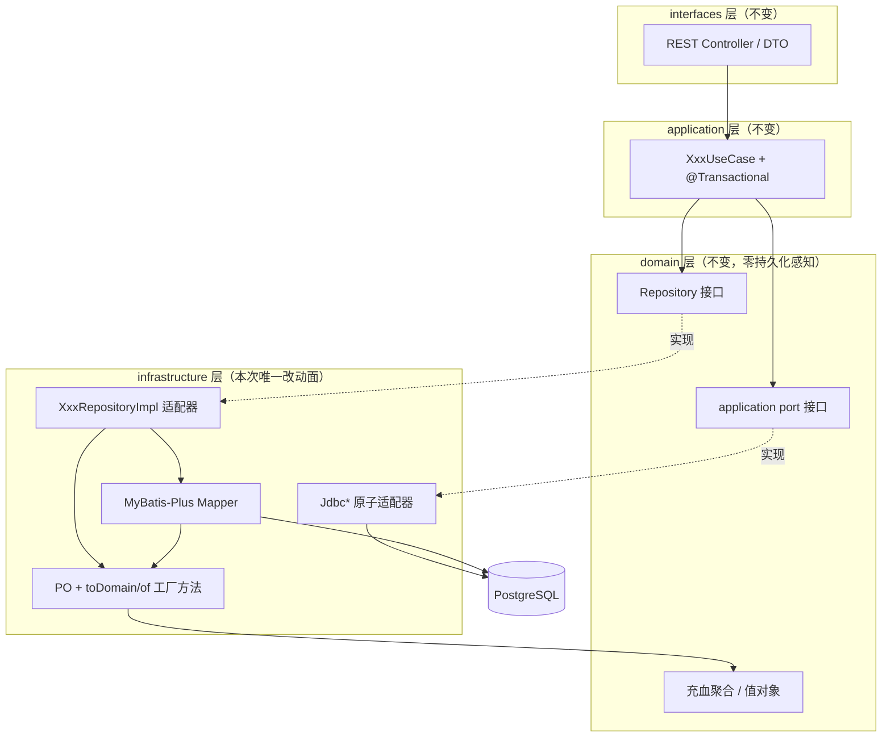
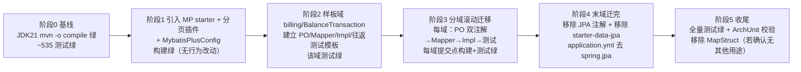
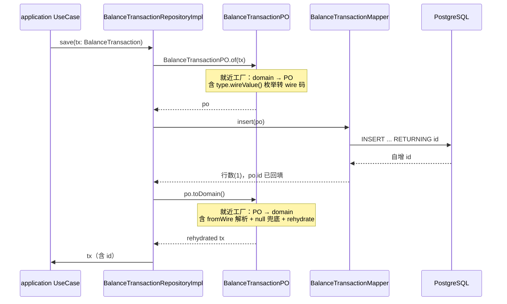
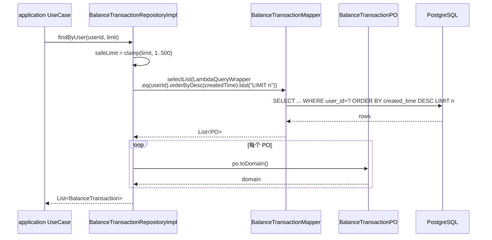

# Design Document: 持久化层从 Spring Data JPA / Hibernate 全量迁移到 MyBatis-Plus

## Overview

本设计描述 `nexa-backend`（Spring Boot 3.2.5 + JDK 21 + PostgreSQL + Flyway）持久化层从 **Spring Data JPA / Hibernate** 全量替换为 **MyBatis-Plus**（`mybatis-plus-spring-boot3-starter` 3.5.9）的重构方案。这是一次**纯技术替换**：四层 DDD 目录结构（顶层 `domain / application / infrastructure / interfaces`，每层内按界限上下文划分）保持不变，领域模型（充血聚合）继续零框架/零持久化感知，对外行为（REST 契约、软删除语义、并发原子性、分页语义）严格等价。

迁移规模实测：29 个 JPA 实体（PO）、29 个 Spring Data 接口（→ MyBatis-Plus Mapper）、26 个 RepositoryImpl（→ Mapper + PO 工厂映射），横跨 account / billing / growth / model / modelgroup / relay / routing / log / ops / passkey / task / telegram / token / oauthprovider 等域。另有 3 个 `Jdbc*` 跨上下文原子适配器（billing `JdbcUserQuotaAccount`、growth `JdbcUserQuotaAccount`、growth `JdbcAffiliateAccountRepository`）需保留原子语义。

两个已敲定的关键决策贯穿全文：
1. **保留 PO 隔离（方案 A）**：PO 继续留在 `infrastructure/<域>/persistence/po/`，MyBatis-Plus 注解（`@TableName`/`@TableId`/`@TableLogic` 等）只加在 PO 上，绝不污染 domain。
2. **PO ↔ domain 映射采用「就近工厂方法」（方案 1）**：不引 MapStruct；在 PO 上提供实例方法 `toDomain()` 与静态工厂 `static of(domainObj)`，把映射逻辑就近收敛到 PO，删除目前散在各 RepositoryImpl 内的私有 `toEntity/toDomain`。

本设计以最简单的聚合 **billing / BalanceTransaction** 作为贯穿示例。

> 注：仓库根 `AGENTS.md` 描述的「双模块 + 按上下文优先」结构已过时，与实际代码（单模块 `nexa-backend` + 四层 DDD 顶层目录）不符，本设计以实际代码为准。

---

## Architecture

### 迁移前后分层对照（不变的边界）



改动严格限定在 `infrastructure/<域>/persistence/`（及 3 个 `Jdbc*` 适配器）。`domain`、`application`、`interfaces` 三层**零改动**——这是验证迁移正确性的天然边界：上层测试（用例测试、接口测试）不应因迁移而改一行。

### 组件职责（迁移后）

| 组件 | 迁移前 | 迁移后 | 位置 |
|------|--------|--------|------|
| PO | `@Entity` + `@SQLRestriction` + getter/setter | `@TableName` + `@TableId` + `@TableLogic` + getter/setter + `toDomain()` / `static of(...)` | `infrastructure/<域>/persistence/po/` |
| 数据访问接口 | `SpringDataXxxJpaRepository extends JpaRepository<PO, Long>` | `XxxMapper extends BaseMapper<PO>` | `infrastructure/<域>/persistence/` |
| 仓储适配器 | `XxxRepositoryImpl`（含私有 `toEntity/toDomain`） | `XxxRepositoryImpl`（用 Mapper + `LambdaQueryWrapper` + PO 工厂方法） | `infrastructure/<域>/persistence/` |
| 跨上下文原子适配器 | `Jdbc*`（JdbcTemplate） | **保持 JdbcTemplate 或改 Mapper `@Update setSql`，二选一，原子性不退化** | `infrastructure/<域>/account|persistence/` |
| 分页 | Spring Data `Pageable` / `Page` | MyBatis-Plus `Page<PO>` + 分页插件 | `infrastructure/persistence/`（共享构件） |

---

## Migration Strategy（迁移分阶段策略）

### 核心约束：`ddl-auto=validate` 下无法只迁单域独立验证

本机实测：只要 `spring-boot-starter-data-jpa` 还在依赖里且 `spring.jpa.hibernate.ddl-auto=validate`，**所有** `@Entity` 在应用启动时必须与库表匹配，否则启动即失败。因此「只迁一个域、其余保持 JPA」的中间态无法独立启动验证——JPA 校验是全局的。

### 推荐方案：样板域先行 + 分域滚动迁移 + 末域统一移除 JPA starter

采纳「先做样板域跑通建立模板，再分域滚动迁移，最后一域迁完统一移除 JPA starter」，**不**一次性全量切换。理由：

- **一次性全量切换**风险过高：29 实体 / 26 Impl 同时改动，一旦构建/测试红，定位成本极高、无法二分回退。
- **分域滚动**每阶段可保持构建绿、测试绿、可回滚到上一域提交。

关键在于解决「中间态两套框架并存」：迁移期 **JPA starter 与 MyBatis-Plus starter 同时在依赖里**。两者共享同一个 HikariCP 数据源（MyBatis-Plus 直接复用 Spring Boot 自动装配的 `DataSource`，不新建连接池——生产 `max-pool-size=5` 的硬约束必须守住）。并存期内：

- 已迁域：PO **同时**保留 JPA 注解（满足 `ddl-auto=validate` 全局校验）**和** MyBatis-Plus 注解（供 Mapper 运行），数据访问走 Mapper。
- 未迁域：维持原 JPA 实现不动。

> 关于并存期 PO 双注解：JPA 的 `@Entity/@Table/@Column` 与 MyBatis-Plus 的 `@TableName/@TableId/@TableField` 注解命名空间不冲突，可共存于同一 PO。MyBatis-Plus 不读 JPA 注解，JPA 不读 MyBatis-Plus 注解。这让「JPA 仅做启动校验、Mapper 做实际读写」的中间态成立。

### 阶段划分



**阶段 1（引入但不切换）**：加 `mybatis-plus-spring-boot3-starter` 依赖、`MybatisPlusConfig`（分页插件）、Mapper 扫描配置。此时无任何 Mapper、无行为改动，验证两 starter 共存可启动、构建绿。

**阶段 2（样板域）**：迁 `billing/BalanceTransaction`（最简单：仅 save + findByUser，无软删除）。产出 `BalanceTransactionMapper`、改写 `BalanceTransactionRepositoryImpl`、PO 加 MyBatis-Plus 注解与 `toDomain/of`、补 `domain → PO → domain` 往返完整性测试。这一域固化所有范式（命名、注解、映射、分页、测试），作为后续域的复制模板。

**阶段 3（滚动迁移）**：按域依次迁移，建议顺序由简到繁：先无软删除的纯历史/KV 域（ops/log），再带 `@TableLogic` 软删除的域（account/token/model/modelgroup/billing-redemption），最后处理跨上下文 `Jdbc*` 适配器。每个域一个提交点，提交前 `mvn -o compile` + 相关域测试必须绿。

**阶段 4（移除 JPA）**：最后一个域迁完后，统一删除所有 PO 的 JPA 注解（`@Entity/@Table/@Column/@Id/@SQLRestriction` 等）、移除 `spring-boot-starter-data-jpa` 依赖、删除 `application.yml` 的 `spring.jpa` 配置块。

**阶段 5（收尾）**：全量 ~535 测试绿；ArchUnit 规则校验 domain 仍零持久化导入；若 MapStruct 仅服务于本次被删的映射则一并移除。

### 回滚策略

- 每阶段/每域是独立提交，任一域迁移引入回归即 `git revert` 该域提交，不影响已迁的其他域。
- 阶段 4 之前 JPA 始终在位，最坏情况可回退到「全 JPA」基线。
- 阶段 4（移除 JPA starter）是不可细粒度回滚的「单向门」，须在所有域测试全绿后再执行，作为独立提交。

### 构建环境（强约束）

本机 PATH 的 `java` 为 JDK17、`mvn` 跑在 JDK8，**均不可直接用**。构建必须用 JDK21：

```
JAVA_HOME = D:\Program Files\dev\env\jdks\corretto-21.0.5
```

设置 `JAVA_HOME` 后再调 `mvn`。基线 `mvn -o compile`（JDK21）为绿；每个迁移提交点须复跑保持绿，并跑相关域测试。

### Schema 一致性保障（JPA 校验消失后）

迁移前 `ddl-auto=validate` 在启动时校验 PO 字段与库表一致。移除 JPA 后此校验消失，PO 与表结构一致性改由两条防线保障：

1. **Flyway 仍是表结构唯一权威**：表由 `db/migration` 脚本管理，迁移不改任何 schema。
2. **集成测试 / 往返测试**：连真实 PG（或测试库）的 `*IT` 与往返测试在 CI 跑通，等价于运行期校验——字段错配会在 Mapper 读写时立刻暴露为 SQL 异常或映射 null。

---

## Dependencies（依赖变更）

### pom.xml 变更

```xml
<!-- 新增：MyBatis-Plus Spring Boot 3 专用 starter -->
<dependency>
    <groupId>com.baomidou</groupId>
    <artifactId>mybatis-plus-spring-boot3-starter</artifactId>
    <version>3.5.9</version>
</dependency>

<!-- 阶段4 移除：JPA starter（迁移完成后） -->
<!--
<dependency>
    <groupId>org.springframework.boot</groupId>
    <artifactId>spring-boot-starter-data-jpa</artifactId>
</dependency>
-->
```

注意事项：
- **JdbcTemplate 来源**：现 3 个 `Jdbc*` 适配器依赖的 `JdbcTemplate` 原由 JPA starter 间接引入。移除 JPA starter 后，若仍保留 JdbcTemplate 实现，需确保 `spring-boot-starter-jdbc` 在依赖树中（MyBatis-Plus starter 已传递引入 `spring-jdbc`，但显式声明 `spring-boot-starter-jdbc` 更稳妥）。
- **MapStruct**：本次映射改用就近工厂方法，不使用 MapStruct。阶段 5 确认无其他用途后，移除 `org.mapstruct:mapstruct` 依赖及 `maven-compiler-plugin` 的 `annotationProcessorPaths` 配置。
- **数据源/连接池不变**：MyBatis-Plus 复用现有 HikariCP（`max-pool-size=5`），不引入第二个连接池。

### application.yml 变更

```yaml
# 阶段4 移除整个 spring.jpa 块：
# spring:
#   jpa:
#     hibernate:
#       ddl-auto: validate
#     properties:
#       hibernate: { dialect: ..., format_sql: false }
#     open-in-view: false

# 新增 MyBatis-Plus 配置：
mybatis-plus:
  configuration:
    # 关闭驼峰映射全局开关——本项目 PO 字段与列名用注解显式声明（@TableField），不靠隐式映射
    map-underscore-to-camel-case: true
  global-config:
    db-config:
      # 逻辑删除全局配置（详见 Low-Level 软删除节）：本项目 deleted_at 为 epoch 秒时间戳，
      # 非 0/1，因此不用全局 logic-delete-value/logic-not-delete-value，改在每个 PO 字段上用
      # @TableLogic(value="NULL", delval="NULL") 配合 PG 表达式，或用自定义 SqlInjector（见下）。
      id-type: auto
```

> `map-underscore-to-camel-case: true` 仅作为兜底；PO 仍逐字段用 `@TableField(value = "...")` 显式声明列名（尤其 PG 保留字列如 `"group"`、`"key"` 必须显式转义），不依赖隐式推断。

---

## Sequence Diagrams（主流程）

### save：领域聚合落库并回填 id（以 BalanceTransaction 为例）



### findByUser：分页/限量查询并重建领域对象



---

## Components and Interfaces

### Component: XxxMapper（取代 SpringDataXxxJpaRepository）

**Purpose**：MyBatis-Plus 数据访问接口，继承 `BaseMapper<PO>` 获得 CRUD（insert/selectById/selectList/updateById/delete...），自定义查询用 `LambdaQueryWrapper` 在 Impl 内组装，复杂 SQL 用 `@Select`/`@Update` 注解。

**Interface**（以 billing 为例）：
```java
// infrastructure/billing/persistence/BalanceTransactionMapper.java
// 包级可见，仅供 BalanceTransactionRepositoryImpl 使用；领域只认 domain.repository.BalanceTransactionRepository
interface BalanceTransactionMapper extends BaseMapper<BalanceTransactionPO> {
    // 基础 CRUD 由 BaseMapper 提供，无需声明。
    // findByUserIdOrderByCreatedTimeDesc 用 LambdaQueryWrapper 在 Impl 内实现，不在此声明派生方法。
}
```

**Responsibilities**：
- 提供基础 CRUD（继承自 `BaseMapper`）。
- 承载无法用 wrapper 表达的复杂 SQL（如多表/CTE，用 `@Select`/`@Update`）。
- 不含领域语义，纯数据访问。

### Component: XxxRepositoryImpl（适配器，职责不变，内部实现改写）

**Purpose**：实现 domain 的 Repository 接口，用 Mapper + PO 工厂方法完成领域对象与 PO 的转换。删除原私有 `toEntity/toDomain`（逻辑移入 PO）。

**Interface**：实现 domain 既有接口（签名不变）：
```java
public interface BalanceTransactionRepository {   // domain 层，零改动
    BalanceTransaction save(BalanceTransaction tx);
    List<BalanceTransaction> findByUser(long userId, int limit);
}
```

**Responsibilities**：
- 调用 `XxxPO.of(domain)` 转 PO，调用 Mapper 落库，回填自增 id。
- 调用 `po.toDomain()` 重建领域对象。
- 组装 `LambdaQueryWrapper`（取代 JPA 派生查询 / `@Query` JPQL）。
- 翻译持久化异常为领域异常（如唯一索引冲突 → `UserAlreadyExistsException`），语义不变。

### Component: 分页支持（共享构件演进）

**Purpose**：现 `infrastructure/persistence/PageQueries` 把「1-based 页号 → Spring Data `Pageable`（0-based）」收敛。迁移后改为产出 MyBatis-Plus `Page<PO>`（1-based，恰好对齐领域约定）。

**Interface**：
```java
// infrastructure/persistence/PageQueries.java（演进，仍是无状态纯工具）
public final class PageQueries {
    /** 1-based 页号 + 每页条数 → MyBatis-Plus Page（MP 页号本就从 1 起，无需减一）。 */
    public static <T> com.baomidou.mybatisplus.extension.plugins.pagination.Page<T> of(int page1Based, int pageSize) {
        int page = Math.max(1, page1Based);
        int size = Math.max(1, pageSize);
        return com.baomidou.mybatisplus.extension.plugins.pagination.Page.of(page, size);
    }
}
```

> 排序在 MyBatis-Plus 中由 `LambdaQueryWrapper.orderByAsc/Desc` 或 `Page.addOrder(OrderItem)` 表达，取代 Spring Data 的 `Sort`。

---

## Data Models

### Model: BalanceTransactionPO（迁移后骨架）

迁移后 PO 用 MyBatis-Plus 注解，并承载就近映射工厂方法。**domain 的 `BalanceTransaction` 零改动**。

```java
// infrastructure/billing/persistence/po/BalanceTransactionPO.java
@TableName("balance_transactions")
public class BalanceTransactionPO {

    @TableId(type = IdType.AUTO)          // 取代 @Id @GeneratedValue(IDENTITY)
    private Long id;

    @TableField("user_id")
    private Long userId;

    @TableField("type")
    private String type;                  // wire 码字面量（ADMIN_CREDIT/...）

    @TableField("amount")
    private Long amount;

    @TableField("balance_after")
    private Long balanceAfter;

    @TableField("operator_id")
    private Long operatorId;

    @TableField("remark")
    private String remark;

    @TableField("created_time")
    private Long createdTime;

    public BalanceTransactionPO() {}      // MyBatis 需无参构造

    // getter/setter 省略（保留）

    // ---- 就近映射工厂方法（方案 1）：映射逻辑收敛在 PO，domain 仍零感知 PO ----

    /** PO → 领域聚合（重建方向，走 rehydrate + 枚举 fromWire + null 兜底）。 */
    public BalanceTransaction toDomain() { /* 见 Low-Level 规范 */ }

    /** 领域聚合 → PO（持久化方向，含 type.wireValue() 枚举转 wire 码）。 */
    public static BalanceTransactionPO of(BalanceTransaction t) { /* 见 Low-Level 规范 */ }
}
```

**Validation / 映射规则**：
- `type` 列承载枚举 wire 码：`of` 时 `t.type().wireValue()`；`toDomain` 时 `BalanceTransactionType.fromWire(type)`。
- 数值列 null 兜底（`amount/balanceAfter/userId/createdTime` 为 null → 0L），与现 `BalanceTransactionRepositoryImpl.toDomain` 行为一致。
- PG 保留字列（如 `"group"`、`"key"`）：`@TableField(value = "\"group\"")` 显式双引号转义，对齐现有 JPA 列名转义。

### Model: 软删除 PO（带 @TableLogic）

现状：大量表用 JPA `@SQLRestriction("deleted_at IS NULL")` 做声明式软删除过滤，且 `deleted_at` 是 **epoch 秒时间戳（`Long`，可空）**，非 0/1。迁移后用 MyBatis-Plus `@TableLogic`，详见 Low-Level「软删除」节。

---

## Algorithmic Pseudocode

### 算法 1：RepositoryImpl.save —— 落库并回填 id

```pascal
ALGORITHM save(domainObj)
INPUT: domainObj 领域聚合（id 可能为 null=新建）
OUTPUT: 持久化后的领域聚合（含 id）

BEGIN
    ASSERT domainObj <> NULL

    po ← PO.of(domainObj)          // 就近工厂：domain → PO

    IF po.id = NULL THEN
        mapper.insert(po)          // MyBatis-Plus 回填自增 id 到 po.id
    ELSE
        mapper.updateById(po)      // 已有 id 更新
    END IF

    domainObj.assignId(po.id)      // 回填 id 到聚合（保持现有契约）

    RETURN po.toDomain()           // 就近工厂：PO → domain（重建）
END
```

**Preconditions**：`domainObj` 非空；`PO.of` 能完整映射所有字段（往返测试护栏保证）。
**Postconditions**：返回聚合含非空 id；DB 多出/更新一行；无对入参 domain 的破坏性修改（除 `assignId`）。
**Loop Invariants**：N/A。

### 算法 2：RepositoryImpl.findByUser —— 限量倒序查询（取代派生查询）

```pascal
ALGORITHM findByUser(userId, limit)
INPUT: userId 用户 id；limit 返回上限
OUTPUT: 该用户账变流水（created_time 倒序，最多 safeLimit 条）

BEGIN
    safeLimit ← IF limit <= 0 THEN 50 ELSE MIN(limit, 500)

    wrapper ← new LambdaQueryWrapper<BalanceTransactionPO>()
    wrapper.eq(PO::getUserId, userId)
    wrapper.orderByDesc(PO::getCreatedTime)
    wrapper.last("LIMIT " + safeLimit)      // safeLimit 已被 clamp 为可信整数，无注入风险

    poList ← mapper.selectList(wrapper)

    result ← empty list
    FOR each po IN poList DO
        result.add(po.toDomain())
    END FOR

    RETURN result
END
```

**Preconditions**：`safeLimit` 经 clamp 为 `[1,500]` 的可信整数（杜绝 `last()` 拼接注入）。
**Postconditions**：结果按 `created_time` 降序；条数 ≤ `safeLimit`；每条均为完整重建的领域对象。
**Loop Invariants**：循环中已转换的元素均为有效领域对象。

### 算法 3：派生查询 / JPQL → LambdaQueryWrapper 翻译范式

```pascal
ALGORITHM translateQuery
// 现 JPA 派生查询 / @Query JPQL → MyBatis-Plus 等价物对照

  findByUsername(username)
    → mapper.selectOne(lqw.eq(UserPO::getUsername, username))   // 软删由 @TableLogic 自动追加 deleted_at IS NULL

  existsByUsername(username)
    → mapper.selectCount(lqw.eq(UserPO::getUsername, username)) > 0

  findByUserIdOrderByCreatedTimeDesc(userId, pageable)
    → mapper.selectList(lqw.eq(...userId).orderByDesc(...createdTime).last("LIMIT n"))

  searchByKeyword(kw, pageable)  // 原 @Query JPQL：username/email/group 大小写不敏感模糊
    → mapper.selectPage(page, lqw.and(w -> w
          .like(LOWER(username), kw).or().like(LOWER(email), kw).or().like(LOWER(group), kw)))
      // 用 apply("LOWER(username) LIKE LOWER({0})", kw) 表达大小写不敏感；占位符 {0} 防注入

  markDeleted(id, deletedAt)     // 原 @Modifying UPDATE deleted_at
    → mapper.deleteById(id)      // @TableLogic 自动转为 UPDATE deleted_at = <删除值>（见软删除节）
END
```

**关键护栏**：所有动态值经 wrapper 的占位符（`eq/like/apply({0})`）传参，**禁止**字符串拼接用户输入到 `apply/last`（仅允许拼接已 clamp 的可信整数如 LIMIT n）。

### 算法 4：跨上下文原子自增适配器改写范式（保留原子性）

```pascal
ALGORITHM atomicCredit(userId, amount)
// 现 JdbcUserQuotaAccount.credit：UPDATE users SET quota = quota + ? WHERE id=? AND deleted_at IS NULL
// 迁移后必须仍是 SQL 级原子自增，禁止退化为「读-改-写」

OPTION A（推荐，改动最小）：保留 JdbcTemplate 实现不变
    affected ← jdbcTemplate.update(
        "UPDATE users SET quota = quota + ? WHERE id = ? AND deleted_at IS NULL", amount, userId)
    IF affected = 0 THEN THROW InvalidBillingParameterException

OPTION B（统一到 MyBatis-Plus）：用 Mapper @Update 注解 / UpdateWrapper.setSql
    // @Update("UPDATE users SET quota = quota + #{amount} WHERE id = #{userId} AND deleted_at IS NULL")
    affected ← userQuotaMapper.creditQuota(userId, amount)
    IF affected = 0 THEN THROW InvalidBillingParameterException
END
```

**Preconditions**：`amount` 已是值对象 `Quota`（非负、单位明确）；零额度短路返回（无谓 UPDATE）。
**Postconditions**：`quota` 原子自增 amount；软删用户（`deleted_at` 非空）不受影响；`affected=0` 即「用户不存在/已删」抛领域异常（不吞错）。
**并发正确性不变量**：自增在单条 SQL 内完成，任意并发交织下 `quota` 终值 = 初值 + Σ各成功 credit 的 amount（无丢更新）。

> **推荐 OPTION A**：3 个 `Jdbc*` 适配器（含 `debitToZero` 的 CTE、`getOrCreateAffCode` 的 CAS 重试、`deductAffQuota` 的条件扣减）是**故意**用裸 SQL 表达原子语义的，MyBatis-Plus 在这里无增量价值，反而 CTE/`RETURNING` 用 `@Update` 表达更别扭。保留 JdbcTemplate 最稳妥，仅需确保 `spring-boot-starter-jdbc` 在依赖树中（移除 JPA starter 后）。本设计将其列为「保留」而非「迁移」项，但仍在迁移范围的清点与回归测试覆盖内。

---

## Key Functions with Formal Specifications

### Function: `BalanceTransactionPO.of(BalanceTransaction)`（就近工厂，domain → PO）

```java
public static BalanceTransactionPO of(BalanceTransaction t)
```
**Preconditions**：`t` 非空；`t.type()` 非空。
**Postconditions**：返回 PO 各列与 `t` 一一对应；`po.type = t.type().wireValue()`；`po.id = t.id()`（可空）；无副作用于 `t`。
**Loop Invariants**：N/A。

### Function: `BalanceTransactionPO.toDomain()`（就近工厂，PO → domain）

```java
public BalanceTransaction toDomain()
```
**Preconditions**：`this` 来自 DB（信任已落库数据）。
**Postconditions**：走 `BalanceTransaction.rehydrate(...)` 重建；`type` 经 `fromWire` 解析；数值列 null → 0L 兜底；返回的领域对象与本 PO 语义等价。
**Loop Invariants**：N/A。

### Function: `BalanceTransactionRepositoryImpl.save(...)` / `findByUser(...)`

签名与 domain 接口一致（见 Components 节）。形式化规格见 Algorithmic Pseudocode 算法 1/2。

---

## 软删除（@TableLogic）配置 —— 低层规范

### 难点：deleted_at 是 epoch 秒时间戳，非 0/1

现状：软删除靠 JPA `@SQLRestriction("deleted_at IS NULL")` 自动过滤未删行；写软删除走 `@Modifying UPDATE deleted_at = <epoch秒>`；`deleted_at` 列为可空 `Long`（epoch 秒）。MyBatis-Plus 标准 `@TableLogic` 默认按「未删值 / 已删值」常量（典型 0/1）工作，与本项目「未删=NULL / 已删=当前时间戳」不直接吻合。

### 方案：@TableLogic + 自定义已删值表达式

```java
// 软删除 PO（如 UserPO / TokenPO / RedemptionPO / ModelGroupPO ...）
@TableName("users")
public class UserPO {

    @TableLogic(value = "null", delval = "extract(epoch from now())")
    @TableField("deleted_at")
    private Long deletedAt;
    // value="null"  → 未删条件：deleted_at IS NULL（select 自动追加）
    // delval=<PG表达式> → 删除时 SET deleted_at = extract(epoch from now())（epoch 秒，行为等价现状）
}
```

效果（MyBatis-Plus 自动改写）：
- `selectList/selectById/selectCount/...` 自动追加 `WHERE deleted_at IS NULL` —— 等价现 `@SQLRestriction`。
- `deleteById(id)` / `delete(wrapper)` 自动转为 `UPDATE ... SET deleted_at = extract(epoch from now()) WHERE id=? AND deleted_at IS NULL` —— 等价现 `markDeleted`，写 epoch 秒时间戳。

> 若某些 MyBatis-Plus 版本对 `delval` 的 SQL 函数表达式支持受限，**回退方案**：`@TableLogic` 仅声明 `value`（控制 select 过滤），软删除写操作改为 Mapper 上的显式 `@Update("UPDATE <t> SET deleted_at = extract(epoch from now()) WHERE id = #{id} AND deleted_at IS NULL")`，与现 `markDeleted` 一对一等价。本设计在样板域之外的首个软删除域（建议 account/UserPO）落地时**实测确认** `delval` 表达式是否被 3.5.9 接受，据此二选一，并在该域 PR 固化结论供其余软删除域复用。

**等价性校验点**（须有测试）：
- 软删除后，普通 `selectList/selectById` 查不到该行。
- 软删除写入的 `deleted_at` 为 epoch 秒（与现状同量纲），非 0/1。
- 需要命中已删行的幂等写（现 `markDeleted` 仅当 `deleted_at IS NULL` 时更新）语义保持。

---

## RepositoryImpl 改写范式（以 BalanceTransaction 贯穿）

```java
// infrastructure/billing/persistence/BalanceTransactionRepositoryImpl.java（迁移后）
@Repository
public class BalanceTransactionRepositoryImpl implements BalanceTransactionRepository {

    private final BalanceTransactionMapper mapper;

    public BalanceTransactionRepositoryImpl(BalanceTransactionMapper mapper) {
        this.mapper = mapper;
    }

    @Override
    public BalanceTransaction save(BalanceTransaction tx) {
        BalanceTransactionPO po = BalanceTransactionPO.of(tx);   // 就近工厂，取代私有 toEntity
        mapper.insert(po);                                       // 回填自增 id 到 po
        tx.assignId(po.getId());
        return po.toDomain();                                    // 就近工厂，取代私有 toDomain
    }

    @Override
    public List<BalanceTransaction> findByUser(long userId, int limit) {
        int safeLimit = limit <= 0 ? 50 : Math.min(limit, 500);
        LambdaQueryWrapper<BalanceTransactionPO> w = Wrappers.<BalanceTransactionPO>lambdaQuery()
                .eq(BalanceTransactionPO::getUserId, userId)
                .orderByDesc(BalanceTransactionPO::getCreatedTime)
                .last("LIMIT " + safeLimit);   // safeLimit 为已 clamp 的可信整数
        return mapper.selectList(w).stream()
                .map(BalanceTransactionPO::toDomain)
                .toList();
    }
}
```

要点：
- 私有 `toEntity/toDomain` **删除**，逻辑移入 PO 的 `of/toDomain`。
- 异常翻译保留：如 `UserRepositoryImpl.save` 捕获 `DataIntegrityViolationException` 翻译为 `UserAlreadyExistsException` 的逻辑迁移后照旧（MyBatis-Plus 同样抛 Spring `DataIntegrityViolationException`）。

---

## 分页插件配置 —— 低层规范

```java
// infrastructure/persistence/MybatisPlusConfig.java（共享构件）
@Configuration
@MapperScan("com.nexa.infrastructure.**.persistence")   // 扫描各域 Mapper（按实际包路径核定）
public class MybatisPlusConfig {

    @Bean
    public MybatisPlusInterceptor mybatisPlusInterceptor() {
        MybatisPlusInterceptor interceptor = new MybatisPlusInterceptor();
        // 分页插件：DbType.POSTGRE_SQL 生成 PG 方言 LIMIT/OFFSET
        interceptor.addInnerInterceptor(new PaginationInnerInterceptor(DbType.POSTGRE_SQL));
        return interceptor;
    }
}
```

分页用法（取代 Spring Data `Page<UserPO> + Pageable`）：
```java
@Override
public UserRepository.Page<User> search(String keyword, int page, int pageSize) {
    Page<UserPO> mpPage = PageQueries.of(page, pageSize);   // 1-based，无需减一
    LambdaQueryWrapper<UserPO> w = Wrappers.<UserPO>lambdaQuery().orderByAsc(UserPO::getId);
    if (keyword != null && !keyword.isBlank()) {
        String kw = "%" + keyword.trim() + "%";
        w.and(q -> q.apply("LOWER(username) LIKE LOWER({0})", kw)
                    .or().apply("LOWER(email) LIKE LOWER({0})", kw)
                    .or().apply("LOWER(\"group\") LIKE LOWER({0})", kw));   // {0} 占位防注入；group 转义
    }
    mapper.selectPage(mpPage, w);
    List<User> items = mpPage.getRecords().stream().map(UserPO::toDomain).toList();
    return new UserRepository.Page<>(items, mpPage.getTotal(), page, pageSize);
}
```

> `@MapperScan` 路径须按各域 Mapper 实际包名核定（如 `com.nexa.infrastructure.billing.persistence`）；也可在每个 Mapper 接口上加 `@Mapper` 注解替代集中扫描，二选一统一。

---

## 往返完整性测试范式（方案 1 的护栏）

方案 1（手写就近映射）唯一硬伤：**加字段忘同步映射、运行期才炸**。护栏是为每个关键聚合配 `domain → PO → domain` 往返完整性测试，确保映射无字段遗漏。

```java
// src/test/java/com/nexa/infrastructure/billing/persistence/po/BalanceTransactionPOMappingTest.java
class BalanceTransactionPOMappingTest {

    @Test
    void roundTrip_preservesAllFields() {
        // given：构造覆盖所有字段（含可空 operatorId/remark）的领域对象
        BalanceTransaction origin = BalanceTransaction.rehydrate(
                42L, 7L, BalanceTransactionType.ADMIN_CREDIT,
                1000L, 5000L, 99L, "manual topup", 1_700_000_000L);

        // when：domain → PO → domain 往返
        BalanceTransaction roundTripped = BalanceTransactionPO.of(origin).toDomain();

        // then：逐字段等价（任一字段漏映射即在此暴露，编译期加字段后此测试立刻红）
        assertThat(roundTripped.id()).isEqualTo(origin.id());
        assertThat(roundTripped.userId()).isEqualTo(origin.userId());
        assertThat(roundTripped.type()).isEqualTo(origin.type());
        assertThat(roundTripped.amount()).isEqualTo(origin.amount());
        assertThat(roundTripped.balanceAfter()).isEqualTo(origin.balanceAfter());
        assertThat(roundTripped.operatorId()).isEqualTo(origin.operatorId());
        assertThat(roundTripped.remark()).isEqualTo(origin.remark());
        assertThat(roundTripped.createdTime()).isEqualTo(origin.createdTime());
    }

    @Test
    void roundTrip_handlesNullableAndDefaults() {
        // 可空字段（operatorId/remark=null）与数值 null 兜底（→0L）的往返语义
        // ...
    }
}
```

测试策略：
- **单元往返测试**：每个关键聚合一个，纯内存、无 Spring，快。覆盖全字段 + 可空 + null 兜底 + 枚举 wire 往返。
- **集成测试（*IT）**：连真实/测试 PG，验证 Mapper SQL、`@TableLogic` 过滤、分页、原子自增、PG 保留字列转义。取代消失的 `ddl-auto=validate` 启动校验。
- **基线回归**：迁移后 ~535 测试（含 domain/application/interfaces 层，零改动）必须全绿。

---

## Correctness Properties（正确性属性）

- **P1 行为等价（映射往返）**：∀ 领域聚合 `d`，`PO.of(d).toDomain()` 在所有持久化字段上与 `d` 等价（id、值对象、枚举 wire、数值 null 兜底均保持）。
- **P2 软删除过滤等价**：∀ 软删除域，普通查询（`selectList/selectById/selectCount`）永不返回 `deleted_at` 非空的行；软删除写入的 `deleted_at` 为 epoch 秒（与迁移前同量纲）。
- **P3 并发原子性不退化**：∀ 并发 credit/debit/CAS 序列，`Jdbc*` 适配器（或其 Mapper 等价实现）的终态 = 单条原子 SQL 串行执行的终态（无丢更新、无超额扣减）。
- **P4 分页语义等价**：∀ `(page1Based, pageSize)`，MyBatis-Plus 分页返回的页与总数与迁移前 Spring Data 一致（页号 1-based 对齐，排序稳定）。
- **P5 domain 零持久化感知**：迁移后 `com.nexa.domain.**` 不出现任何 MyBatis-Plus / JPA / Spring Data 导入（ArchUnit 校验）。
- **P6 上层零改动**：`domain` / `application` / `interfaces` 三层代码与测试因迁移产生的 diff 为零。

---

## Error Handling

### 场景 1：PO 与表结构不一致（JPA 校验消失后）

**Condition**：移除 `ddl-auto=validate` 后，PO 字段/列名与库表错配。
**Response**：Mapper 读写时抛 SQL 异常（列不存在）或映射出 null。
**Recovery**：靠 `*IT` 集成测试 + 往返测试在 CI 拦截；Flyway 仍是 schema 权威，PO 须对齐脚本。

### 场景 2：并存期两套框架对同表的注解冲突

**Condition**：迁移中间态 PO 同时带 JPA 与 MyBatis-Plus 注解。
**Response**：两套注解命名空间独立，互不读取，正常共存；JPA 仅启动校验，Mapper 实际读写。
**Recovery**：阶段 4 统一移除 JPA 注解与 starter，消除并存。

### 场景 3：唯一索引冲突（如 username / aff_code）

**Condition**：并发插入撞唯一索引。
**Response**：MyBatis-Plus 同样抛 Spring `DataIntegrityViolationException`。
**Recovery**：RepositoryImpl 翻译为领域异常（`UserAlreadyExistsException` 等），逻辑与迁移前完全一致。

### 场景 4：动态 SQL 拼接注入风险

**Condition**：`apply()/last()` 误拼用户输入。
**Response/Recovery**：强制用占位符 `{0}` 传参；`last("LIMIT n")` 仅允许已 clamp 的可信整数。代码评审 + 测试覆盖。

---

## Testing Strategy

### Unit Testing
- 每个关键聚合的 `domain → PO → domain` 往返测试（纯内存，护栏 P1）。
- RepositoryImpl 的查询组装可用 mock Mapper 验证 wrapper 行为（可选）。

### Property-Based Testing
- 对映射往返（P1）适合属性测试：随机生成领域对象，断言往返不变。
- **Property Test Library**：jqwik（JUnit5 友好）或基于现有 JUnit 的参数化生成。本项目当前无 PBT 依赖，是否引入待 tasks 阶段定夺；最低限度用参数化用例覆盖边界（null、0、负 amount、枚举全集）。

### Integration Testing（*IT）
- 连真实/测试 PG 验证：CRUD、`@TableLogic` 软删除过滤与写入量纲、分页方言、原子自增/CAS、PG 保留字列转义。
- 取代消失的 `ddl-auto=validate` 启动校验。

### 回归基线
- 迁移后全量 ~535 测试（含上三层零改动测试）必须全绿，是行为等价（P6）的核心证据。
- 每个域迁移提交点：`JAVA_HOME=corretto-21.0.5` 下 `mvn -o compile` + 相关域测试绿。

---

## Performance Considerations

- **连接池硬约束**：生产 `max-pool-size=5`，MyBatis-Plus 复用同一 HikariCP，不新建第二池。迁移不得增加每请求连接占用（单事务单连接模型不变）。
- **分页插件**：`PaginationInnerInterceptor` 在 PG 上生成 `LIMIT/OFFSET`，与 Spring Data 同等开销；`selectPage` 默认执行 count，行为对齐 Spring Data `Page.getTotalElements`。
- **原子自增保留 SQL 级**：避免「读-改-写」既是正确性也是性能要求（少一次往返、无行锁等待放大）。
- **虚拟线程**：已开（`spring.threads.virtual.enabled`），MyBatis-Plus/JDBC 阻塞 IO 在虚拟线程上承载，迁移不改变此模型。

## Security Considerations

- **SQL 注入**：所有动态值经 MyBatis 占位符 / wrapper 占位（`{0}`）传参；禁止字符串拼接用户输入到 `apply/last`。
- **软删除即不可见**：`@TableLogic` 保证已删行不被普通查询返回，等价现 `@SQLRestriction`，防止越权读到已删数据（如 token self-scope）。
- **凭据/密钥**：迁移不触碰 `application.yml` 的密钥注入；不在 PO/日志打印敏感列。

## Dependencies（汇总）

新增：`com.baomidou:mybatis-plus-spring-boot3-starter:3.5.9`。
阶段 4 移除：`spring-boot-starter-data-jpa`、`spring.jpa` 配置块、所有 PO 的 JPA 注解。
确认后移除：`org.mapstruct:mapstruct` 及编译器插件的 annotationProcessorPaths。
保留/确保：`spring-boot-starter-jdbc`（供 3 个 `Jdbc*` 原子适配器，移除 JPA starter 后须在依赖树中）、HikariCP、Flyway、PostgreSQL 驱动。
