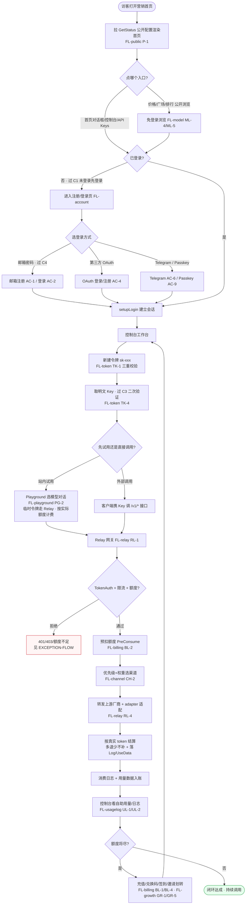
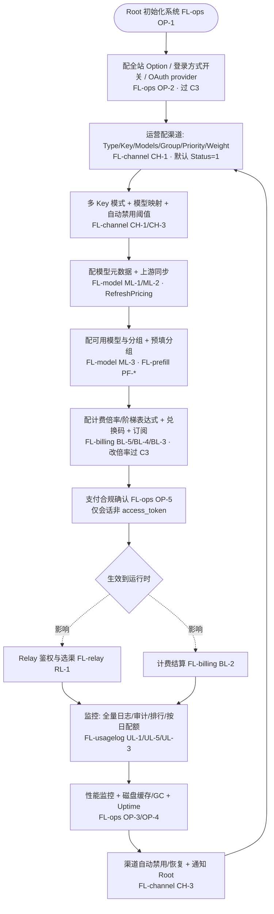

# BUSINESS-MAIN-FLOW — 端到端业务主流程（主干闭环）

> 项目：基于 new-api 的 AI API 网关 SaaS（RoutifyAPI）。
> 本文件从 14 个 `flow/FL-*.md` 中抽取**主干闭环**，串成一条端到端的用户侧主流程与一条管理员侧运营链路。
> 细节分支/异常/状态下沉到各 FL 文件与 `EXCEPTION-FLOW.md`，本文件只画主链路（happy path）。
> 跨切面契约（C1 未登录先登录 / C3 二次验证 / C4 Turnstile / C5 self-scope）见 `OVERALL-FLOW.md §3`，本文件仅标注「过 Cn」。

---

## 1. 用户侧主链路（访客 → 注册 → 建 Key → Playground 试用 → 正式调用 → 扣费 → 看用量）

> 这是产品的**核心价值闭环**：一个访客从落地到产生第一笔计费、再回到查看自己的用量，全程跨「公开站点 / 控制台 / Relay 网关」三端。

### 用户侧主链路文字说明

1. **落地与发现（FL-public）**：访客打开营销首页，前端拉 `GetStatus` 按开关条件渲染（公告/FAQ/价格入口）。价格页、模型广场、排行榜免登录可看，用于建立信任。
2. **身份建立（FL-account · 过 C4/C1）**：点击受限入口（控制台/Playground/API Keys）触发「未登录先登录」契约 C1，带 `returnUrl` 跳登录。支持邮箱密码（过 C4 Turnstile）、第三方 OAuth、Telegram、Passkey 多入口，统一汇到 `setupLogin` 建会话。
3. **建 Key（FL-token · 过 C3）**：控制台新建令牌经「名称长度→令牌数上限→额度区间」三重串行校验，`GenerateKey()` 生成唯一 `sk-` 前缀 key。列表默认掩码，取明文须过 C3 二次验证 + `CriticalRateLimit + DisableCache`。
4. **试用（FL-playground）**：用户可先在 Playground 选模型对话——构造临时令牌 `playground-<group>` 走 Relay（复用 RL-1），按用户实际额度计费、流式逐块渲染。降低首次调用门槛。
5. **正式调用（FL-relay RL-1）**：客户端携 Key 调 `/v1/chat/completions` 等端点，经 `TokenAuth → ModelRequestRateLimit → Distribute` 中间件链进入 Relay。
6. **扣费（FL-billing BL-2 + FL-channel CH-2）**：转发前 `PreConsumeQuota` 预扣冻结额度；选渠引擎按优先级分层 + 权重随机选满足（分组+模型）的渠道；adapter 转厂商原生协议转发；上游返回后按真实 token 结算（多退少不补），失败则全额返还。
7. **观测与续费（FL-usagelog + FL-billing/FL-growth）**：消费日志与用量数据入账，用户在控制台看本人用量看板（quota/rpm/tpm）。额度将尽时通过充值、兑换码、每日签到、邀请额度划转补充，回到工作台形成闭环。

---

## 2. 管理员侧运营链路（配渠道 → 配模型 → 配计费 → 监控）

> 管理员/运营/Root 的链路保证用户侧能跑通：渠道有上游、模型可见、计费正确、运行可观测。

### 管理员侧运营链路文字说明

1. **初始化（FL-ops OP-1）**：首访 setup 向导创建 Root 账号（幂等防重），写自用/演示模式开关，置 `constant.Setup=true`。
2. **全站配置（FL-ops OP-2 · 过 C3）**：Root 配 Option（登录方式开关、OAuth provider、限流分组、主题）。敏感键读取时剔除，写入逐键校验，审计仅记 key 不记 value。
3. **配渠道（FL-channel CH-1/CH-3）**：运营创建渠道（含上游 Key、模型列表、分组、优先级、权重），可开多 Key 模式、配模型映射与自动禁用阈值（AutoBan）。
4. **配模型（FL-model ML-1/ML-2/ML-3 + FL-prefill）**：维护模型元数据，从 `basellm.github.io` 同步上游模型（预览→应用），配置可用分组与启用模型；预填分组减少渠道/令牌配置重复输入。
5. **配计费（FL-billing BL-5/BL-4/BL-3 · 改倍率过 C3）**：配模型/分组/补全/缓存倍率与阶梯表达式计费；生成兑换码、配订阅计划。改倍率为高危操作走二次验证 + 审计。需先过支付合规确认（OP-5）。
6. **监控（FL-usagelog + FL-ops + FL-channel CH-3）**：管理员看全量日志/审计/按日配额/排行榜，看性能监控面板（内存/磁盘/GC/Goroutine）与 Uptime-Kuma 状态；渠道出错触发自动禁用并通知 Root，恢复后自动启用，反馈回渠道配置形成运维闭环。

---

## 3. 两条链路的交汇点（用户侧 ⊗ 管理员侧）

| 交汇点 | 用户侧动作 | 管理员侧配置 | 契约/约束 |
|---|---|---|---|
| Relay 鉴权 | 携 Key 调 /v1 | 渠道 Status / 模型分组 / 限流分组 | C5 self-scope、TokenAuth |
| 计费结算 | 产生消费 | 倍率/阶梯/订阅配置 | BL-2 预扣结算、BL-5 快照重算 |
| 模型可见 | 查可用模型 | ML-3 分组启用模型 | UserAuth、分组聚合去重 |
| 用量观测 | 看本人日志 | 看全量日志/审计 | C5 self-scope vs AdminAuth |
| 渠道健康 | 调用失败重试 | CH-3 自动禁用/恢复 | 通知 Root、RetryTimes |

---

## 4. 主流程完整性结论

- **用户侧闭环完整**：访客→注册→建 Key→（Playground 试用）→正式调用 Relay→预扣/选渠/转发/结算→看用量→续费 全链贯通，每一段都有对应 FL 细图支撑（FL-public / FL-account / FL-token / FL-playground / FL-relay / FL-channel / FL-billing / FL-usagelog / FL-growth）。
- **管理员侧链路完整**：初始化→全站配置→配渠道→配模型→配分组→配计费→合规确认→监控运维 全链贯通（FL-ops / FL-channel / FL-model / FL-prefill / FL-billing / FL-usagelog）。
- **交汇点闭合**：用户侧调用的鉴权、计费、模型可见、用量观测、渠道健康均由管理员侧配置驱动，两条链路在 Relay 与计费节点交汇，形成可自洽运转的 SaaS 主流程。
