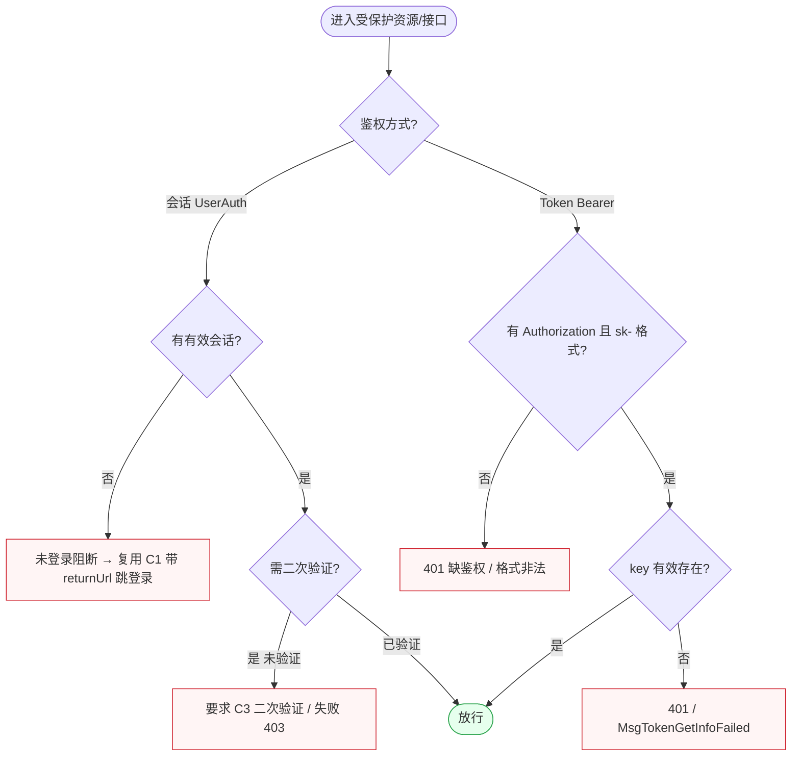
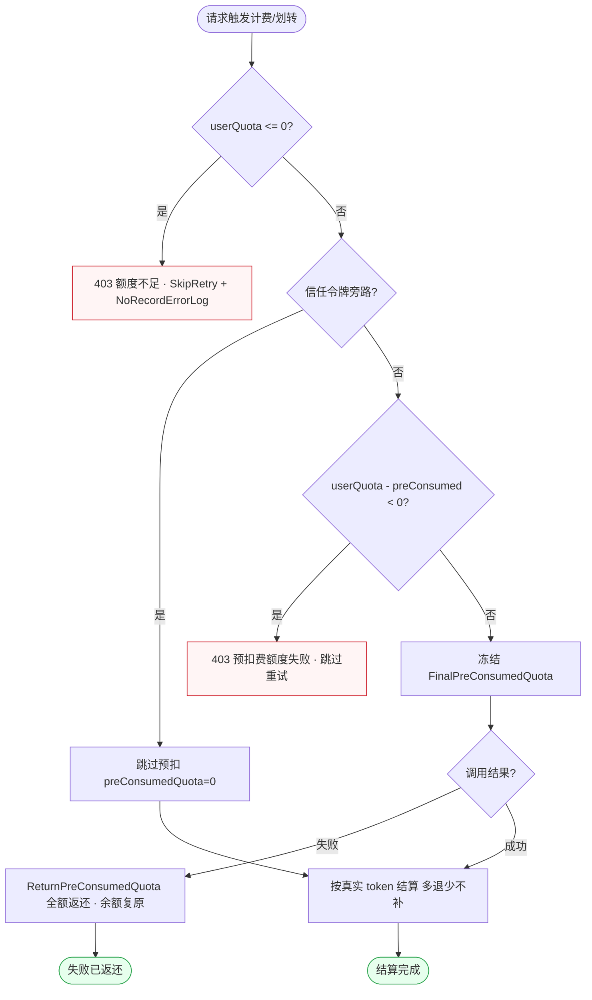
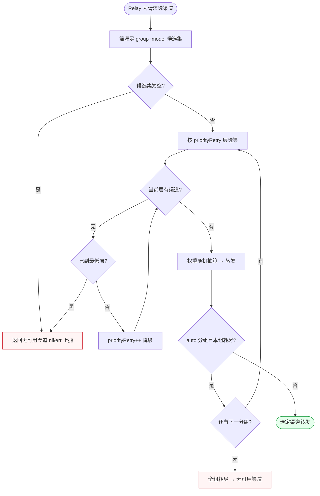
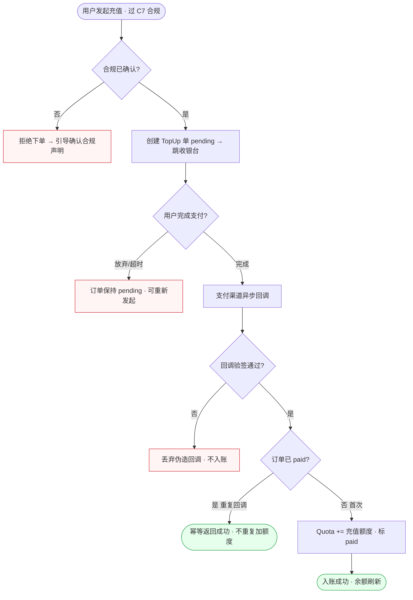
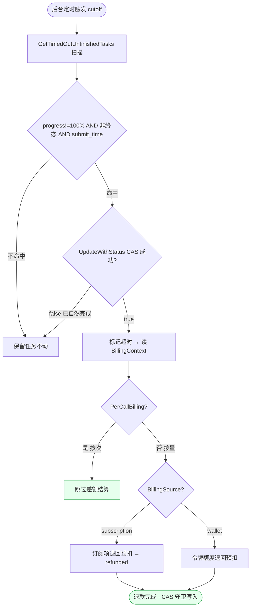
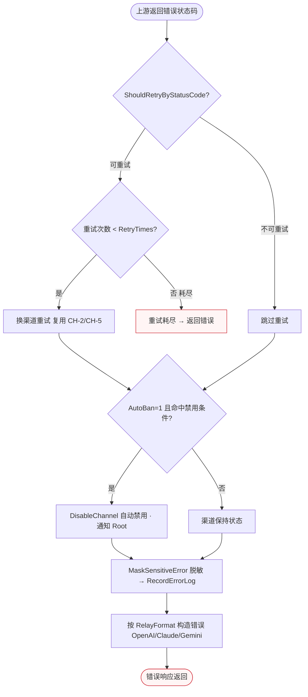
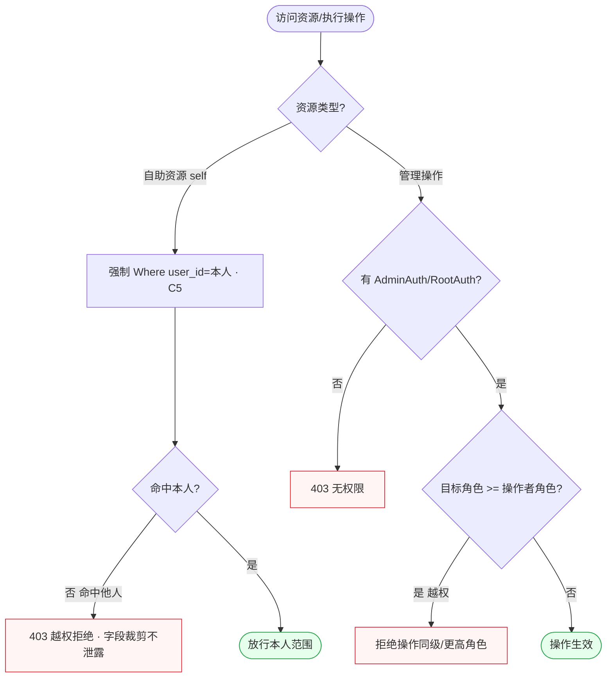
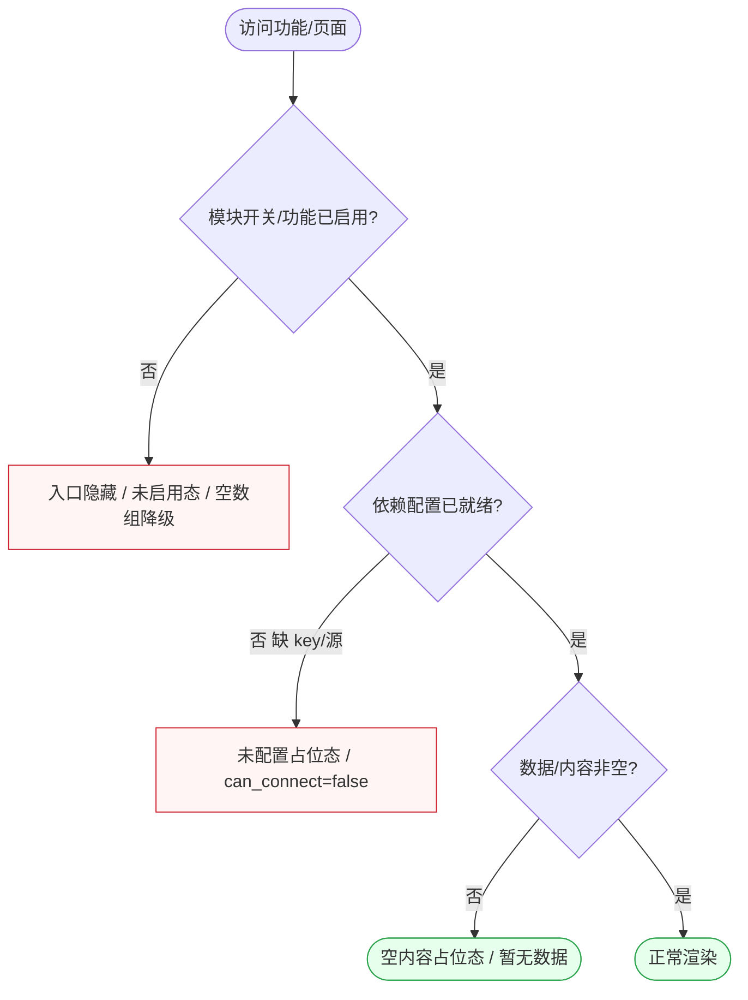

# EXCEPTION-FLOW — 全局异常流程汇总

> 项目：基于 new-api 的 AI API 网关 SaaS（RoutifyAPI）。
> 本文件汇总 14 个 `flow/FL-*.md` 中**跨场景复用的全局异常**，归类为 8 大类，每类给出触发条件、跨场景出现位置、处理策略、用户/系统反馈。
> 单场景独有的局部异常（如「用户名重复」「区间非法」）仍在各 FL 文件就地处理，本文件只收**跨场景共性异常**与**主链路关键异常**。

---

## 0. 异常类目总览

| 类目 | 异常名 | 主要触发链路 | 处理策略关键词 |
|---|---|---|---|
| EX-A | 鉴权失败 | Relay / 控制台 / 外部 API | 401/403、拒绝、引导登录/二次验证 |
| EX-B | 额度不足 | Relay 预扣 / 划转 / 充值 | 403 SkipRetry、引导充值、返还 |
| EX-C | 渠道全不可用 | 选渠 / 跨分组重试 | nil/err 上抛、自动禁用、降级提示 |
| EX-D | 支付/回调失败 | 充值 / 合规 | 验签丢弃、幂等、保持 pending |
| EX-E | 任务超时 | 异步任务 / 视频 | CAS 守卫超时标记、退款 |
| EX-F | 上游限流/错误 | Relay / 外部只读 API | 按状态码重试/禁用、脱敏记录 |
| EX-G | 权限拦截/越权 | 自助资源 / 管理端 | C5 self-scope、角色优先级、403 |
| EX-H | 配置缺失/未启用 | 公开页 / 集成 / 模块开关 | 入口隐藏、降级占位、未启用态 |

---

## EX-A · 鉴权失败（401/403）

**触发条件**：会话过期/无会话（控制台、Playground）；Token Key 无效/缺 Authorization 头/非 bearer 格式（Relay、外部 API）；二次验证未通过（取明文 Key、改倍率等高危动作）；TurnstileCheck 失败（注册/登录/签到）。

**跨场景出现**：FL-account AC-2（账号密码错/封禁）、FL-token TK-6（401 缺鉴权/格式非法）、FL-relay RL-1（TokenAuth 拒绝）、FL-usagelog UL-4（无效令牌）、FL-playground PG-1（匿名引导登录）、FL-ops OP-5（access_token 拒绝）。

**处理策略**：会话类 → C1 带 returnUrl 跳登录、登录后回原路径；高危动作 → C3 二次验证闸门（密码/TOTP/Passkey）；Token 类 → 直接返回 401/403，错误信息脱敏，不泄露 key 是否存在的差异（防枚举）；登录/注册类失败统一文案不区分「账号不存在 vs 密码错」。

---

## EX-B · 额度不足

**触发条件**：Relay 预扣时 `userQuota<=0` 或 `userQuota-preConsumed<0`；邀请额度划转 `quota<QuotaPerUnit` 或 `AffQuota` 不足；订阅额度耗尽且不允许钱包溢出。

**跨场景出现**：FL-billing BL-2（预扣 403）、FL-billing BL-3（订阅兜底被阻）、FL-growth GR-5（划转额度不足）、FL-relay RL-1、FL-playground PG-3（气泡提示额度不足）。

**处理策略**：预扣阶段额度不足 → 403 + `SkipRetry`（不浪费重试）、引导用户充值/签到/兑换/邀请划转；请求失败 → 异步全额返还冻结额度；结算阶段 → 多退（实际<预扣回补）、少不补（仅补记不追扣）；Playground 以对话气泡降级提示而非整页报错。

---

## EX-C · 渠道全不可用

**触发条件**：满足（分组+模型）的候选渠道集为空；优先级层逐层降级到最低层仍无渠道；auto 分组全组耗尽；亲和命中渠道失败且 `SkipRetryOnFailure=true`。

**跨场景出现**：FL-channel CH-2（无可用渠道 nil/err）、FL-channel CH-5（全组耗尽）、FL-relay RL-1（选渠失败上抛）、FL-relay RL-3（重试耗尽）、FL-playground PG-3（气泡提示无可用渠道）。

**处理策略**：优先级分层 + 权重随机逐层降级；auto 分组逐组耗尽切下一组（`CrossGroupRetry` 控制本次/下次切组）；最终全不可用 → 返回明确「无可用渠道」错误（区别于上游错误）；亲和规则 `SkipRetryOnFailure=true` 时失败不跨渠道重试以保会话稳定；渠道反复出错配合 AutoBan 自动禁用（见 EX-F）。

---

## EX-D · 支付/回调失败

**触发条件**：支付回调验签失败（伪造回调）；用户放弃/超时未完成支付；重复回调（订单已 paid）；合规未确认就发起金额流转。

**跨场景出现**：FL-billing BL-1（充值回调）、FL-growth GR-5（划转过 payment_compliance）、FL-ops OP-5（合规确认）、FL-ops OP-2（QuotaForInviter 正值需先合规）。

**处理策略**：额度入账**只在回调验签通过后**发生（两段式）；以订单号做幂等键，重复回调直接返回成功不重复加额度；验签失败的伪造回调静默丢弃；放弃/超时订单保持 pending 可重发；任何金额流转前先过支付合规闸门（C7），合规字段禁止经通用选项接口篡改。

---

## EX-E · 任务超时

**触发条件**：异步任务（MJ/Suno/视频）`progress!=100%` 且非终态、`submit_time<cutoff`；后台定时扫描命中超时任务。

**跨场景出现**：FL-asynctask AT-1（状态机轮询）、AT-3（超时扫描）、AT-4（超时退款）、FL-relay RL-5（视频任务未完成）。

**处理策略**：所有超时标记与退款**必须走 `UpdateWithStatus`（CAS 守卫）**，以 `fromStatus` 为 WHERE 条件，避免覆盖已自然完成的任务（禁用无守卫 bulk update）；按次计费任务超时跳过差额结算；按量任务按 `BillingSource` 退回预扣（订阅转 refunded / 钱包退令牌额度）；视频内容代理对未完成任务返回当前状态错误而非超时直接 404。

---

## EX-F · 上游限流/错误

**触发条件**：上游厂商返回错误状态码（限流 429、5xx 等）；外部只读 API 高频触发 `CriticalRateLimit`；模型请求超 `ModelRequestRateLimit`；发码/搜索限流。

**跨场景出现**：FL-relay RL-1/RL-3（上游错误处理）、FL-usagelog UL-4（CriticalRateLimit 拦截）、FL-token TK-3（SearchRateLimit）、FL-account AC-1（发码过频）、FL-playground PG-3（上游暂不可用）。

**处理策略**：按状态码判定可重试/不可重试；可重试且未达 `RetryTimes` → 换渠道重试；满足禁用条件且渠道 `AutoBan=1` → 自动禁用并通知 Root（见 EX-C/CH-3）；错误日志经 `MaskSensitiveErrorWithStatusCode` 脱敏后记录 channel/model/status_code；错误响应按渠道协议（OpenAI/Claude/Gemini）分别构造；客户端类限流（发码/搜索/取明文）→ 提示「稍后重试」。

---

## EX-G · 权限拦截/越权

**触发条件**：普通用户访问 AdminAuth/RootAuth 接口；自助接口尝试查他人 user_id 资源；管理员越权操作同级/更高角色；OAuth/Telegram 解绑越权或锁死风险。

**跨场景出现**：FL-account AC-10（角色优先级）、AC-11（解绑越权）、FL-token TK-4（取他人令牌）、FL-usagelog UL-1（自助维度受限）、FL-asynctask AT-2/AT-3（self-scope / 403）、FL-prefill PF-1（非管理员 403）。

**处理策略**：自助资源统一过 C5 self-scope（按 user_id 强制过滤 + Omit 敏感字段如 channel_id、PrivateData/key 不序列化），命中他人返回 403；管理操作走角色优先级闸门（root>admin>common，不可操作同级/更高角色，提升不可越界）；OAuth/Telegram 解绑校验本人归属 + 仅剩一种登录方式时二次确认防锁死。

---

## EX-H · 配置缺失/未启用

**触发条件**：模块开关关闭（rankings/pricing 等 `HeaderNavModuleAuth`）；功能未启用（签到、Telegram、io.net、邮箱验证）；公开页内容未配置；集成 key 缺失；上游同步/Uptime 拉取失败。

**跨场景出现**：FL-public P-3/P-4（协议/隐私入口隐藏）、FL-growth GR-1/GR-2（签到未启用）、FL-account AC-5/AC-6（微信/Telegram 未配置）、FL-model ML-4/ML-5（模块不可见）、FL-deploy DP-1（io.net 未配置）、FL-ops OP-4（LogDir/Uptime 未配置）。

**处理策略**：模块开关关闭 → 入口隐藏（404/重定向首页 / 空数组），不暴露功能存在；功能未启用 → 明确「未启用」错误态而非报错；公开页内容未配置 → 空内容占位态（非异常崩溃）；集成 key 缺失 → `can_connect=false` + 明确提示「api_key is required」；外部拉取失败（上游同步/Uptime/GetStatus）→ 降级到默认壳 + 重试 / 单组返回空，不阻塞整页。

---

## 异常流程完整性结论

- **8 大类全局异常齐备**：鉴权失败（EX-A）、额度不足（EX-B）、渠道全不可用（EX-C）、支付/回调失败（EX-D）、任务超时（EX-E）、上游限流/错误（EX-F）、权限拦截/越权（EX-G）、配置缺失/未启用（EX-H），覆盖任务要求的全部跨场景异常类型。
- **每类均给出处理策略**：含触发条件、跨场景出现位置、Mermaid 处理图、文字策略（拒绝/降级/重试/返还/幂等/脱敏/隐藏）。
- **与契约一致**：异常处理统一引用 OVERALL-FLOW §3 的 C1（未登录先登录）、C3（二次验证）、C5（self-scope）、C7（支付合规），不重复定义。
- **可作 S4/S6 错误态输入**：每类异常的终态文案与降级方式已明确，供原型设计错误页/空态/拦截态使用。
