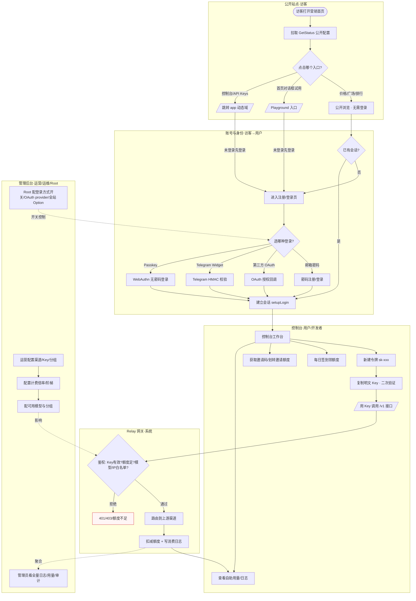

# OVERALL-FLOW — 整体交互大图（跨端·跨模块·跨角色主干）

> 项目：基于 new-api 的 AI API 网关 SaaS（RoutifyAPI）。
> 本文件是 S3 第一批（公开/账号/增长/令牌/用量日志）所属主干的**整体大图**：把访客→注册登录→建 Key→调用→看用量计费这条端到端主链路，连同管理员配渠道/模型/计费的运营链路，跨端跨角色串成一张可跑通的图。
> 细粒度分支/异常/终态下沉到 `flow/FL-*.md`，本图只保证主干、角色切换、端间跳转一个不漏。

---

## 0. 端与角色总览

| 端 | 角色 | 主要触点 |
|---|---|---|
| 公开站点（www 营销域） | 访客 Guest | 首页/价格/协议/隐私/模型广场/排行榜/Playground 入口 |
| 控制台（app 动态域） | 用户 User / 开发者 Developer | 令牌、额度、签到、邀请、任务、自助日志/用量 |
| 管理后台（admin 子集） | 运营 Operator / 运维 SRE / 管理员 Admin | 渠道、计费倍率、用户管理、全量日志/审计/用量 |
| 系统设置 | Root 超管 | 全站 Option、OAuth provider、限流、登录方式开关 |
| 外部系统 | — | GitHub/Discord/OIDC/LinuxDO/WeChat/Telegram OAuth、上游模型供应商 |

业务对象：User / Session / Token / Quota(钱包) / Log / QuotaData / Checkin / aff_code(邀请) / Channel / Ratio(计费)。

---

## 1. 主干大图（按端/角色分 subgraph）

---

## 2. 主干路径清单（happy path + 主异常）

> 每条路径标出经过的端/角色/模块，作为细图与原型整体导航骨架。

### MP-1 访客自助开通到首次调用（核心 happy path）
公开站点[访客] → 注册/登录页[访客→用户] → 控制台新建令牌[用户] → 复制明文 Key（二次验证）[用户] → 用 Key 调 /v1[Developer] → Relay 鉴权扣额写日志[系统] → 控制台看自助用量[用户]。
跳转：www→app（跨端深链，未登录先跳登录）；app→/v1（API 调用，非页面跳转）。

### MP-2 增长闭环（签到 + 邀请返利）
控制台工作台[用户] → 每日签到领随机额度[用户] →（额度入钱包，可直接用于调用）。
并行：获取邀请码[用户] → 分享 → 被邀请人带 aff_code 注册[访客] → 邀请人 AffQuota 自动入账[系统] → 邀请人划转邀请额度为可用额度[用户]。

### MP-3 管理员运营链路（配渠道/模型/计费）
Root 配登录方式开关/OAuth provider[Root] → 运营配渠道+上游 Key+分组[Operator] → 配计费倍率/阶梯[Operator] → 配可用模型[Operator] →（生效到 Relay 鉴权与计费）。
跳转：管理后台为独立 admin 角色视图；改倍率/取上游 Key 为高危操作，走二次验证 + 审计。

### MP-4 用量与计费观测闭环
用户调用产生消费日志[系统] → 用户自助日志/用量统计（仅本人）[用户]；同一批日志 → 管理员全量日志/按日配额/排行榜[Admin]。
排行榜 /rankings 为公开/半公开（受模块开关控制），访客也可见快照。

### 主异常路径（细节见各 FL 文件）
- **EX-1 未登录阻断**：访问受限入口（控制台/Playground/API Keys）→ 未登录阻断 → 跳登录 → 回原路径。（跨切面契约，§3）
- **EX-2 注册被禁/验证码错**：RegisterEnabled=false 或邮箱验证码错/过期 → 注册失败。
- **EX-3 Key 取明文被限流/越权**：高频取明文被 CriticalRateLimit 拦截；取他人令牌返回错误。
- **EX-4 调用被拒**：Key 失效/额度耗尽/模型不在白名单/IP 不在白名单 → Relay 拒绝。
- **EX-5 签到重复/未启用**：当日已签到 → 今日已签到；签到开关关 → 未启用。
- **EX-6 邀请额度不足/低于最小单位**：划转 quota<QuotaPerUnit 或 AffQuota 不足 → 拒绝划转。

---

## 3. 跨切面契约（只记一次，全项目复用）

> 下列契约在各 `flow/FL-*.md` 中以「复用【契约名】」引用，不重画图体。

### 契约 C1 · 未登录先登录（externalAuth gate）
进入受限入口 → 检测无会话 → 未登录阻断态 → 跳登录页（保存 returnUrl）→ 登录成功 → 回原路径。
适用：控制台、Playground、API Keys、任何 UserAuth 保护入口。

### 契约 C2 · externalJump 四态（外跳第三方）
跳转前确认态 → 跳转中态 → 跳转失败/超时态（重试+返回）→ 跳转返回态。
适用：所有 OAuth provider 授权外跳、上游供应商外链。

### 契约 C3 · 二次验证闸门（SecureVerification）
触发高危动作 → 检测是否已二次验证 → 未验证则要求验证（密码/TOTP/Passkey）→ 验证通过放行 / 失败拦截。
适用：取令牌明文 Key、取上游渠道 Key、改计费倍率、封禁/重置 2FA、改全站 Option。

### 契约 C4 · 人机校验（TurnstileCheck）
提交前置 → Turnstile 校验 → 通过进入业务逻辑 / 失败拦截。
适用：注册、登录、发验证码、签到。

### 契约 C5 · self-scope 越权防护
任何自助资源接口按 user_id 强制过滤 → 命中本人放行 / 命中他人返回 403。
适用：令牌、额度、任务、自助日志/用量。

---

## 4. 与细图的对应

| 主干段 | 细图文件 |
|---|---|
| 公开站点入口/协议/主题语言 | `flow/FL-public.md` |
| 注册/登录/OAuth/Telegram/Passkey/2FA | `flow/FL-account.md` |
| 签到状态机 + 邀请返利分销 | `flow/FL-growth.md` |
| 令牌生命周期/明文 Key/白名单/用量查询 | `flow/FL-token.md` |
| 全量/自助日志、按日配额、排行榜、审计 | `flow/FL-usagelog.md` |
