# FL-account — 账号与身份（D1 + D4 Telegram登录）流程图

> 分片：账号与身份 D1（F-1001~F-1038）+ Telegram 登录 Bot D4（F-1051~F-1054）。
> 角色：访客 / 注册用户 / 登录用户 / 管理员 / Root / 系统。
> 跨切面契约见 `../OVERALL-FLOW.md §3`：C2 externalJump（OAuth 外跳）、C3 二次验证、C4 Turnstile（注册/登录前置）。本文件不重画 C4，仅在节点标注「过 C4」。

---

## 场景 AC-1 · 邮箱密码注册（含验证码 + 邀请归因）（F-1001/F-1004/F-1005/F-1040）

> 业务规则：`RegisterEnabled=false` 拒绝；用户名重复 `MsgUserExists`；`EmailVerificationEnabled` 开启时验证码错/过期拒绝；携带有效 `aff_code` 则写 `InviterId`；成功后 `Role=common`、`Quota=QuotaForNewUser`、生成 4 位 `aff_code`。多重串行校验链。

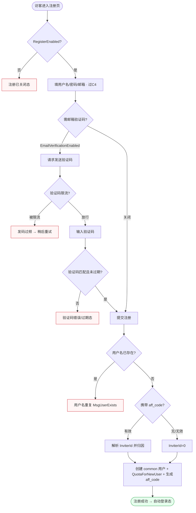

屏幕状态清单（AC-1 邮箱注册）：
- 注册已关闭态（RegisterEnabled=false） ← 异常终态
- 注册表单默认态（过 C4 人机校验）
- 发码过频限流态 ← 异常
- 验证码错误/过期态 ← 异常
- 用户名重复态（MsgUserExists） ← 异常
- 邀请归因态（带 aff_code，提示「来自邀请」）
- 注册成功自动登录态 ← 终态

---

## 场景 AC-2 · 邮箱密码登录（封禁拦截）（F-1002）

> 业务规则：凭证正确**且** `Status=UserStatusEnabled` 才建会话；被封禁用户登录被拒；过 C4 + CriticalRateLimit。短链 + 状态闸门。

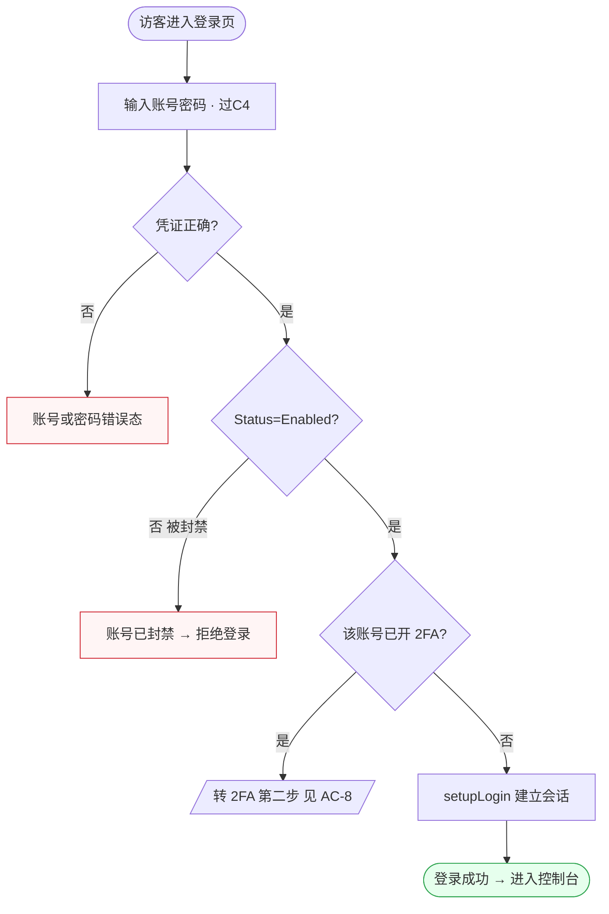

屏幕状态清单（AC-2 邮箱登录）：
- 登录表单默认态（过 C4）
- 账号或密码错误态 ← 异常
- 账号已封禁拒绝态 ← 异常
- 转 2FA 第二步态（已开 2FA，跳 AC-8）
- 登录成功进控制台态 ← 终态

---

## 场景 AC-3 · 找回密码（发重置邮件→提交新密码）（F-1006/F-1007）

> 业务规则：向**已注册**邮箱发重置令牌（非注册邮箱不发有效令牌）；提交 reset 时令牌无效/过期拒绝；两段式，跨「发件」与「重置」两个时刻。

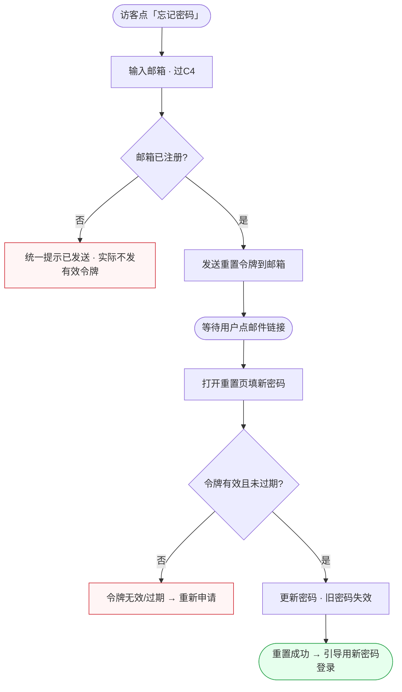

屏幕状态清单（AC-3 找回密码）：
- 填邮箱默认态（过 C4）
- 未注册邮箱统一提示态（防枚举，不发有效令牌） ← 异常处理
- 已发送等待态（邮件已寄出）
- 填新密码态（令牌跳转后）
- 令牌无效/过期态（重新申请） ← 异常
- 重置成功引导登录态 ← 终态

---

## 场景 AC-4 · 第三方 OAuth 登录/注册/绑定（多 provider 分发）（F-1016/F-1018/F-1019/F-1020/F-1025）

> 业务规则：先 `GET /oauth/state` 生成 CSRF state（可带 aff），回调校验 state；provider 未启用拒绝；`RegisterEnabled=false` 时不创建新用户；已登录会话走绑定分支；LinuxDO 额外校验信任级。复用契约 C2（externalJump 四态）。

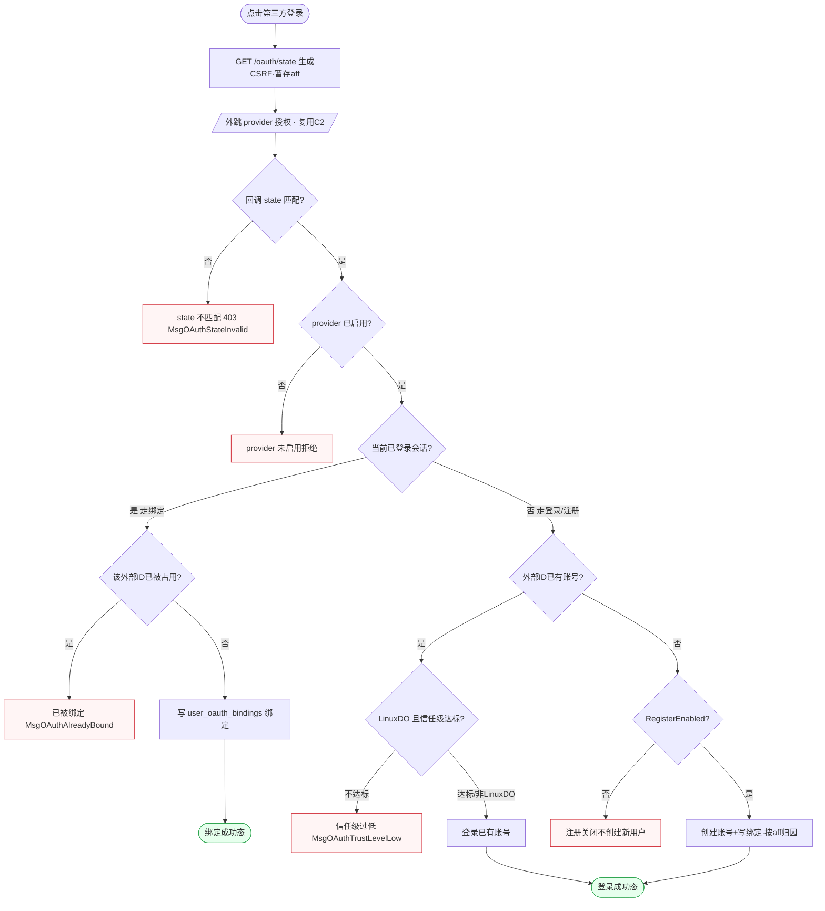

屏幕状态清单（AC-4 OAuth 登录/绑定）：
- 外跳授权前确认态/跳转中态（复用 C2）
- state 不匹配拒绝态（403） ← 异常
- provider 未启用态 ← 异常
- 已被绑定态（MsgOAuthAlreadyBound） ← 异常
- 绑定成功态 ← 终态
- 信任级过低态（LinuxDO） ← 异常
- 注册关闭不创建态 ← 异常
- 登录成功态（已有账号 / 新建账号 + aff 归因） ← 终态

---

## 场景 AC-5 · WeChat 扫码授权登录/绑定（F-1021/F-1022）

> 业务规则：先 `GET /oauth/wechat` 发起授权获取 `wechat_id`，再 `POST /oauth/wechat/bind` 完成；已登录则绑定，未登录且 wechat_id 存在则登录对应用户；微信未配置不可用。扫码态 + 轮询特性，区别于标准 OAuth 重定向。

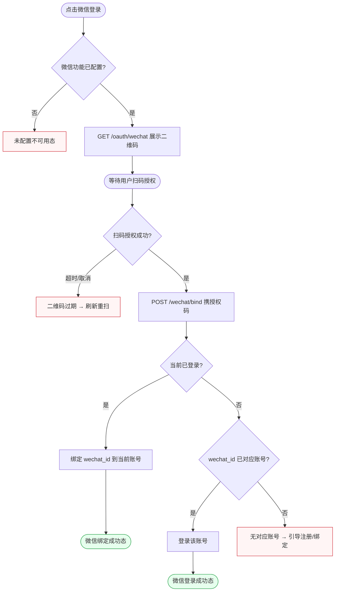

屏幕状态清单（AC-5 微信扫码）：
- 微信未配置不可用态 ← 异常终态
- 二维码展示等待扫码态
- 二维码过期刷新态 ← 异常
- 微信绑定成功态（已登录绑定） ← 终态
- 微信登录成功态（未登录且有对应账号） ← 终态
- 无对应账号引导态 ← 异常

---

## 场景 AC-6 · Telegram Widget 登录（HMAC 防伪）（F-1051/F-1053）

> 业务规则：`TelegramOAuthEnabled=false` 返回未开启；用 `key=SHA256(BotToken)` 对**按字典序拼接的非 hash 参数**做 HMAC-SHA256，与传入 `hash` 一致才登录对应 `telegram_id`；篡改任一参数 → hash 不等 → 拒绝。安全校验密集型。

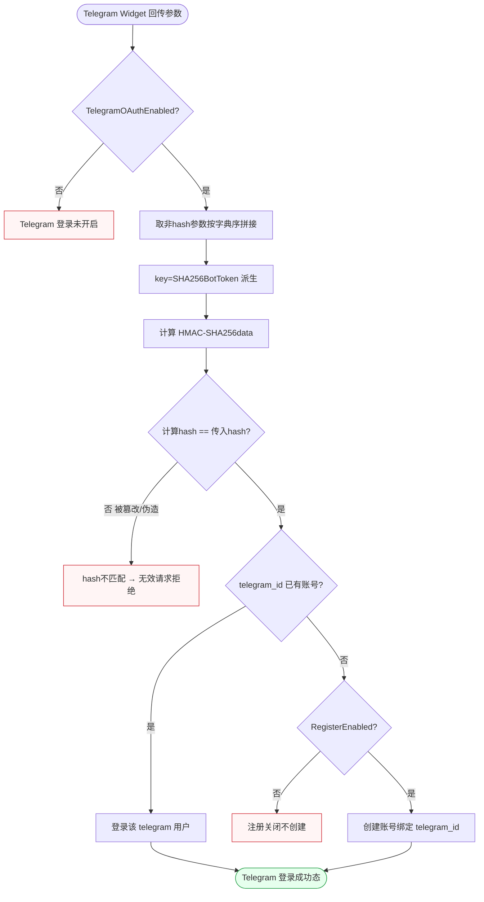

屏幕状态清单（AC-6 Telegram 登录）：
- Telegram 登录未开启态 ← 异常终态
- hash 不匹配拒绝态（防伪失败） ← 异常
- Telegram 登录成功态（已有账号） ← 终态
- 注册关闭不创建态 ← 异常
- 新建账号登录成功态 ← 终态

---

## 场景 AC-7 · Telegram 绑定到现有账号（唯一性校验）（F-1052/F-1054）

> 业务规则：登录用户 `GET /oauth/telegram/bind`，HMAC 校验后将 `telegram_id` 写入当前用户；该 telegram 已被绑定 → `IsTelegramIdAlreadyTaken` 返回「已被绑定」；用户已注销报错；成功后 302 跳 `/console/personal`。绑定唯一性闸门是核心判定。

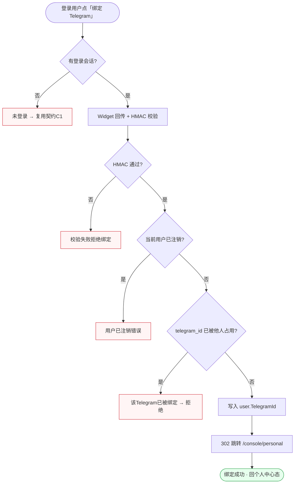

屏幕状态清单（AC-7 Telegram 绑定）：
- 未登录阻断态（复用 C1） ← 异常
- HMAC 校验失败态 ← 异常
- 用户已注销错误态 ← 异常
- Telegram 已被占用态（唯一性拒绝） ← 异常
- 绑定成功回个人中心态（302） ← 终态

---

## 场景 AC-8 · 2FA 启用 + 登录二次校验（F-1033/F-1036）

> 业务规则：`setup` 返回 TOTP 密钥，`enable` 校验首个 TOTP 通过才开启；登录时已开 2FA 的账号须 `POST /login/2fa` 传 TOTP/备份码，错误拒绝。一个状态机跨「配置期」与「登录期」。

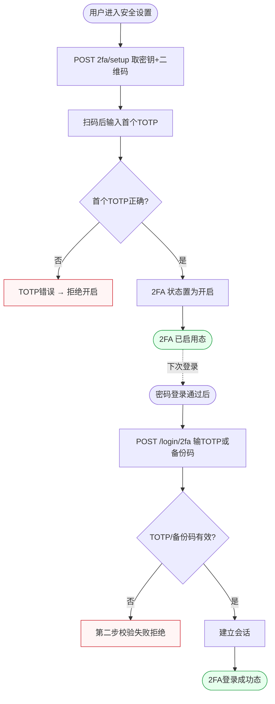

屏幕状态清单（AC-8 2FA 启用+登录）：
- setup 展示密钥/二维码态
- 首个 TOTP 错误拒绝开启态 ← 异常
- 2FA 已启用态 ← 终态（配置期）
- 登录第二步输入态（TOTP/备份码）
- 第二步校验失败态 ← 异常
- 2FA 登录成功态 ← 终态（登录期）

---

## 场景 AC-9 · Passkey 注册与无密码登录（F-1028/F-1029/F-1031）

> 业务规则：注册 `register/begin→finish` WebAuthn 凭据；登录 `login/begin→finish` 无密码校验通过即建会话；删除后 passkey 登录失效。begin/finish 两段挑战-应答，与密码/2FA 形态不同。

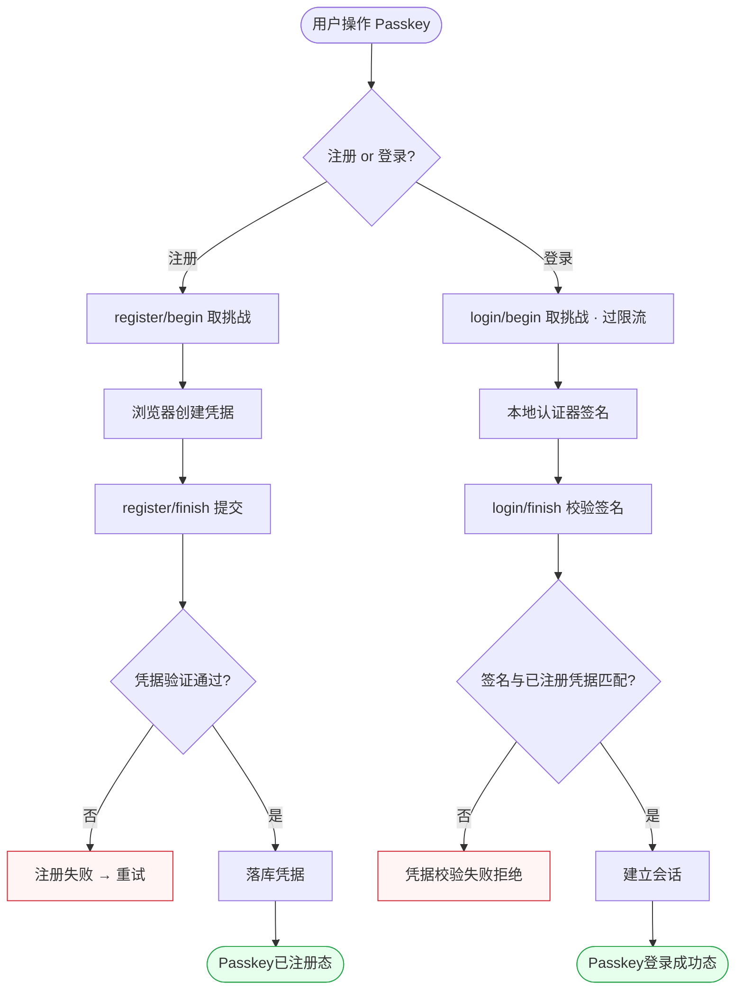

屏幕状态清单（AC-9 Passkey）：
- register/begin 挑战态
- 凭据创建中态
- 注册失败重试态 ← 异常
- Passkey 已注册态 ← 终态
- login/begin 挑战态（过限流）
- 凭据校验失败拒绝态 ← 异常
- Passkey 登录成功态 ← 终态

---

## 场景 AC-10 · 管理端用户管理（ManageUser 越权护栏）（F-1010）

> 业务规则：`POST /api/user/manage` 启用/禁用/提升/删除；需 AdminAuth；**不可对同级或更高角色越权**（admin 不能操作 root，不能操作平级 admin）。角色优先级闸门是核心。

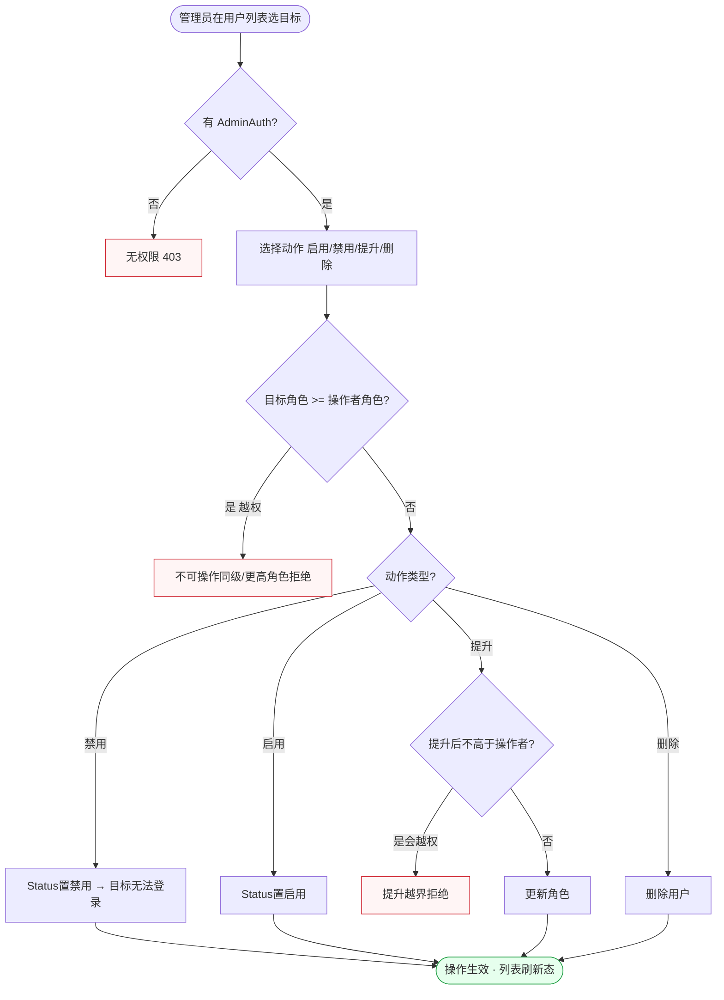

屏幕状态清单（AC-10 管理用户）：
- 无 AdminAuth 拒绝态（403） ← 异常
- 动作选择态（启用/禁用/提升/删除）
- 越权拒绝态（操作同级/更高角色） ← 异常
- 提升越界拒绝态 ← 异常
- 禁用生效态（目标无法登录） ← 终态
- 启用/提升/删除生效列表刷新态 ← 终态

---

## 场景 AC-11 · OAuth 绑定查看与解绑（本人 + 管理端）（F-1026/F-1027）

> 业务规则：本人 `DELETE /self/oauth/bindings/:provider_id` 仅能解绑本人；管理端 `GET/DELETE /user/:id/oauth/bindings` 需 AdminAuth。解绑后该 provider 不再能登录此账号。一个动作两个权限入口 + 末路保护。

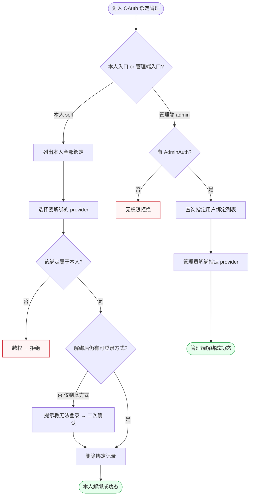

屏幕状态清单（AC-11 OAuth 绑定管理）：
- 本人绑定列表态
- 越权解绑拒绝态 ← 异常
- 仅剩一种登录方式二次确认态（防锁死）
- 本人解绑成功态 ← 终态
- 管理端无权限态 ← 异常
- 管理端用户绑定列表态
- 管理端解绑成功态 ← 终态
