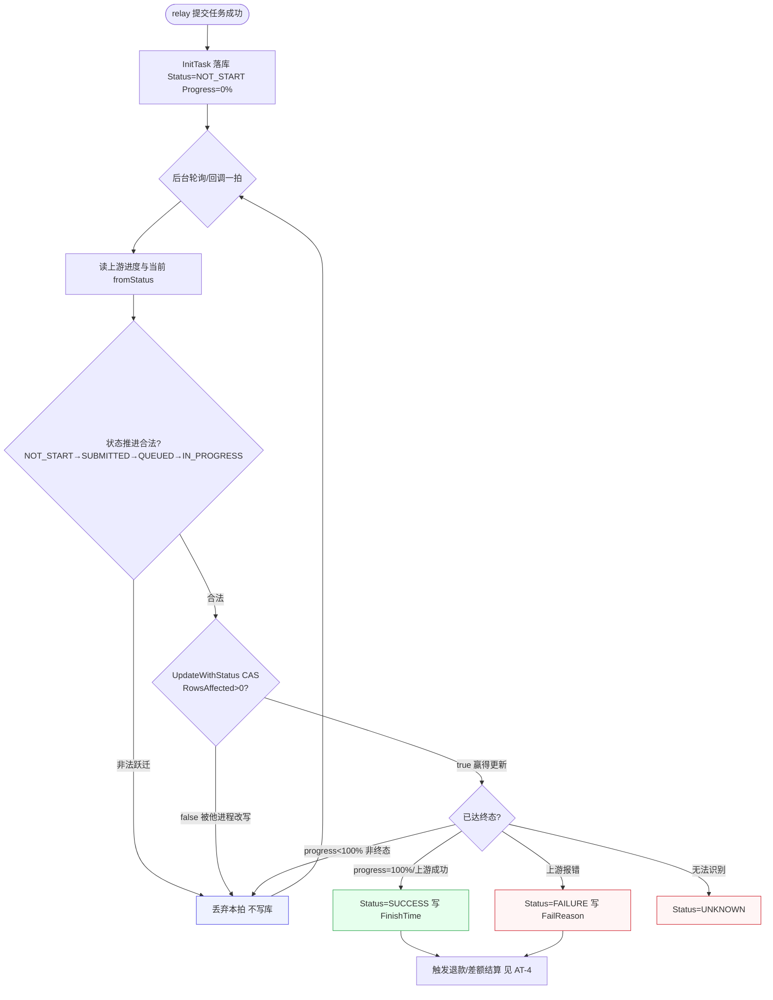
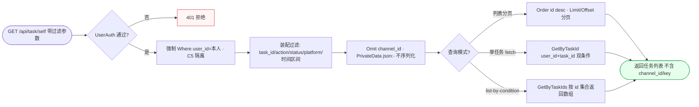
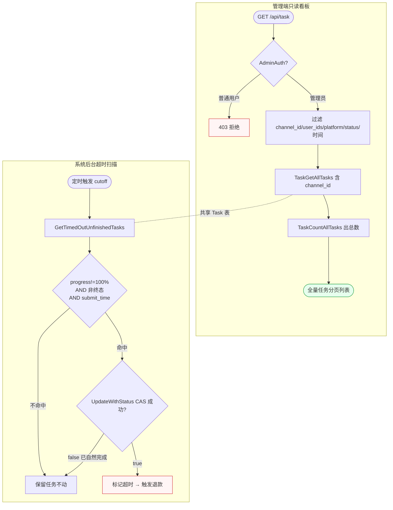
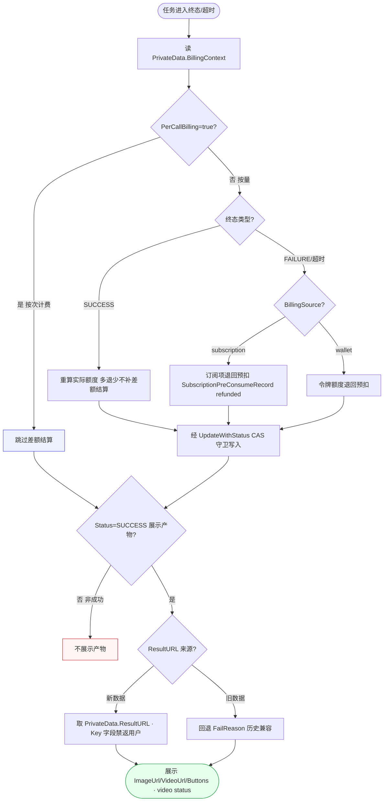
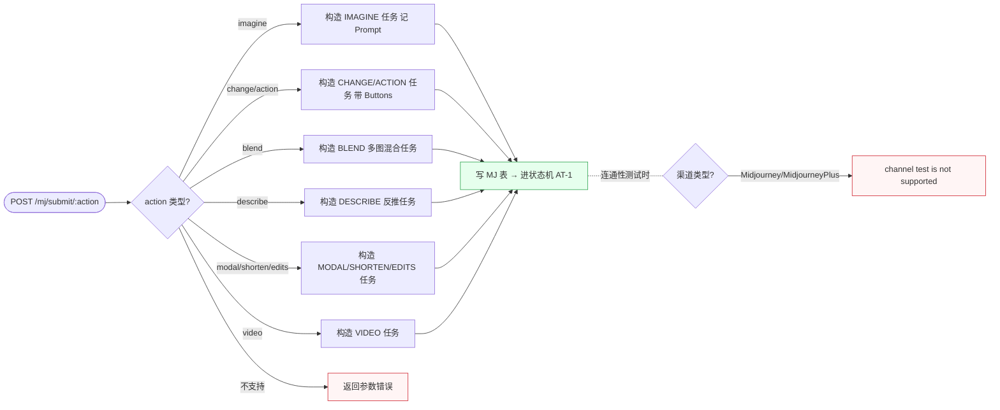

# FL-asynctask — 异步任务中心（D5）流程图

> 分片：异步任务中心（F-2001~F-2011）。MJ/Suno/视频任务的提交→排队→进度轮询→终态判定，含 CAS 条件更新、超时扫描、退款结算、产物展示。
> 角色：登录用户（提交/查询/拉取产物）/ 管理员（全量任务列表）/ 系统（状态机·轮询·CAS·退款·超时扫描·后台定时）。
> 跨切面契约见 `../OVERALL-FLOW.md §3`：C1 鉴权（TokenAuth/UserAuth）、C5 self-scope（TaskGetAllUserTask 强制 user_id 隔离 + Omit(channel_id)）。任务计费衔接见 `FL-billing.md`（预扣/退款），本文件标注「调退款结算」不重画倍率细节。
> 后端：`model/task.go`、`model/midjourney.go`、`controller/task_video.go`、`constant/task.go`。关键：`TaskStatusNotStart/Submitted/Queued/InProgress/Success/Failure`、`UpdateWithStatus`（CAS）、`GetTimedOutUnfinishedTasks`、`TaskPrivateData`、`ToVideoStatus`、`GetResultURL`。

---

## 场景 AT-1 · 任务提交后的状态机轮询循环（NOT_START→…→SUCCESS/FAILURE，含 CAS 守卫）（F-2001/F-2002/F-2005/F-2007/F-2008）

> 业务规则：relay 提交成功后 `InitTask` 以 `Status=TaskStatusNotStart、Progress=0%` 落库（MJ 走 `/mj/submit/:action`、Suno 走 `/suno/submit/:action`、视频走 `task_video.go` 按 provider adapter）。后台轮询/回调按状态机合法顺序推进 `NOT_START→SUBMITTED→QUEUED→IN_PROGRESS`，每次写入都用 `UpdateWithStatus(fromStatus, …)` 做 CAS：以 `fromStatus` 为 WHERE 守卫条件 UPDATE，`RowsAffected>0` 才算赢得更新（防并发覆盖），否则放弃本次写入等下一轮。`progress==100%` 或上游回报终态时进 `SUCCESS`，错误进 `FAILURE`，无法识别进 `UNKNOWN`。终态（SUCCESS/FAILURE）不可再被普通 bulk update 覆盖。本图为「提交落库 → 轮询循环（推进 ⊕ CAS 失败回退）→ 终态分叉」的自循环结构。

屏幕状态清单（AT-1 状态机轮询，用户任务详情 + 系统内部态）：
- 提交成功态（task_id 返回，DB 存在 NOT_START 行，progress=0%）
- 排队/进行中态（SUBMITTED/QUEUED/IN_PROGRESS，progress 递增）
- 非法跃迁丢弃态（状态机不允许的跳变，本拍不写库） ← 内部
- CAS 失败回退态（RowsAffected=0，被他进程改写，等下一拍） ← 内部
- 成功终态（SUCCESS，FinishTime 写入，触发结算） ← 终态
- 失败终态（FAILURE，FailReason 写入，触发退款） ← 终态/异常
- 未知终态（UNKNOWN，无法识别上游回报） ← 异常

---

## 场景 AT-2 · 用户任务列表分页查询与多条件过滤（self-scope 隔离 + Omit channel_id）（F-2003/F-2006）

> 业务规则：用户 `GET /api/task/self` 经 `TaskGetAllUserTask` 强制 `Where(user_id=?)` 隔离（C5），并 `Omit(channel_id)` 不泄露渠道，`PrivateData`（含 key）以 `json:"-"` 永不序列化。支持 `task_id/action/status/platform/时间区间` 过滤，按 `id desc` 分页。单任务拉取走 `/mj/task/:id/fetch`（`GetByTaskId` 以 user_id+task_id 双条件保证只能拉本人）或 `list-by-condition`（按 id 集合批量返回数组）。本图为「过滤条件装配 → 强制隔离查询 → 字段裁剪 → 分页/单拉分叉」的数据获取流（看板取数，非循环）。

屏幕状态清单（AT-2 用户任务列表，任务管理页）：
- 未登录拒绝态（UserAuth 失败，401） ← 异常
- self-scope 隔离态（仅本人 user_id 任务可见）
- 过滤生效态（按 status=SUCCESS/platform=suno/时间区间命中子集）
- 字段裁剪态（channel_id 不出现、PrivateData/key 不泄露）
- 列表分页态（id desc，total/page_size 正确） ← 终态
- 单任务详情态（fetch 返回 progress + 产物 url） ← 终态
- 批量拉取态（list-by-condition 返回任务数组） ← 终态

---

## 场景 AT-3 · 管理端全量任务列表与超时未完成任务后台扫描（F-2004/F-2011）

> 业务规则：管理员 `GET /api/task` 走 `TaskGetAllTasks`（无 user_id 限制，含 channel_id，仅 AdminAuth 可访问），支持 `channel_id/user_id/user_ids/platform/action/status/时间区间` 过滤与分页（`TaskCountAllTasks` 出总数）。并行地，后台定时任务用 `GetTimedOutUnfinishedTasks` 按 `cutoff` 扫描：命中条件 `progress!=100% AND status NOT IN(FAILURE,SUCCESS) AND submit_time<cutoff` 的任务批量做超时处理，超时标记触发退款时必须走 `UpdateWithStatus`（CAS）避免覆盖已自然完成的任务。本图刻意用并行泳道（subgraph）表达「管理端只读看板」与「系统后台写扫描」两条独立数据流，共享同一 Task 表。

屏幕状态清单（AT-3 全量看板 + 超时扫描，管理端 + 系统态）：
- 越权拒绝态（普通用户访问 /api/task，403） ← 异常
- 全量过滤态（管理员按 channel_id/user_ids 跨用户过滤命中）
- 含 channel_id 列表态（区别用户自助接口）
- 分页总数态（TaskCountAllTasks 出 total） ← 终态
- 超时命中态（progress!=100% 且非终态且 submit_time<cutoff） ← 内部
- 超时 CAS 保护态（已自然完成的任务被 CAS 守卫跳过，不误覆盖） ← 内部
- 超时标记退款态（命中且 CAS 成功，触发退款） ← 异常/终态

---

## 场景 AT-4 · 任务终态退款差额结算与产物展示（计费上下文重算 + ResultURL 回退）（F-2009/F-2010）

> 业务规则：任务轮询到终态或超时后，读 `PrivateData.BillingContext` 重算实际额度。按 `BillingSource` 分流：`subscription` 走订阅退款、`wallet` 走令牌额度退款。`PerCallBilling=true`（按次计费）任务终态**跳过**差额结算；按量任务失败时按 BillingSource 退回预扣额度。所有退款/结算必须经 `UpdateWithStatus` 的 CAS 守卫执行（禁用无守卫 bulk update）。产物展示：仅 SUCCESS 状态任务展示，`GetResultURL` 优先取 `PrivateData.ResultURL`，旧数据回退到 `FailReason`（历史兼容）；MJ 额外返回 `ImageUrl/VideoUrl/Buttons`，视频走 `ToVideoStatus` 映射。Gemini/VertexAi 在 InitTask 时把 ApiKey 写入 `PrivateData.Key`，该字段禁止返回用户。本图为「终态触发 → 按次/按量分流 → BillingSource 分流退款 → 产物取值回退」的多级分流树。

屏幕状态清单（AT-4 退款结算 + 产物展示，系统态 + 任务结果页）：
- 按次计费跳过态（PerCallBilling=true，不触发差额结算） ← 内部
- 成功差额结算态（按真实 token 重算，多退少不补）
- 订阅退款态（BillingSource=subscription，预扣记录转 refunded） ← 异常补偿
- 钱包退款态（BillingSource=wallet，令牌额度退回） ← 异常补偿
- CAS 守卫写入态（退款/结算经 UpdateWithStatus，避免覆盖） ← 内部
- 非成功不展示态（Status≠SUCCESS，无产物） ← 异常
- 产物展示态（新数据取 PrivateData.ResultURL，Key 不泄露） ← 终态
- 旧数据回退态（ResultURL 回退 FailReason 历史兼容） ← 终态

---

## 场景 AT-5 · MJ 多 action 提交路由与不支持连通性测试约束（F-2005/F-2006）

> 业务规则：`/mj/submit/:action` 按 action 类型构造 MJ 任务（`imagine/change/blend/describe/modal/shorten/action/edits/video`），记录 `Action/Prompt` 并进入状态机；不支持的 action 返回参数错误。MJ/MidjourneyPlus 渠道在 `channel-test.go` 的 `unsupportedTestChannelTypes` 中明确**不支持连通性测试**；mjproxy 拉不到账号实例且 AutoBan 开启时禁用渠道。本图为「action 分支路由 → 构造对应任务 → 进状态机」的提交侧分发，单独表达 action 维度（区别 AT-1 的状态机视角）。

屏幕状态清单（AT-5 MJ 提交路由，MJ 绘图页 + 渠道管理）：
- imagine 提交态（Action=IMAGINE 行新增，返回 task_id）
- change/action 态（带 Buttons 的派生任务）
- blend/describe/modal/shorten/edits/video 各 action 态
- 不支持 action 态（返回参数错误） ← 异常
- 进状态机态（写 MJ 表，移交 AT-1 轮询） ← 终态
- 连通性测试不支持态（Midjourney/MidjourneyPlus 返回 not supported） ← 异常
