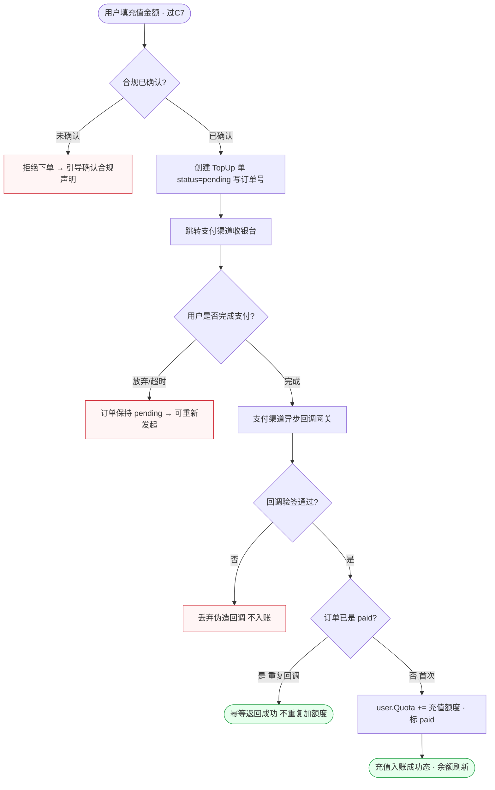
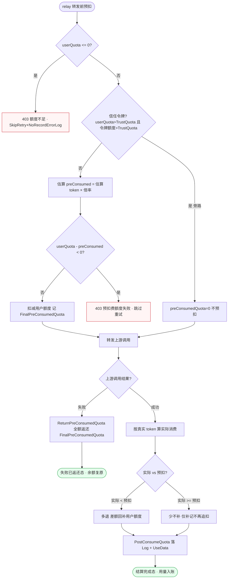
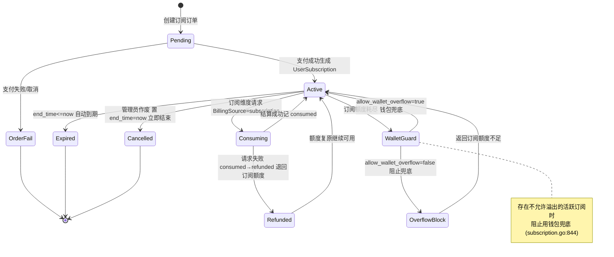
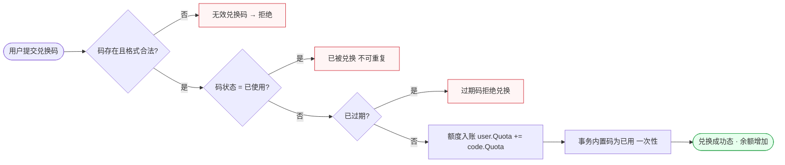
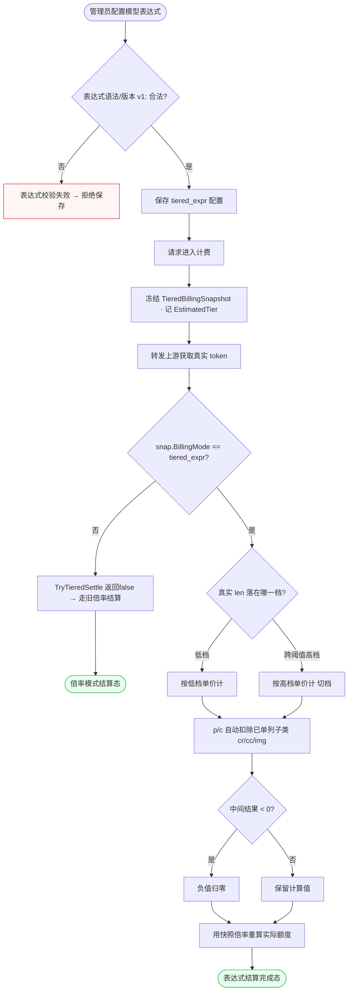
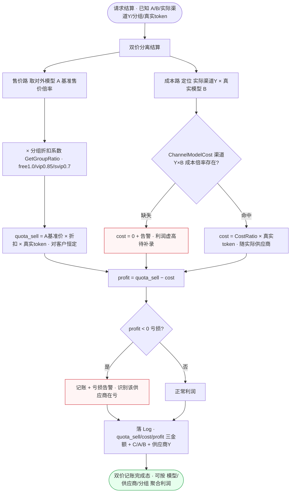

# FL-billing — 计费与钱包（D8）流程图

> 分片：计费与额度 / 钱包（F-2038~F-2048、F-2042 预扣、F-2046/F-2047 订阅）。
> 角色：登录用户（充值/兑换/订阅）/ 系统（预扣·结算·退款）/ 管理员（倍率·兑换码·订阅作废）/ 访客（价格页）。
> 跨切面契约见 `../OVERALL-FLOW.md §3`：C1 会话鉴权、C5 限流、C7 支付合规闸门（payment_compliance）。涉及金额流转的节点不重画 C1/C7，仅标注「过C7」。
> 后端：`controller/topup.go`、`controller/redemption.go`、`model/subscription.go`、`service/pre_consume_quota.go`、`service/quota.go`、`service/tiered_settle.go`。关键常量：`QuotaPerUnit`、`TrustQuota`、`FinalPreConsumedQuota`。

---

## 场景 BL-1 · 在线充值入账（支付下单→回调→幂等入账）（F-2044）

> 业务规则：用户发起充值先过 C7 支付合规闸门，创建本地 TopUp 单（pending）后跳支付渠道；**额度入账只发生在支付回调验签通过后**，回调以订单号做幂等键，重复回调（订单已 paid）直接返回成功不重复加额度；验签失败丢弃。这是「先下单、回调才入账」的两段式，本图突出回调侧的幂等守卫。

屏幕状态清单（BL-1 充值入账）：
- 充值金额填写态（过 C7 合规闸门）
- 合规未确认拒绝态（引导确认声明） ← 异常
- 待支付态（订单 pending，跳收银台）
- 放弃/超时态（订单保持 pending，可重发） ← 异常
- 回调验签失败丢弃态（伪造回调） ← 异常
- 幂等成功态（重复回调不重复加额度） ← 终态
- 充值入账成功态（Quota 增加、余额刷新） ← 终态

---

## 场景 BL-2 · 按量请求的预扣→调用→结算/失败返还（多退少不补）（F-2042）

> 业务规则：转发前 `PreConsumeQuota` 估算预扣——`userQuota<=0` 直接 403「额度不足」且 SkipRetry；`userQuota-preConsumed<0` 也 403；`userQuota>TrustQuota 且令牌额度>TrustQuota` 的信任令牌 `preConsumedQuota=0` 跳过预扣。预扣成功记 `FinalPreConsumedQuota` 并扣减。上游返回后按真实 token 结算：差额「多退少不补」；请求失败异步 `ReturnPreConsumedQuota` 全额返还。本图为「冻结额度→真实消费→差额回补」的资金生命周期，含信任令牌旁路。

屏幕状态清单（BL-2 预扣结算，系统/用户感知）：
- 余额不足 403 态（userQuota<=0，SkipRetry） ← 异常
- 信任令牌旁路态（跳过预扣，preConsumedQuota=0）
- 预扣失败 403 态（扣后为负，跳过重试） ← 异常
- 额度已冻结态（记 FinalPreConsumedQuota）
- 调用失败全额返还态（余额复原） ← 终态
- 多退差额回补态（实际<预扣）
- 少不补态（实际>=预扣，仅补记）
- 结算完成态（Log+UseData 入账） ← 终态

---

## 场景 BL-3 · 订阅生命周期（开通→活跃判定→到期/作废）（F-2046/F-2047）

> 业务规则：用户下订阅订单生成 `UserSubscription`，状态在 `active/expired/cancelled` 间流转；**活跃判定 = status=active AND end_time>now**；到期（end_time<=now）自动转 expired；管理员 `AdminInvalidateUserSubscription` 置 cancelled 且 end_time=now 立即结束。订阅维度请求按 `BillingSource=subscription` 从订阅项预扣（`SubscriptionId>0`），失败将预扣记录从 consumed 转 refunded。本图为订阅实体状态机 + 结算分支，刻意用状态图表达多态迁移。

屏幕状态清单（BL-3 订阅生命周期）：
- 订阅订单待支付态（Pending）
- 下单失败态（支付失败/取消） ← 异常终态
- 活跃态（status=active AND end_time>now）
- 订阅消费中态（BillingSource=subscription 预扣）
- 订阅失败退回态（consumed→refunded） ← 异常
- 钱包兜底态（allow_wallet_overflow=true）
- 兜底被阻态（overflow=false，订阅额度不足） ← 异常
- 自动到期态（end_time<=now，expired） ← 终态
- 管理员作废态（cancelled，end_time=now 立即结束） ← 终态

---

## 场景 BL-4 · 兑换码兑换（一次性、过期、已用守卫）（F-2045）

> 业务规则：管理员按 Quota 生成单个或批量（Count）兑换码；用户兑换时校验——码不存在/格式错 → 拒绝；已使用 → 不可重复兑换；已过期 → 拒绝；有效则额度入账并把码置为已用（一次性）。本图为短链线性校验串，与 BL-1 充值的两段式刻意不同：无外部回调，校验全在本地事务内完成。

屏幕状态清单（BL-4 兑换码）：
- 兑换码输入态
- 无效码态（不存在/格式错） ← 异常
- 重复兑换态（已使用） ← 异常
- 过期码态（拒绝） ← 异常
- 兑换成功态（额度入账、码置已用） ← 终态

---

## 场景 BL-5 · 阶梯/表达式计费配置与冻结快照结算（F-2040/F-2041）

> 业务规则：管理员为模型配 `billingexpr` 表达式（变量 p/c/cr/cc/img/ai/ao/len，函数 tier/param/header/has/hour），`tier` 按 `len` 分档切单价；`p/c` 在引用子类变量时**自动排除该子类**避免重复计价；表达式版本化 `v1:`、负值归零。请求前冻结 `TieredBillingSnapshot`（含 BillingMode/GroupRatio/QuotaPerUnit/EstimatedTier），结算时 `TryTieredSettle` 仅当 `snap.BillingMode==tiered_expr` 用真实 token 重算，否则返回 false 走旧倍率逻辑。本图为「配置→冻结→重算」的双轨判定，配置侧与结算侧并存。

屏幕状态清单（BL-5 表达式/阶梯计费）：
- 表达式配置编辑态
- 表达式校验失败态（语法/版本非法） ← 异常
- 快照冻结态（记 EstimatedTier）
- 旧倍率结算态（非 tiered_expr，TryTieredSettle=false） ← 终态
- 低档计价态 / 高档切档态（按真实 len 分档）
- 子类排除态（p/c 扣除 cr/cc/img）
- 负值归零态
- 表达式结算完成态（快照重算实际额度） ← 终态

---

## 场景 BL-6 · 成本/售价分离计费（售价挂对外模型恒定、成本随实际供应商、利润逐笔可算）（兼容层 / 经营计费）

> 业务规则（唯一权威 = `../COMPAT-BILLING-DECISIONS.md §4` 成本/售价分离 + §6 分组纯折扣，对齐 prd-billing / prd-relay RL-6 ⑥⑦）：一笔请求结算时**售价与成本两路独立**——**售价** `quota_sell` = 对外模型 A 的基准售价倍率（`PublicModel.BasePriceRatio`/`GetModelRatio(A)`）× 分组折扣系数（`GetGroupRatio(UsingGroup)`，free=1.0/vip=0.85/svip=0.7），**对客户恒定**，不管内部走了哪个供应商、兜底切供应商也不波动；**成本** `cost` = 实际选中渠道 × 真实模型 B 的成本倍率（`ChannelModelCost.CostRatio`，超管手填，挂在「供应商渠道×B」上），按真实 token 用量计；**利润** `profit = quota_sell − cost`，逐笔可算、可按 模型/供应商/分组 聚合（利润看板）；**成本缺失**（该渠道×B 未配倍率）则 `cost=0` + 告警（不阻断结算，利润虚高需运营补录）；`profit<0` 亏损也记账并告警（识别该供应商在亏）。本图为「售价路（恒定）⊕ 成本路（随供应商）」双轨并行汇聚到利润落账，含成本缺失旁路。

屏幕状态清单（BL-6 成本/售价分离计费，系统/经营态）：
- 双价分离结算态（售价路 ⊕ 成本路并行）
- 售价计算态（A 基准价 × 分组折扣，对客户恒定、兜底不波动）
- 成本定位态（实际渠道Y × 真实模型 B）
- 成本缺失告警态（cost=0 + 告警，利润虚高待补录） ← 异常
- 成本计算态（CostRatio × 真实 token，随实际供应商）
- 利润计算态（profit = quota_sell − cost）
- 亏损告警态（profit<0，识别亏损供应商） ← 异常
- 双价记账落账态（quota_sell/cost/profit 三金额 + C/A/B + 供应商，可聚合利润看板） ← 终态
