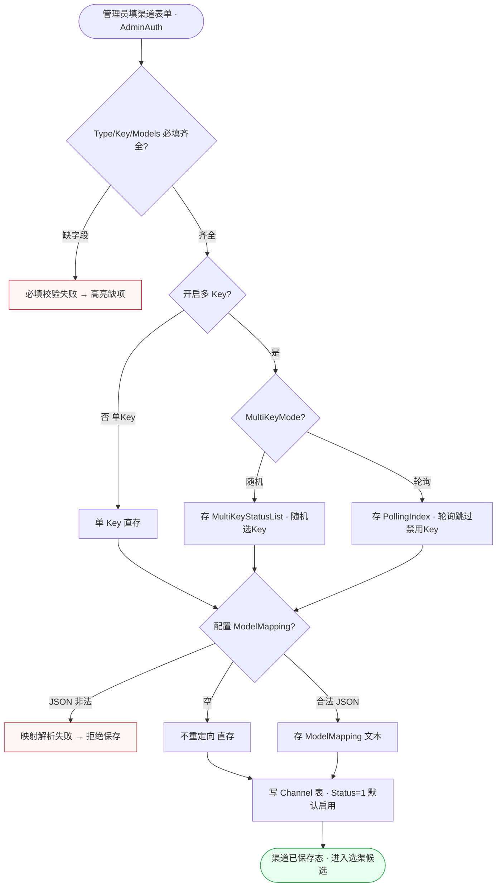
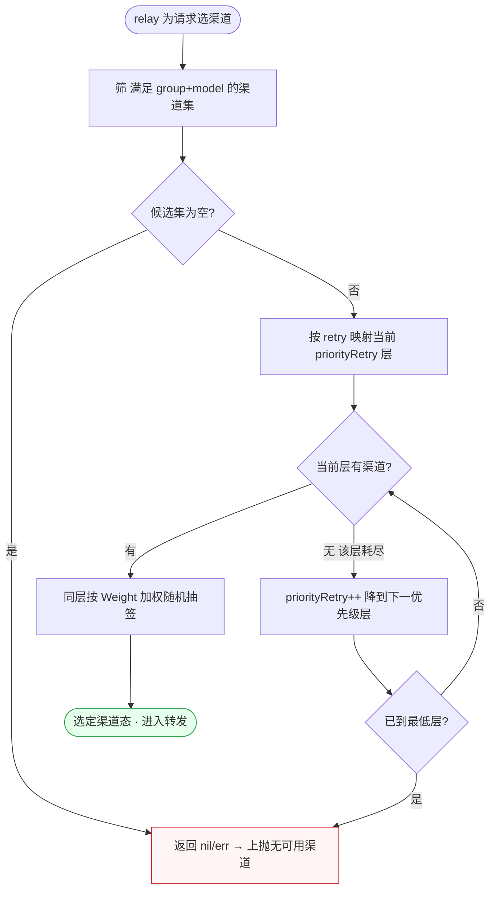
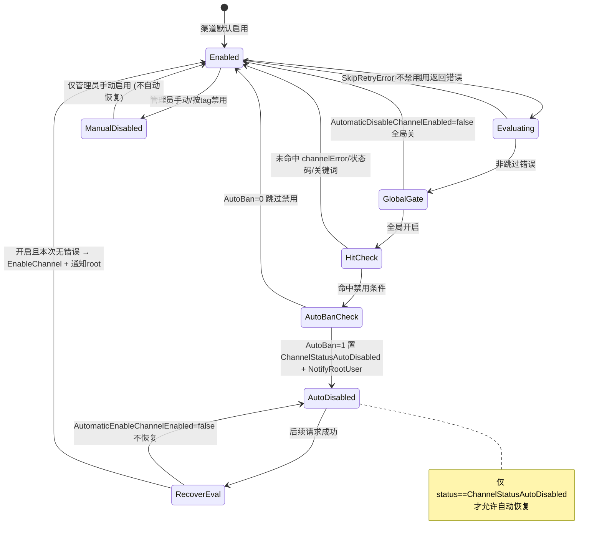
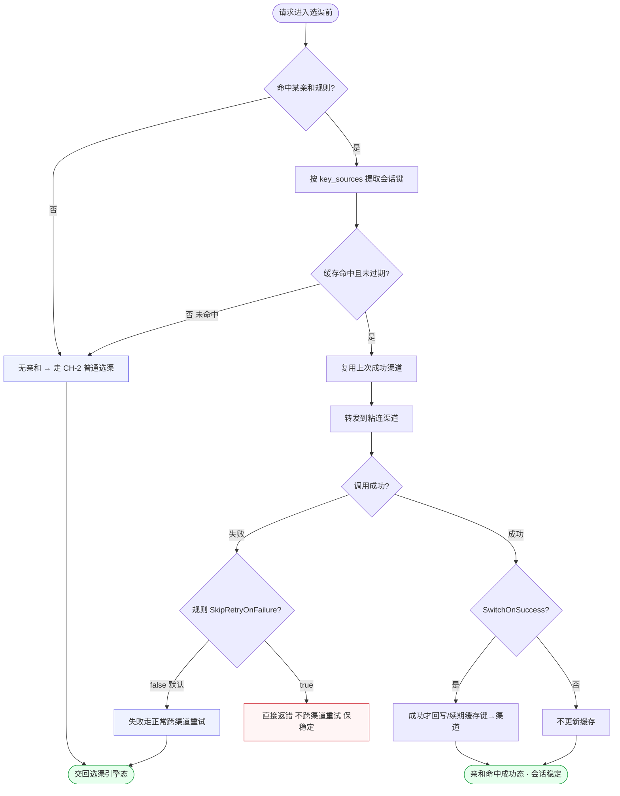
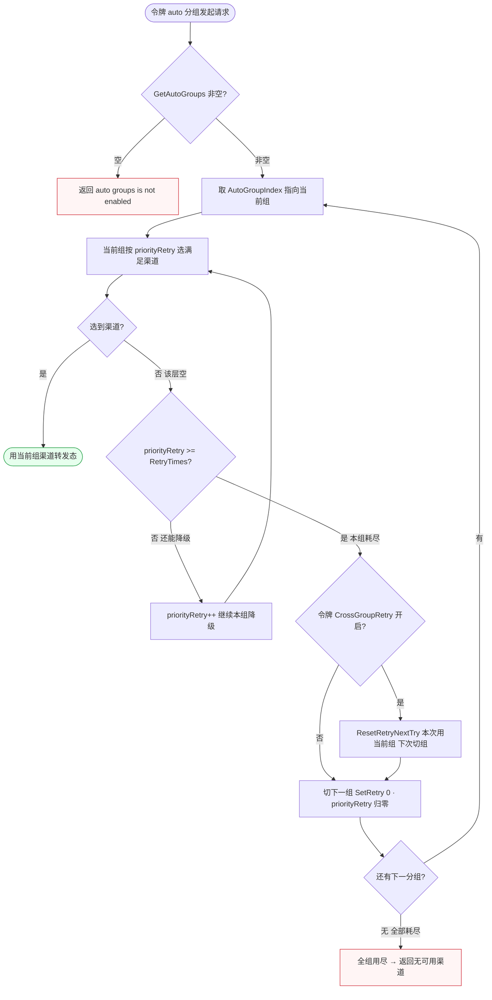

# FL-channel — 渠道管理与上游路由（D7/D10）流程图

> 分片：渠道管理与上游路由（F-2016~F-2028）、跨分组重试（F-2035~F-2037）、亲和缓存（F-2029~F-2034）。
> 角色：管理员（渠道 CRUD/启停）/ 系统（选渠·禁用·恢复·重试·亲和）/ root（被通知人）。
> 跨切面契约见 `../OVERALL-FLOW.md §3`：C6 权限分层（AdminAuth）。系统侧选渠/重试为内部链路，不涉及屏幕的以「内部态」标注。
> 后端：`model/channel.go`、`service/channel.go`、`service/channel_select.go`、`setting/operation_setting/channel_affinity_setting.go`。关键常量：`ChannelStatusAutoDisabled`、`common.RetryTimes`、`priorityRetry`。

---

## 场景 CH-1 · 渠道创建/编辑（多 Key 模式 + 模型映射落库）（F-2016/F-2020/F-2021）

> 业务规则：管理员创建渠道需填 `Type/Key/Models/Group/Priority/Weight`，默认 `Status=1(启用)`；开启多 Key（`IsMultiKey`）时按 `MultiKeyMode` 取随机或轮询；`ModelMapping` 为 JSON 文本（空则不重定向）。本图为表单写库前的字段校验与多 Key 分支落库，终态是渠道可被选渠引擎纳入候选。

屏幕状态清单（CH-1 渠道创建/编辑）：
- 渠道表单编辑态（Type/Key/Models/Group/Priority/Weight）
- 必填校验失败态（缺字段高亮） ← 异常
- 单 Key 直存态
- 多 Key 随机模式态 / 多 Key 轮询模式态
- 映射解析失败态（JSON 非法） ← 异常
- 无映射态（ModelMapping 空）
- 渠道已保存态（默认 Status=1，纳入候选） ← 终态

---

## 场景 CH-2 · 优先级分层 + 权重随机选渠道（F-2028）

> 业务规则：`GetRandomSatisfiedChannel(group,model,retry)` 在满足（分组+模型）的渠道中，按 `Priority` 分层、`retry` 次数映射到 `priorityRetry` 层级逐层降级，同层内按 `Weight` 加权随机；无满足渠道返回 nil/err。`Weight/Priority` 默认 0。本图突出「先按优先级定层、层内再权重抽签」的二级选择，与重试循环联动（CH-5）。

屏幕状态清单（CH-2 选渠道，系统内部态）：
- 候选筛选态（满足 group+model）
- 无可用渠道态（候选集空，nil/err） ← 异常
- 当前优先级层选择态（priorityRetry 映射）
- 层耗尽降级态（priorityRetry++ 下一层）
- 权重加权抽签态（同层 Weight）
- 选定渠道态（进入转发） ← 终态

---

## 场景 CH-3 · 渠道自动禁用与自动恢复（AutoBan 阈值 → ChannelStatusAutoDisabled）（F-2023/F-2024）

> 业务规则：relay 调用渠道出错时，`ShouldDisableChannel` 判定——全局 `AutomaticDisableChannelEnabled` 开启 且（`IsChannelError` 或 `ShouldDisableByStatusCode` 或错误命中 `AutomaticDisableKeywords`），且渠道 `AutoBan=1` 才置 `ChannelStatusAutoDisabled` 并 `NotifyRootUser`；`SkipRetryError` 不禁用。反向：被自动禁用渠道后续请求成功且 `AutomaticEnableChannelEnabled` 开启时 `ShouldEnableChannel` 恢复启用并通知 root（**手动禁用不自动恢复**）。本图为禁用判定与恢复判定的对偶状态机。

屏幕状态清单（CH-3 自动禁用/恢复，系统+管理员可见）：
- 启用态（Status=1）
- 错误评估态（relay 出错触发判定）
- 跳过禁用态（SkipRetryError）
- 全局开关关闭态（不禁用）
- 命中但 AutoBan=0 态（跳过禁用）
- 自动禁用态（ChannelStatusAutoDisabled，已通知 root）
- 自动恢复态（请求成功 + 开关开，回启用 + 通知 root）
- 手动禁用态（按 tag/手动，不自动恢复）

---

## 场景 CH-4 · 会话亲和键提取与渠道粘连（命中即复用 + SkipRetryOnFailure）（F-2029/F-2034）

> 业务规则：请求命中亲和规则（如内置 codex `gpt-* + /v1/responses + gjson prompt_cache_key`、claude `claude-* + /v1/messages + gjson metadata.user_id`）时，按 `model_regex/path_regex/key_sources` 提取会话键查缓存：命中且未过期则**复用上次成功渠道**，否则走正常选渠（CH-2）；`SwitchOnSuccess=true` 仅请求成功才把会话粘到该渠道；命中 `SkipRetryOnFailure=true` 的规则失败时直接返回错误**不跨渠道重试**（避免缓存被刷到别的渠道）。本图为缓存命中分叉 + 成功才回写的闭环。

屏幕状态清单（CH-4 亲和缓存，系统内部态）：
- 无亲和直走普通选渠态（未命中规则）
- 会话键提取态（key_sources）
- 缓存未命中回退态（走 CH-2）
- 渠道粘连复用态（命中缓存）
- 成功回写缓存态（SwitchOnSuccess=true） ← 终态
- 不回写态（SwitchOnSuccess=false） ← 终态
- 失败不重试态（SkipRetryOnFailure=true，保稳定） ← 异常
- 失败正常重试态（默认 false）

---

## 场景 CH-5 · auto 分组逐组耗尽优先级后跨组重试（priorityRetry>=RetryTimes）（F-2035/F-2036/F-2037）

> 业务规则：令牌用 `auto` 分组时 `CacheGetRandomSatisfiedChannel` 遍历 autoGroups——当前组按优先级选满足渠道，组内 `priorityRetry` 用尽（`>=common.RetryTimes`）则切下一组：`SetContextKey(AutoGroupIndex,i+1)`+`SetRetry(0)` 在新组归零重试；令牌级 `CrossGroupRetry` 开启时本次仍用当前组、`ResetRetryNextTry` 下次才切组；`GetAutoGroups()` 为空返回「auto groups is not enabled」。本图为「组内优先级降级 → 组耗尽切组 → 组用尽终止」的嵌套循环判定。

屏幕状态清单（CH-5 跨分组重试，系统内部态）：
- auto 未启用态（GetAutoGroups 空，报错） ← 异常
- 当前组选渠态（priorityRetry 层）
- 组内降级态（priorityRetry++ 未达 RetryTimes）
- 本组耗尽态（priorityRetry>=RetryTimes）
- 直接切组态（CrossGroupRetry 关，本次即切，归零重试）
- 延迟切组态（CrossGroupRetry 开，本次用当前组、下次切）
- 用当前组转发态（选到渠道） ← 终态
- 全组耗尽态（无可用渠道） ← 异常
