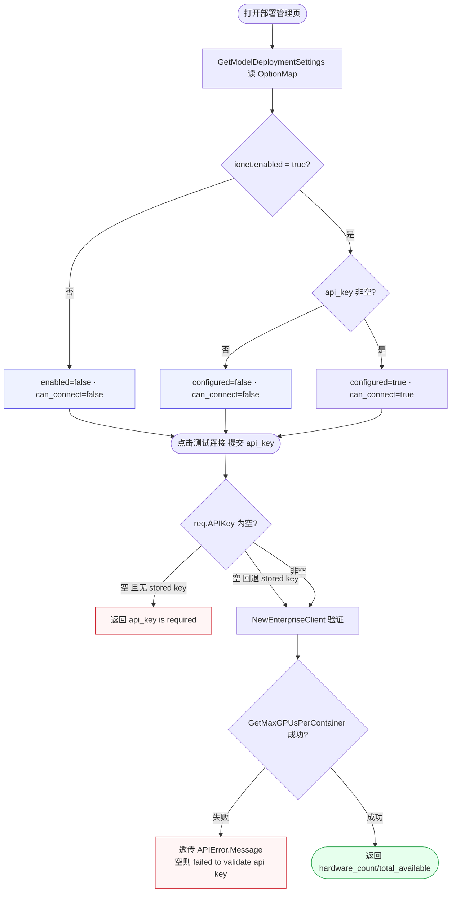
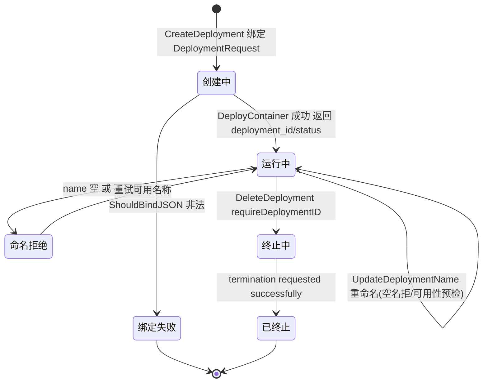
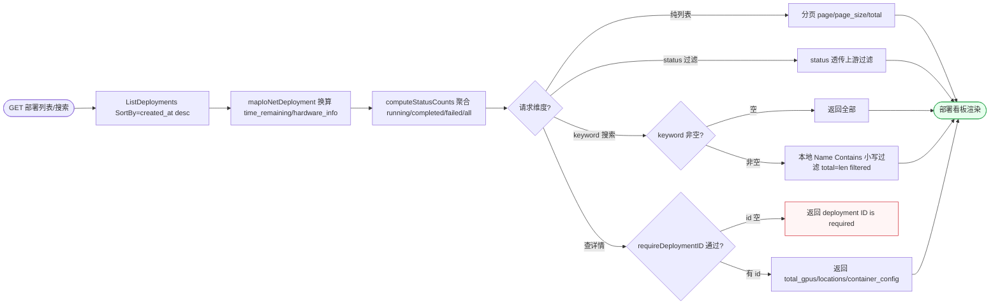
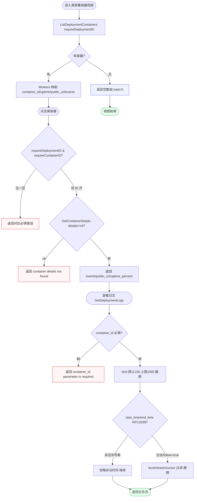
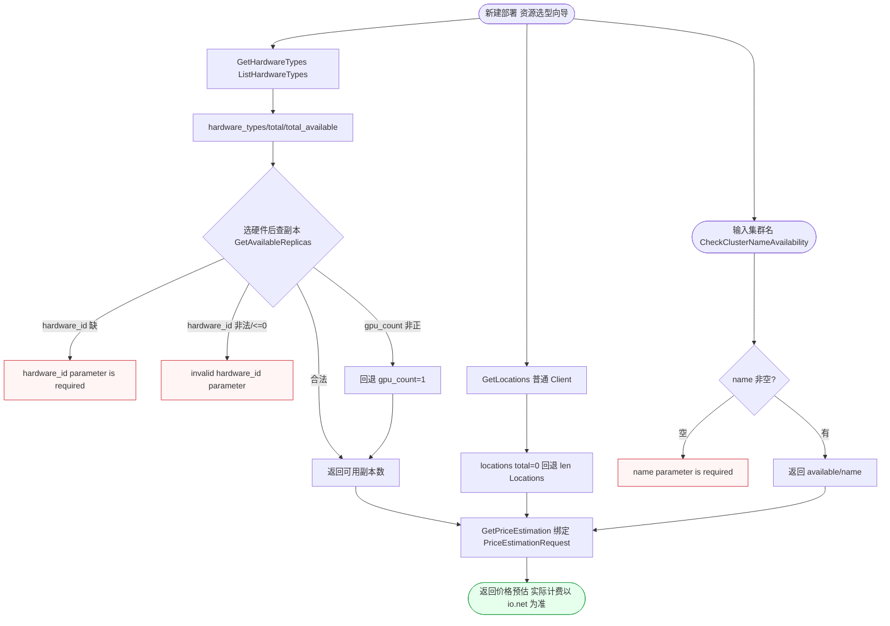

# FL-deploy — 部署管理（D14 io.net 集成）流程图

> 分片：部署管理（F-3039~F-3056）。io.net 集成配置、连接测试、部署生命周期（创建→运行→续期/更新→删除终止）、列表/详情/容器/日志查询、硬件/地域/副本/价格预估。
> 角色：管理员（全程 AdminAuth，多数走 EnterpriseClient，部分走普通 Client）。
> 跨切面契约见 `../OVERALL-FLOW.md §3`：`deploymentsRoute` 挂 AdminAuth；`getIoAPIKey` 在未启用或 key 缺失时返回错误。本分片为外部 SaaS（io.net）代理，实际计费以 io.net 为准。
> 后端：`controller/deployment.go`、`ionet` 包（`EnterpriseClient`/`Client`/`APIError`）。关键：`OptionMap[model_deployment.ionet.enabled/api_key]`、`ListDeployments`、`computeStatusCounts`、`DeployContainer`、`ExtendDeployment`、`DeleteDeployment`、`requireDeploymentID/requireContainerID`、`ComputeMinutesRemaining`。

---

## 场景 DP-1 · io.net 集成开关查询与连接测试（enabled/configured/can_connect 三态 + key 校验）（F-3039/F-3040）

> 业务规则：`GetModelDeploymentSettings` 读 `OptionMap[ionet.enabled/api_key]` 返回 `provider=io.net`、`enabled`（OptionMap 等于 true）、`configured`（api_key 非空）、`can_connect`（enabled 且 configured）。连接测试 `TestIoNetConnection` 提交 `api_key`（为空回退 stored key），用 `NewEnterpriseClient` 验证并 `GetMaxGPUsPerContainer`：req key 为空且无存储 key 返回「api_key is required」；key 无效透传 `APIError.Message`（空 message 回退「failed to validate api key」）；成功返回 `hardware_count/total_available`。本图为「设置三态派生 → 测试 key 来源回退 → 校验结果分支」的配置就绪判定。

屏幕状态清单（DP-1 集成开关 + 连接测试，部署管理设置页）：
- 未启用态（enabled=false，can_connect=false） ← 配置未就绪
- 已启用未配置态（configured=false，can_connect=false） ← 配置未就绪
- 就绪态（enabled+configured，can_connect=true）
- key 缺失态（req 空且无 stored key，「api_key is required」） ← 异常
- key 无效态（透传 APIError.Message 或兜底文案） ← 异常
- 测试成功态（返回 hardware_count/total_available） ← 终态

---

## 场景 DP-2 · 部署生命周期（创建→运行→续期/更新/重命名→删除终止）（F-3044~F-3048/F-3045/F-3046/F-3047/F-3048）

> 业务规则：`CreateDeployment` 绑定 `ionet.DeploymentRequest` → `DeployContainer` 下发容器，成功返回 `deployment_id/status`（运行中）。运行态可：续期 `ExtendDeployment`（延长 compute 分钟，返回新 `compute_minutes_remaining/time_remaining`）、更新 `UpdateDeployment`（配置变更）、重命名 `UpdateDeploymentName`（空名拒绝、`CheckClusterNameAvailability` 预检不可用则拒）。删除 `DeleteDeployment`（`requireDeploymentID` → `DeleteDeployment` 发终止请求 → 「termination requested」）。本图为部署对象的**状态生命周期图**（创建态→运行态→终止态，运行态自环多种维护操作），区别于 DP-1 的配置判定。

屏幕状态清单（DP-2 部署生命周期，部署列表 + 详情/操作面板）：
- 绑定失败态（CreateDeployment 请求体非法） ← 异常
- 运行中态（DeployContainer 成功，deployment_id/status 返回）
- 续期成功态（ExtendDeployment，compute_minutes_remaining 更新）
- 配置更新态（UpdateDeployment status/deployment_id）
- 命名拒绝态（空名「cannot be empty」/不可用「is not available」/预检失败） ← 异常
- 终止中态（DeleteDeployment 发终止请求）
- 已终止态（termination requested successfully） ← 终态

---

## 场景 DP-3 · 部署列表查询与状态计数聚合（分页 + status_counts + 本地名称过滤）（F-3041/F-3042/F-3043）

> 业务规则：`GetAllDeployments` 调 `ListDeployments(SortBy=created_at desc)`，经 `mapIoNetDeployment` 映射出 `time_remaining`（按 `ComputeMinutesRemaining` 换算时分）/`hardware_info`/`compute_minutes_remaining`，并 `computeStatusCounts` 聚合各状态计数（running/completed/failed…，含 all）。搜索 `SearchDeployments`：`status` 透传上游过滤、`keyword` 在**本地**按 `Name Contains`（小写包含）过滤，keyword 非空时 `total=len(filtered)`。详情 `GetDeployment`（`requireDeploymentID` → 返回 `total_gpus/total_containers/compute_minutes_served/locations/container_config`）。本图为「上游取数 → 映射换算 → 状态聚合 → 本地过滤 → 分页/详情分叉」的看板数据获取流。

屏幕状态清单（DP-3 列表/搜索/详情，部署看板）：
- 列表分页态（created_at desc，page/page_size/total）
- 状态计数态（status_counts 含 all 与各状态计数）
- time_remaining 换算态（ComputeMinutesRemaining 折算时分）
- status 过滤态（透传上游）
- keyword 本地过滤态（Name Contains 小写，total 修正） / keyword 空返回全部
- 详情缺 id 态（deployment ID is required） ← 异常
- 详情态（total_gpus/locations/container_config） ← 终态

---

## 场景 DP-4 · 容器列表/详情/日志查询（事件时间线 + 日志游标分页与时间范围）（F-3054/F-3055/F-3056）

> 业务规则：容器列表 `ListDeploymentContainers`（`requireDeploymentID` → `ListContainers` → Workers 映射 `container_id/device_id/uptime_percent/public_url/events(time,message)`，无容器返回空数组 total=0）。容器详情 `GetContainerDetails`（`requireDeploymentID` 与 `requireContainerID` 双 ID 必填，`details==nil` 返回「container details not found」，否则返回 `events/public_url/uptime_percent`）。日志 `GetDeploymentLogs`（`container_id` 必填，`limit` 默认 100 上限 1000，`level/stream/cursor/follow` 过滤，`start_time/end_time` 按 RFC3339 解析，非法时间字符串被忽略，follow=true 启用跟随，用普通 Client）。本图为「列表 → 详情双 ID 校验 → 日志参数规整」的三级钻取流，刻意以容器为中心区别 DP-3 的部署级看板。

屏幕状态清单（DP-4 容器列表/详情/日志，容器钻取视图）：
- 空容器态（无容器，空数组 total=0）
- 容器列表态（container_id/uptime_percent/public_url/events 时间线）
- 详情缺 ID 态（deployment/container_id 任一空，对应必填错误） ← 异常
- 详情不存在态（details==nil，「container details not found」） ← 异常
- 容器详情态（events/public_url/uptime_percent）
- 日志缺 container_id 态（「container_id parameter is required」） ← 异常
- limit 截断态（>1000 截断为 1000）
- 非法时间忽略态（start_time/end_time 非 RFC3339 被忽略）
- 日志流态（level/stream/cursor 过滤，follow 跟随） ← 终态

---

## 场景 DP-5 · 部署资源选型查询（硬件类型/地域/可用副本/价格预估/集群名可用性）（F-3049~F-3053）

> 业务规则：新建部署前的资源选型链——硬件类型 `GetHardwareTypes`（`ListHardwareTypes` 返回 `hardware_types/total=类型数/total_available=总可用副本`）；地域 `GetLocations`（普通 Client，上游 `total=0` 时回退 `len(Locations)`）；可用副本 `GetAvailableReplicas`（`hardware_id` 必填且 `Atoi>0`，缺失「hardware_id parameter is required」、非法「invalid hardware_id parameter」，`gpu_count` 默认 1 非正回退 1）；价格预估 `GetPriceEstimation`（绑定 `PriceEstimationRequest`，返回上游 priceResp，实际计费以 io.net 为准）；集群名 `CheckClusterNameAvailability`（`name` 必填，返回 `available/name`）。本图为选型向导的并列查询面板（多个独立校验入口汇成「配置就绪→可创建部署」），区别于生命周期与看板。

屏幕状态清单（DP-5 资源选型，新建部署向导）：
- 硬件类型态（hardware_types/total/total_available）
- 副本缺 hardware_id 态（「hardware_id parameter is required」） ← 异常
- 副本非法 hardware_id 态（「invalid hardware_id parameter」） ← 异常
- gpu_count 回退态（非正回退 1）
- 可用副本态（返回副本数）
- 地域态（locations，total=0 回退列表长度）
- 集群名缺 name 态（「name parameter is required」） ← 异常
- 集群名可用性态（available/name）
- 价格预估态（priceResp，实际计费以 io.net 为准） ← 终态
