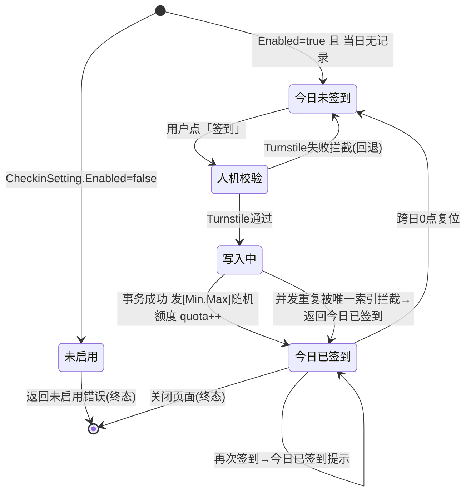
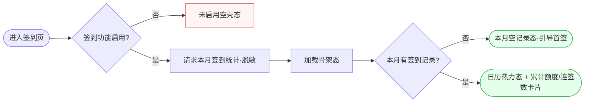
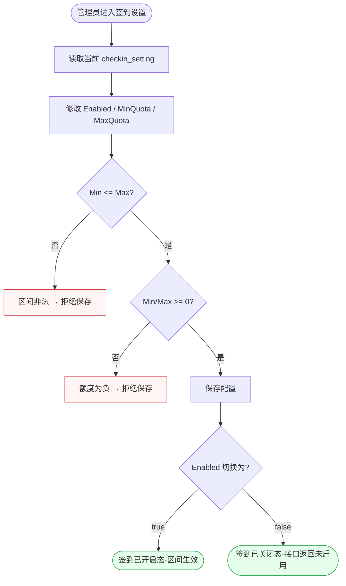
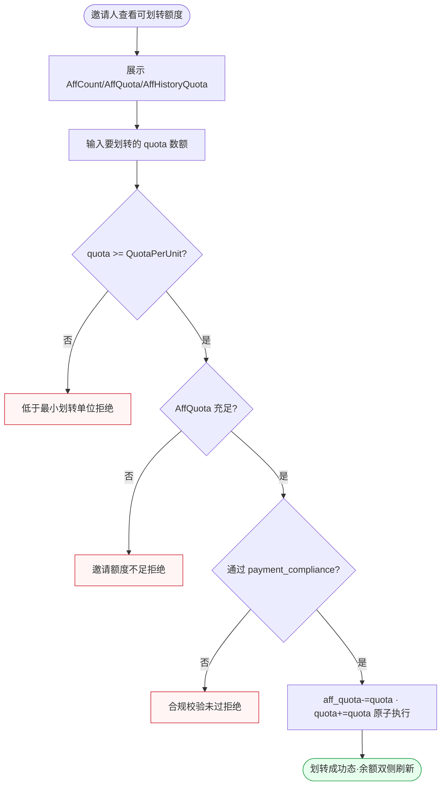

# FL-growth — 增长（D2 签到 + D3 邀请返利分销）流程图

> 分片：签到 D2（F-1046~F-1050）+ 邀请返利分销 D3（F-1039~F-1045）。
> 角色：登录用户 / 系统 / 管理员。
> 跨切面契约见 `../OVERALL-FLOW.md §3`：C4 Turnstile（签到前置）、C5 self-scope。

---

## 场景 GR-1 · 每日签到状态机（未签到→签到→已签到）（F-1046/F-1047/F-1048/F-1050）

> 业务规则：签到功能未启用返回未启用；签到前过 C4 Turnstile；当日首次签到发 `[MinQuota,MaxQuota]` 随机额度并同步增 `quota`；同日重复签到被 `(user_id,checkin_date)` 唯一索引+事务拦截返回「今日已签到」。这是一个**日级状态机**，用 stateDiagram 表达每日复位。



屏幕状态清单（GR-1 签到状态机）：
- 签到未启用态（Enabled=false） ← 异常终态
- 今日未签到态（可签到按钮高亮）
- 人机校验进行态（C4）
- 人机校验失败回退态 ← 异常
- 签到写入中态（loading）
- 签到成功态（展示本次随机额度 + quota 新余额） ← 终态
- 今日已签到态（按钮置灰，提示明日再来） ← 终态
- 并发重复拦截态（唯一索引，仍提示已签到） ← 异常终态

---

## 场景 GR-2 · 签到记录与累计统计查询（F-1047）

> 业务规则：`GET /api/user/checkin?month=` 返回 `total_quota/total_checkins/checkin_count/checked_in_today` 及本月记录；未启用返回未启用；记录不含 `id/user_id` 敏感字段。这是数据获取/可视化流（日历型），无控制分支，按 §5.2 画数据流。



屏幕状态清单（GR-2 签到统计）：
- 未启用空壳态 ← 异常
- 加载骨架态
- 本月空记录态（引导首签） ← 终态
- 日历热力态（本月已签日高亮）
- 累计统计卡片态（total_quota/total_checkins/checkin_count/checked_in_today） ← 终态

---

## 场景 GR-3 · 签到开关与额度区间配置（管理端）（F-1049）

> 业务规则：管理端配 `checkin_setting` 的 `Enabled` 与 `Min/MaxQuota`（默认 Enabled=false/Min=1000/Max=10000）；关闭后签到接口返回未启用；调整 Min/Max 后奖励区间随之变化。配置校验型（区间合法性）。



屏幕状态清单（GR-3 签到配置）：
- 配置读取态（回显当前值）
- 区间非法拒绝态（Min>Max） ← 异常
- 额度为负拒绝态 ← 异常
- 签到已开启态（区间生效） ← 终态
- 签到已关闭态（接口返回未启用） ← 终态

---

## 场景 GR-4 · 邀请返利分销全链（生成邀请码→被注册→返利入账）（F-1039/F-1040/F-1041/F-1042/F-1043）

> 业务规则：本人 `GET /self/aff` 取/生成唯一 4 位 `aff_code`；被邀请人带 aff_code（邮箱或 OAuth session 取 aff）注册解析 `InviterId`；新用户创建完成回调使邀请人 `AffCount++`、`AffQuota/AffHistoryQuota += QuotaForInviter`，且新用户初始额度叠加 `QuotaForNewUser`；仅 inviterId 有效时发放。这是跨「邀请人」与「被邀请人」两主体的返利状态流。

```mermaid
flowchart TD
  I0([邀请人进入邀请页]) --> I1{已有 aff_code?}
  I1 -->|否| I2[生成唯一4位随机码并落库]
  I1 -->|是| I3[返回已有 aff_code]
  I2 --> I4[展示邀请码/邀请链接]
  I3 --> I4
  I4 --> I5([被邀请人收到带 aff_code 的链接])
  I5 --> I6{注册渠道?}
  I6 -->|邮箱| I7[注册请求携 aff_code]
  I6 -->|OAuth| I8[/oauth/state?aff=xxx 暂存session]
  I8 --> I9[回调从 session 取 aff]
  I7 --> I10{aff_code 有效解析出 inviterId?}
  I9 --> I10
  I10 -->|否/空| I11[InviterId=0 → 无返利·按默认初始额度]:::err
  I10 -->|是| I12[新用户 InviterId=邀请人 · 初始额度叠加QuotaForNewUser]
  I12 --> I13[回调: 邀请人 AffCount++ ]
  I13 --> I14[邀请人 AffQuota += QuotaForInviter · AffHistoryQuota += ]
  I14 --> OK([返利已入账态·邀请人侧统计+1]):::term
  classDef term fill:#e6ffed,stroke:#2da44e
  classDef err fill:#fff5f5,stroke:#cf222e
```

屏幕状态清单（GR-4 邀请返利全链）：
- 邀请页生成码态（首次生成唯一 4 位码）
- 邀请页已有码态（展示码 + 链接）
- 无效/空 aff_code 无返利态（InviterId=0） ← 异常分支
- 被邀请人归因成功态（InviterId 写入 + 新用户额度叠加）
- 返利入账态（邀请人 AffCount++/AffQuota 增加） ← 终态

---

## 场景 GR-5 · 邀请额度划转为可用额度（F-1044/F-1045）

> 业务规则：`POST /self/aff_transfer` 提交 quota，须 `quota >= QuotaPerUnit` 且 `AffQuota` 充足才成功：`aff_quota -= quota`、`quota += quota`；低于最小单位报最小额度错；AffQuota 不足报邀请额度不足；需通过 payment_compliance。划转是带双重前置校验的资金动作。



屏幕状态清单（GR-5 邀请额度划转）：
- 邀请统计展示态（AffCount/AffQuota/AffHistoryQuota，复用 C5 self-scope）
- 输入划转额态
- 低于最小单位拒绝态（quota<QuotaPerUnit） ← 异常
- 邀请额度不足拒绝态（AffQuota 不足） ← 异常
- 合规校验未过态（payment_compliance） ← 异常
- 划转成功态（AffQuota 减、可用 Quota 增，双侧刷新） ← 终态
