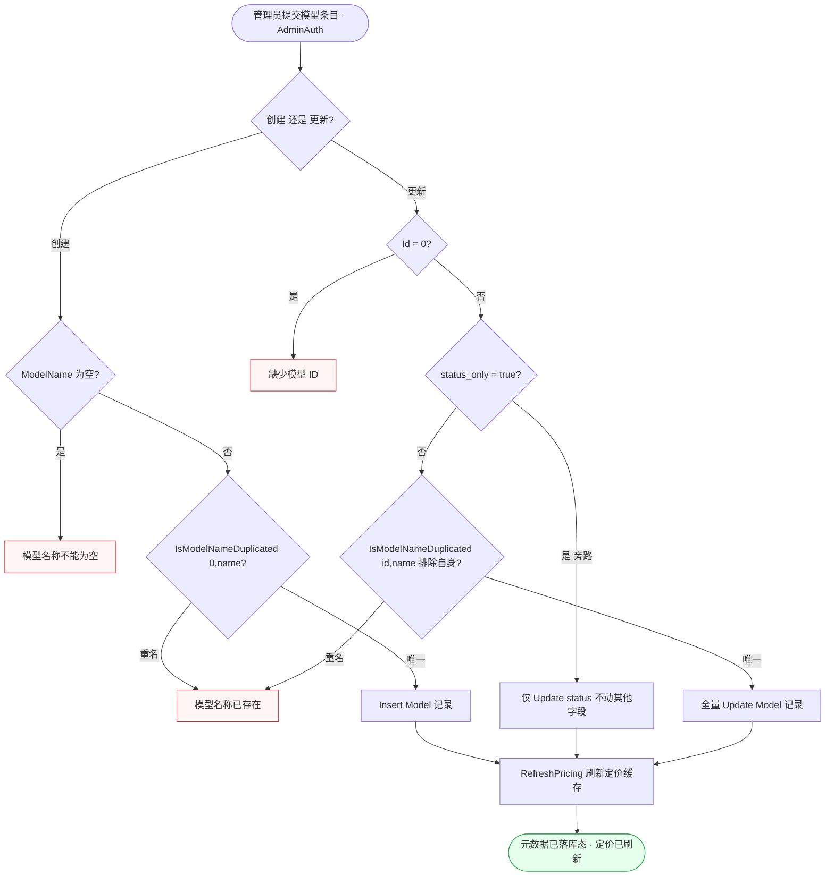
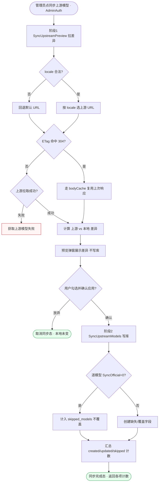
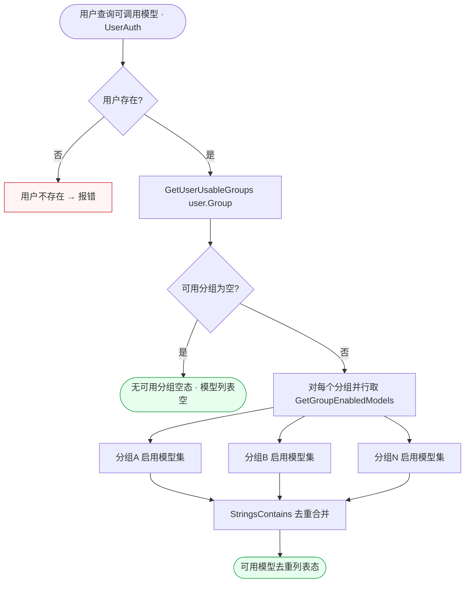
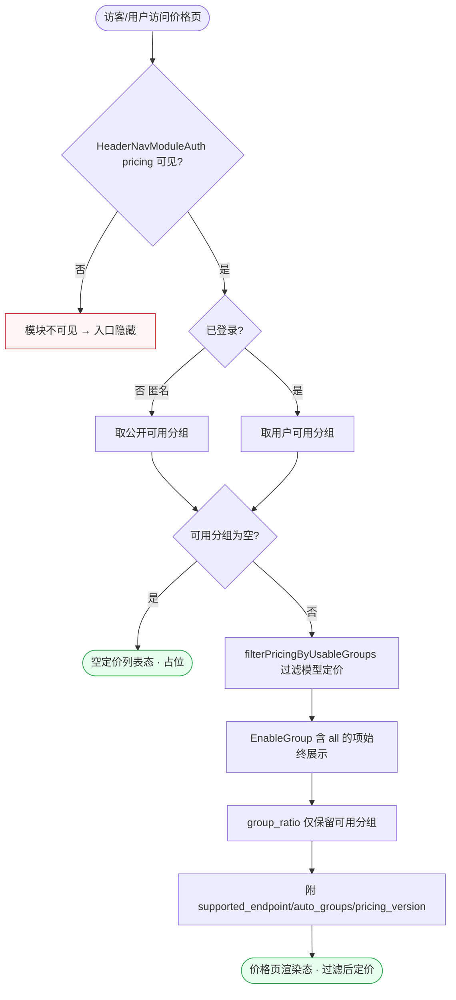
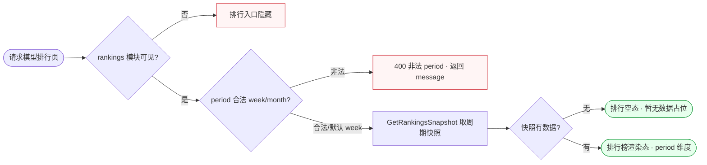
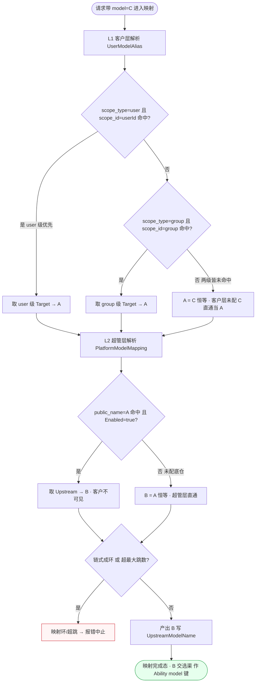

# FL-model — 模型广场与元数据（D9）流程图

> 分片：模型元数据（F-3013~F-3017）、供应商元数据（F-3018）、上游同步（F-3019~F-3021）、模型广场/排行/定价（F-3022~F-3025）。
> 角色：管理员（元数据 CRUD / 同步）/ 登录用户（可用模型）/ 访客（公开排行/价格）。
> 跨切面契约见 `../OVERALL-FLOW.md §3`：C6 权限分层（AdminAuth / HeaderNavModuleAuth 模块可见性 / UserAuth）。看板/广场/排行类按「数据获取流」绘制，终态含可视化态 + 空态。
> 后端：`controller/model_meta.go`、`controller/vendor_meta.go`、`controller/model_sync.go`、`controller/rankings.go`、`controller/pricing.go`、`controller/model.go`。同步源 `basellm.github.io`，ETag 条件请求。

---

## 场景 ML-1 · 模型元数据创建/更新（名称查重 + status_only + 刷新定价）（F-3015/F-3016）

> 业务规则：创建 `CreateModelMeta` 校验 `ModelName` 非空 + `IsModelNameDuplicated(0,name)`，写库后 `RefreshPricing()`；更新 `UpdateModelMeta` 若 `status_only=true` **仅** `Update(status)`（防误清其他字段），否则 `IsModelNameDuplicated(id,name)`（排除自身）后全量更新，均触发 `RefreshPricing`；`Id=0` 返回「缺少模型 ID」。本图为「创建 vs 更新」两入口合流到刷新定价，更新侧含 status_only 旁路。

屏幕状态清单（ML-1 元数据创建/更新）：
- 模型条目编辑态（创建/更新）
- 名称为空态（创建，模型名称不能为空） ← 异常
- 重名态（创建/更新查重命中） ← 异常
- 缺 Id 态（更新，缺少模型 ID） ← 异常
- status_only 旁路态（仅改状态，不清字段）
- 全量更新态
- 元数据落库 + 定价刷新态 ← 终态

---

## 场景 ML-2 · 上游模型同步（预览差异 → 应用，ETag 条件请求）（F-3019/F-3020/F-3021）

> 业务规则：管理员先 `SyncUpstreamPreview` 拉 `basellm.github.io`（按 locale 选 URL，非法 locale 回退默认），ETag 命中 304 走 bodyCache；预览**只返回差异不写库**。确认后 `SyncUpstreamModels` 创建本地缺失模型并按需覆盖（`SyncOfficial=0` 的本地模型跳过覆盖），返回 `created_models/created_vendors/updated_models/skipped_models` 计数；上游拉取失败返回「获取上游模型失败」；无缺失且无 overwrite 时直接返回零计数不请求上游。本图为「预览（只读）→ 用户勾选 → 应用（写库）」的两阶段同步，含 ETag 与跳过分支。

屏幕状态清单（ML-2 上游同步）：
- 预览拉取态（SyncUpstreamPreview，只读）
- locale 回退态（非法 → 默认 URL）
- ETag 命中复用态（304 bodyCache）
- 上游拉取失败态（获取上游模型失败） ← 异常
- 差异预览弹窗态（不写库）
- 取消同步态（放弃，本地未变） ← 终态
- 跳过覆盖态（SyncOfficial=0，skipped_models）
- 创建/覆盖态
- 同步完成态（created/updated/skipped 计数） ← 终态

---

## 场景 ML-3 · 用户可见模型列表（按用户分组聚合去重，数据获取流）（F-3024/F-3025）

> 业务规则：`GetUserModels` 取 `GetUserUsableGroups(user.Group)` 后对每个可用分组取 `GetGroupEnabledModels`，用 `StringsContains` 去重合并；用户不存在返回错误。`DashboardListModels` 返回 `channelId→models` 映射。本图为「分组扇出 → 各组取启用模型 → 去重合并」的数据聚合流，终态含可用模型列表态与无可用分组的空态。

屏幕状态清单（ML-3 可见模型列表，数据获取流）：
- 模型查询加载态
- 用户不存在错误态 ← 异常
- 无可用分组空态（模型列表为空） ← 终态
- 分组扇出取启用模型态（多分组并行）
- 去重合并态（StringsContains）
- 可用模型去重列表态 ← 终态

---

## 场景 ML-4 · 公开价格页（按可用分组过滤定价 + 分组倍率，数据获取流）（F-3023）

> 业务规则：`GetPricing` 走 `filterPricingByUsableGroups`——未登录按公开可用分组过滤；`EnableGroup` 含 `all` 的项始终展示；`group_ratio` 仅保留可用分组的；返回含 `supported_endpoint/auto_groups/pricing_version`；受 `HeaderNavModuleAuth(pricing)` 模块可见性控制；可用分组为空返回空定价列表。本图为公开看板的数据获取流，按「模块可见 → 取可用分组 → 过滤定价」逐级裁剪，含空态。

屏幕状态清单（ML-4 公开价格页，数据获取流）：
- 模块不可见隐藏态（HeaderNavModuleAuth pricing 关） ← 异常
- 匿名取公开分组态 / 登录取用户分组态
- 空定价列表态（可用分组为空） ← 终态
- 定价过滤态（按可用分组）
- all 分组常显态（EnableGroup 含 all）
- 价格页渲染态（含 endpoint/auto_groups/版本） ← 终态

---

## 场景 ML-5 · 模型排行榜公开快照（period 维度，数据获取流）（F-3022）

> 业务规则：`GetRankings` 调 `service.GetRankingsSnapshot(DefaultQuery(period,week))`——默认 `period=week`，非法 period 返回 400+message；受 `HeaderNavModuleAuth(rankings)` 模块可见性控制（可公开）；返回排行快照数据。本图为最短的看板取数流：模块可见 → period 校验 → 取快照，刻意短链以区别其他看板，含非法 period 与空快照两类终态。

屏幕状态清单（ML-5 模型排行榜，数据获取流）：
- 排行入口隐藏态（rankings 模块关） ← 异常
- 非法 period 态（400 + message） ← 异常
- 取快照加载态（默认 week）
- 排行空态（暂无数据占位） ← 终态
- 排行榜渲染态（period 维度快照） ← 终态

---

## 场景 ML-6 · 两层模型映射解析（C→A 客户层 user>group → A→B 超管层 → 环检测+最大跳数）（兼容层 / 两层映射）

> 业务规则（唯一权威 = `../COMPAT-BILLING-DECISIONS.md §2` 两层映射 C→A→B 1对1，对齐 prd-model ML-7、prd-relay RL-6 ②）：一笔请求带 `model=C` 进入映射，固定**先客户层 L1（C→A）再超管层 L2（A→B）**，两层都是 1对1 纯字符串替换、最终调用 B（客户永不可见）。**L1 客户层（UserModelAlias）**：先查 `scope_type=user AND scope_id=userId` 命中取 `Target=A`（**user 级优先**）；user 未命中再查 `scope_type=group AND scope_id=group` 命中取 A；**两级都未命中则 A=C 恒等**（客户层未配则 C 直接当 A）。**L2 超管层（PlatformModelMapping）**：按 `public_name=A` 查全局底仓，命中且 `Enabled=true` 取 `Upstream=B`；**未命中则 B=A 恒等（A 直通）**。全程带**环检测 + 最大跳数限制**，成环或超跳报错中止；客户硬输平台没有的 A 落库不拦，调用期 L2 查不到自然 404。本图为「L1（user>group 优先级树）→ L2（命中/直通）→ 环检测」的链式解析流，终态产出 B 交选渠（B 作为 Ability `model` 维查询键）。

屏幕状态清单（ML-6 两层模型映射解析，系统内部态）：
- L1 user 级命中态（取 user 级 Target=A，user>group 优先）
- L1 group 级命中态（user 未命中，取 group 级 A）
- L1 两级皆未命中恒等态（A=C，客户层未配 C 直通）
- L2 底仓命中态（取 Upstream=B，客户不可见）
- L2 未命中直通态（B=A 恒等，超管层未配）
- 映射环/超跳报错态（环检测 + 最大跳数） ← 异常
- 映射完成态（产出 B，交选渠作 Ability model 键） ← 终态
