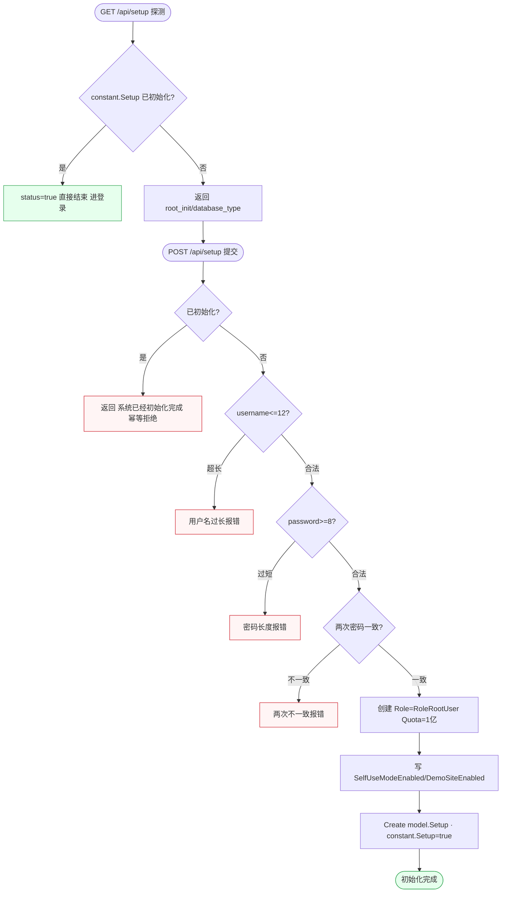
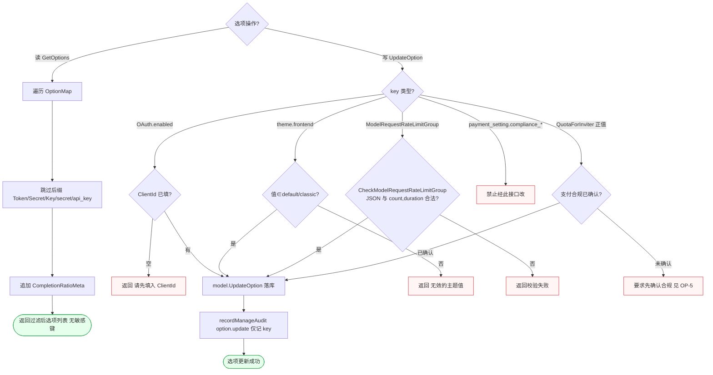
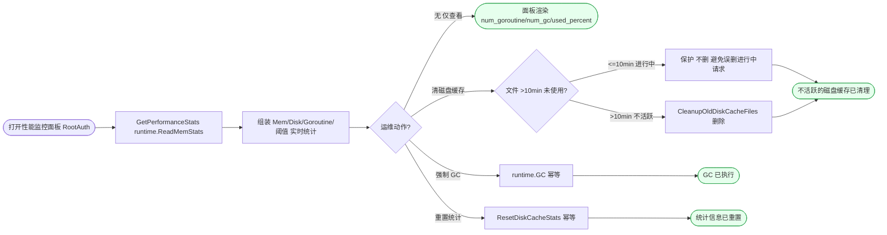
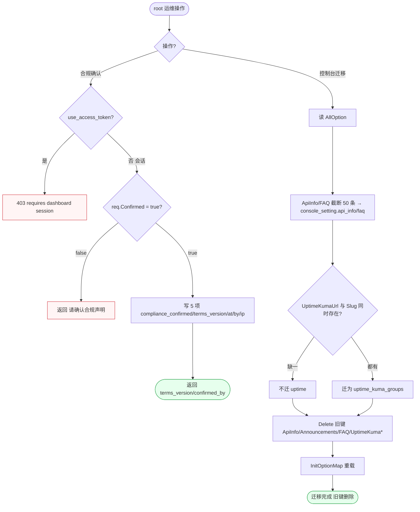

# FL-ops — 运营 / 系统设置 / 运维（D16）流程图

> 分片：运营与运维（F-4015~F-4036、F-4045）。系统初始化 setup、全站选项读取/更新（敏感键剔除 + 逐键校验 + 审计）、性能监控、磁盘缓存/GC/日志文件维护、Uptime-Kuma 状态接入、控制台旧设置迁移、支付合规确认。
> 角色：匿名（setup 探测/提交·公开内容读取·uptime 状态）/ root（选项·性能·迁移·合规·限流分组·主题）。
> 跨切面契约见 `../OVERALL-FLOW.md §3`：`optionRoute/performanceRoute` 挂 RootAuth；C3 二次验证（合规确认仅会话非 access_token）。倍率配置细节见 `FL-billing.md`，本文件只画选项框架与运维。
> 后端：`controller/setup.go`、`controller/option.go`、`controller/performance.go`、`controller/uptime_kuma.go`、`controller/console_migrate.go`、`controller/payment_compliance.go`。关键：`RootUserExists`、敏感键后缀过滤（Token/Secret/Key/secret/api_key）、`recordManageAudit("option.update")`、`CleanupOldDiskCacheFiles(10min)`、`uptimeKeySuffix=_24`。

---

## 场景 OP-1 · 系统初始化 setup（探测状态 → 提交创建 root + 模式开关，幂等防重复）（F-4015/F-4016）

> 业务规则：首访前端探测 `GET /api/setup`（匿名）：已初始化返回 `status=true` 直接结束；未初始化返回 `root_init=RootUserExists()` 与 `database_type`（mysql/postgres/sqlite，按 `UsingMySQL/PostgreSQL/SQLite`）。提交 `POST /api/setup`：已初始化返回「系统已经初始化完成」（幂等防重）；校验 `username<=12`、`password>=8` 且两次一致（任一不满足分别报错）；通过后创建 `Role=RoleRootUser、Quota=100000000` 用户，写 `SelfUseModeEnabled/DemoSiteEnabled` 并 `Create model.Setup`，置 `constant.Setup=true`。本图为「探测分叉 → 提交前已初始化短路 → 三项表单校验 → 创建落库置标记」的一次性向导链。

屏幕状态清单（OP-1 系统初始化，安装向导页）：
- 已初始化短路态（status=true，跳过向导进登录） ← 终态
- 未初始化探测态（root_init/database_type 返回）
- 重复初始化拒绝态（「系统已经初始化完成」，幂等防重） ← 异常
- 用户名过长态（username>12） ← 异常
- 密码过短态（password<8） ← 异常
- 两次不一致态 ← 异常
- 创建 root 态（Role=RoleRootUser，Quota=1亿）
- 模式写入态（SelfUseMode/DemoSite 开关）
- 初始化完成态（constant.Setup=true） ← 终态

---

## 场景 OP-2 · 全站选项读取与更新（敏感键剔除 + 逐键合法性/依赖校验 + 审计仅记 key）（F-4017/F-4018/F-4032/F-4035）

> 业务规则：读 `GetOptions` 遍历 `OptionMap` **跳过后缀 Token/Secret/Key/secret/api_key 的键**（不泄露敏感配置），追加 `key=CompletionRatioMeta` 元信息。更新 `UpdateOption` 逐键校验后落库：启用 OAuth（GitHub/discord/oidc）但未填 ClientId → 「请先填入…」；`theme.frontend` 非 `default/classic` → 「无效的主题值」；`ModelRequestRateLimitGroup` 调 `CheckModelRequestRateLimitGroup` 校验 `[count,duration]` JSON；合规字段 `payment_setting.compliance_*` **禁止经此接口改**；`QuotaForInviter` 正值需先确认支付合规。成功后 `recordManageAudit("option.update",{key})` **仅记 key 不记 value**。本图为「读取过滤」与「更新校验闸门链」两入口共享 OptionMap，关键是写入侧的逐键分支校验与审计。

屏幕状态清单（OP-2 选项读写，系统设置页）：
- 敏感键剔除态（Token/Secret/Key 结尾的键不返回）
- CompletionRatioMeta 注入态（读取额外项） ← 终态（读）
- OAuth 缺 ClientId 态（「请先填入…」） ← 异常
- 主题非法态（非 default/classic，「无效的主题值」） ← 异常
- 限流分组校验失败态（[count,duration] JSON 非法） ← 异常
- 合规字段禁改态（payment_setting.compliance_* 不可经此改） ← 异常
- 邀请额度需合规态（QuotaForInviter 正值要求先确认合规） ← 异常闸门
- 更新成功态（落库，审计仅记 key 不记 value） ← 终态

---

## 场景 OP-3 · 性能监控与运维动作（实时统计 + 磁盘缓存/GC/统计重置，含 10 分钟保护）（F-4019/F-4020/F-4021）

> 业务规则：`GetPerformanceStats` 实时读 `runtime.ReadMemStats` 组装 `CacheStats/MemoryStats(Alloc/Sys/NumGC/NumGoroutine)/DiskCacheInfo/DiskSpaceInfo(used_percent)/PerformanceConfig`（含 CPU/内存/磁盘阈值）。运维动作三选：`ClearDiskCache` 调 `CleanupOldDiskCacheFiles(10*time.Minute)` 仅删 **10 分钟以上未使用**文件（保护进行中请求不误删）→「不活跃的磁盘缓存已清理」；`ForceGC` 调 `runtime.GC()` →「GC 已执行」（幂等）；`ResetPerformanceStats` 调 `ResetDiskCacheStats()` →「统计信息已重置」（幂等）。本图为「实时采集面板 → 三类运维动作分发」的运维操作面板，强调磁盘缓存清理的 10 分钟阈值保护判定。

屏幕状态清单（OP-3 性能监控 + 运维动作，性能监控面板）：
- 实时统计态（num_goroutine/num_gc/disk used_percent + CPU/内存/磁盘阈值） ← 终态（查看）
- 缓存保护态（<=10min 进行中文件不删） ← 内部保护
- 缓存清理态（>10min 不活跃文件被删，「不活跃的磁盘缓存已清理」） ← 终态
- GC 执行态（runtime.GC 幂等，「GC 已执行」） ← 终态
- 统计重置态（幂等，「统计信息已重置」） ← 终态

---

## 场景 OP-4 · 日志文件维护与 Uptime-Kuma 状态接入（按数量/天数清理 + 并发拉取聚合）（F-4022/F-4023/F-4026)

> 业务规则：日志文件 `GetLogFiles` 仅收**前缀 `oneapi-` 且后缀 `.log`** 的文件按名降序（`LogDir` 为空 `Enabled=false`），返回 `file_count/total_size/oldest_time/newest_time`。清理 `CleanupLogFiles`：`mode` 必须 `by_count`（保留最新 N 个）/`by_days`（删早于 N 天），否则「invalid mode」；`value` 须正整数否则「invalid value」；**跳过当前活动日志** `GetCurrentLogPath()`；部分失败返回 `failed_files` 且 `success=false`。Uptime-Kuma `GetUptimeKumaStatus`：读 `GetUptimeKumaGroups()`（未配置返回空数组），`errgroup` **并发**拉各组 `/api/status-page/{slug}` 与 `/heartbeat/{slug}`，按 monitorID 匹配 `uptimeList(_24 后缀)` 与 heartbeatList，单组拉取失败返回该组空 monitors。本图刻意用并行 subgraph 表达「本地日志文件维护」与「外部状态页并发聚合」两条独立运维数据流。

```mermaid
flowchart TB
  subgraph LOGFILE[本地日志文件维护]
    lf_list([GetLogFiles]) --> lf_dir{LogDir 配置?}
    lf_dir -->|空| lf_off[Enabled=false]:::norm
    lf_dir -->|有| lf_pick[仅收 oneapi-*.log 名降序]
    lf_pick --> lf_meta[file_count/total_size/oldest/newest]
    lf_meta --> lf_clean([CleanupLogFiles])
    lf_clean --> lf_mode{mode∈by_count/by_days?}
    lf_mode -->|否| lf_em[invalid mode]:::err
    lf_mode -->|是| lf_val{value 正整数?}
    lf_val -->|否| lf_ev[invalid value]:::err
    lf_val -->|是| lf_skip[跳过当前活动日志 GetCurrentLogPath]
    lf_skip --> lf_res{全部成功?}
    lf_res -->|部分失败| lf_fail[failed_files success=false]:::err
    lf_res -->|全成功| lf_ok[删除数+释放字节]:::term
  end
  subgraph UPTIME[Uptime-Kuma 并发聚合]
    uk_in([GET /api/uptime/status]) --> uk_grp{GetUptimeKumaGroups 配置?}
    uk_grp -->|未配置| uk_empty[返回空数组]:::norm
    uk_grp -->|有| uk_fan[errgroup 并发拉各组 status-page + heartbeat]
    uk_fan --> uk_match[按 monitorID 匹配 uptimeList _24 + heartbeatList]
    uk_match --> uk_one{单组拉取失败?}
    uk_one -->|失败| uk_ze[该组返回空 monitors]:::err
    uk_one -->|成功| uk_okm[组内 monitors 可用率/状态/分组]:::term
  end
  classDef term fill:#e6ffed,stroke:#2da44e
  classDef err fill:#fff5f5,stroke:#cf222e
  classDef norm fill:#eef2ff,stroke:#4f46e5
```

屏幕状态清单（OP-4 日志维护 + Uptime 接入，日志管理页 + 状态页）：
- LogDir 未配置态（Enabled=false） ← 配置缺失
- 日志文件列表态（oneapi-*.log，file_count/total_size/oldest/newest）
- 清理 mode 非法态（「invalid mode」） ← 异常
- 清理 value 非法态（「invalid value」） ← 异常
- 活动日志保护态（跳过 GetCurrentLogPath，不删当前）
- 部分失败态（failed_files，success=false） ← 异常
- 清理成功态（删除数 + 释放字节） ← 终态
- Uptime 未配置态（空数组） ← 配置缺失
- Uptime 并发聚合态（按 monitorID 匹配 _24 可用率 + 心跳）
- 单组失败态（该组空 monitors） ← 异常
- Uptime 正常态（组内 monitors 可用率/状态/分组） ← 终态

---

## 场景 OP-5 · 支付合规确认与控制台旧设置迁移（会话闸门写 5 项 + 旧键转 console_setting.*）（F-4030/F-4031）

> 业务规则：合规确认 `ConfirmPaymentCompliance`（C3 闸门）：**拒绝 access_token**（`use_access_token` 返回 403「requires dashboard session」，仅会话可确认）；`req.Confirmed` 必为 true（false 返回「请确认合规声明」）；成功写 5 个 `payment_setting.compliance_*` 选项（confirmed/terms_version/confirmed_at/confirmed_by/confirmed_ip）并返回 `terms_version/confirmed_by`。控制台迁移 `MigrateConsoleSetting`：读 `AllOption`，`ApiInfo/FAQ` **截断 50 条**转 `console_setting.api_info/faq`，`UptimeKumaUrl+Slug` **同时存在**才迁为 `uptime_kuma_groups`，`Delete` 旧键并 `InitOptionMap` 重载（标注下个版本删除）。本图为「合规会话闸门串行校验」与「迁移条件转换」两条独立 root 运维流，用分叉表达不同入口（区别 OP-2 通用选项更新）。

屏幕状态清单（OP-5 合规确认 + 控制台迁移，合规弹窗 + 迁移操作）：
- access_token 拒绝态（403「requires dashboard session」，仅会话可确认） ← 异常
- 未勾选态（Confirmed=false，「请确认合规声明」） ← 异常
- 合规写入态（5 项 compliance_* 落库，返回 terms_version/confirmed_by） ← 终态
- ApiInfo/FAQ 截断态（超 50 条截断转 console_setting.*）
- uptime 条件迁移态（url+slug 同时存在才迁 uptime_kuma_groups） / 缺一不迁
- 旧键删除重载态（Delete 旧键 + InitOptionMap，标注下版本删除） ← 终态
