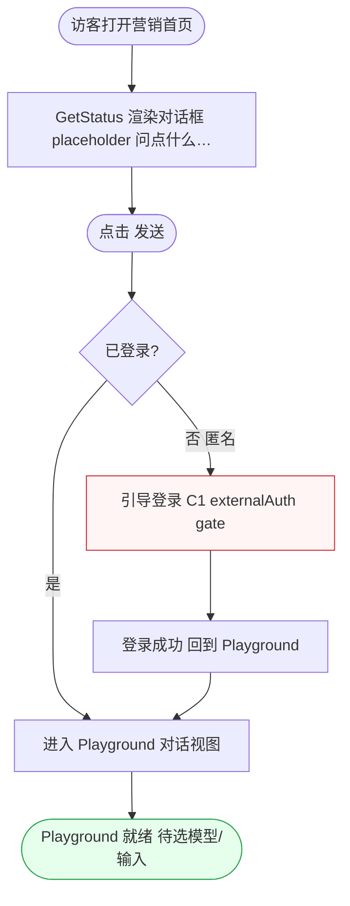
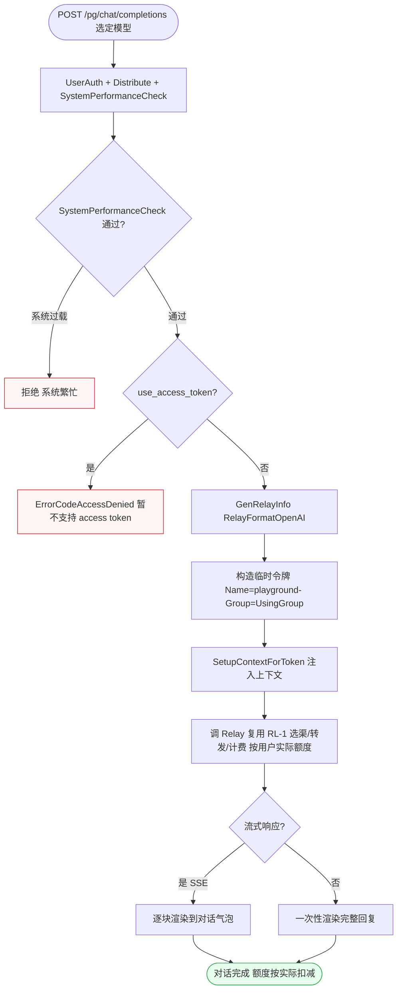
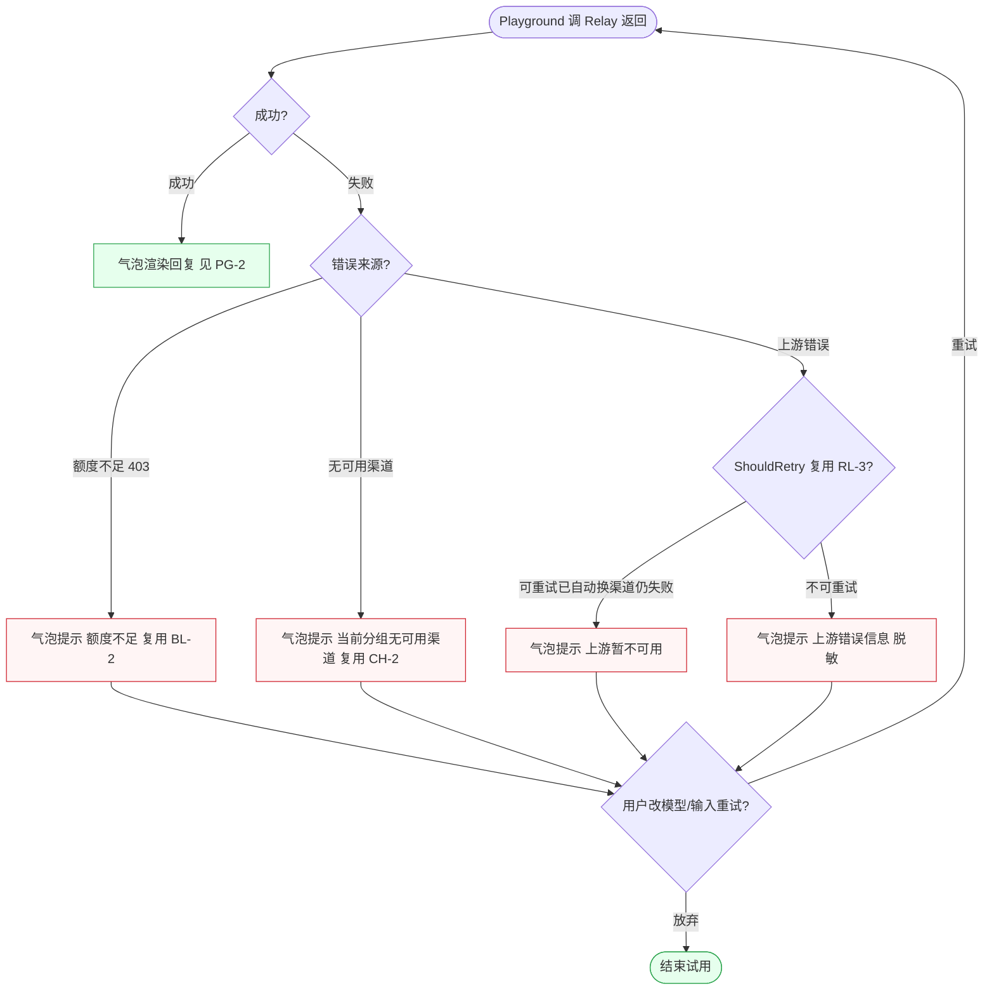

# FL-playground — Playground 在线试用（D17）流程图

> 分片：Playground（F-4038、F-4039/F-4040 首页入口）。站内对话试用：选模型→输入→以临时令牌走 relay→流式输出→错误处理。
> 角色：登录用户（试用对话）/ 匿名（首页入口引导登录）。
> 跨切面契约见 `../OVERALL-FLOW.md §3`：C1 鉴权（`playgroundRouter /pg` 挂 UserAuth）；与 Relay 主链路衔接见 `FL-relay.md RL-1`（本文件不重画转发/选渠，仅画 Playground 特有的临时令牌构造与流式渲染）。
> 后端：`controller/playground.go`、`controller/misc.go GetStatus`。关键：拒绝 `use_access_token`（ErrorCodeAccessDenied）、`GenRelayInfo(RelayFormatOpenAI)`、临时令牌 `{Name:playground-<group>, Group:UsingGroup}`、`SetupContextForToken`、`Distribute`、`SystemPerformanceCheck`、按用户实际额度计费。

---

## 场景 PG-1 · 首页对话框入口与登录引导（匿名「问点什么…」→ 引导登录 → 进 Playground）（F-4039/F-4040）

> 业务规则：营销首页拉 `GetStatus` 渲染对话输入框（placeholder「问点什么…」，Playground/试用入口候选）。匿名访客点「发送」时，因 `/pg` 路由需 `UserAuth`，未登录应**引导登录**（C1 externalAuth gate）；登录后进入 Playground 对话。本图为「入口渲染 → 登录态判定 → 引导/直达」的入口闸门，节点为真实入口与鉴权 gate。

屏幕状态清单（PG-1 首页入口，营销首页 + Playground 入口）：
- 入口渲染态（GetStatus，对话框 placeholder「问点什么…」）
- 匿名引导登录态（未登录点发送，C1 gate） ← 异常/闸门
- 登录回流态（登录成功回到 Playground）
- Playground 就绪态（待选模型/输入） ← 终态

---

## 场景 PG-2 · 站内对话提交主链路（拒绝 access_token → 临时令牌构造 → relay 流式输出）（F-4038）

> 业务规则：用户在 Playground 选模型并 `POST /pg/chat/completions`。先经 `UserAuth + Distribute + SystemPerformanceCheck` 中间件链；`Playground` 处理器**拒绝 `use_access_token`**（返回 `ErrorCodeAccessDenied`「暂不支持使用 access token」）；通过后 `GenRelayInfo(RelayFormatOpenAI)`，构造临时令牌 `{Name:playground-<group>, Group:UsingGroup}` 经 `SetupContextForToken` 注入上下文，再调 `Relay`（复用 RL-1 转发/选渠/计费，**按用户实际额度计费**）。流式响应逐块（SSE）渲染到对话气泡。本图为「中间件 → access_token 拒绝 → 临时令牌构造 → relay → 流式逐块输出」的提交主链路，临时令牌构造与流式渲染为 Playground 特有节点。

屏幕状态清单（PG-2 对话提交，Playground 对话视图）：
- 系统繁忙态（SystemPerformanceCheck 未过，拒绝） ← 异常
- access_token 拒绝态（use_access_token，ErrorCodeAccessDenied「暂不支持使用 access token」） ← 异常
- 临时令牌构造态（playground-<group>，Group=UsingGroup）
- 上下文注入态（SetupContextForToken）
- 流式输出态（SSE 逐块渲染到对话气泡）
- 非流式输出态（一次性完整回复）
- 对话完成态（按用户实际额度扣减） ← 终态

---

## 场景 PG-3 · 试用错误处理与额度/选渠失败回显（复用 relay 错误路径，对话气泡降级显示）（F-4038）

> 业务规则：Playground 调 `Relay` 后，复用 RL-1/RL-3 的错误路径（本文件不重画重试/禁用，仅画 Playground 侧回显）。常见失败：预扣额度不足（userQuota<=0 → 403，复用 BL-2）、无可用渠道（选渠失败，复用 CH-2）、上游错误（按状态码可重试/不可重试，复用 RL-3）。Playground 把这些错误以对话气泡内的**降级提示**回显（而非整页报错），用户可改模型/输入重试。本图为「relay 返回 → 错误来源分类 → 气泡降级回显 → 重试」的错误回显流，刻意以 Playground UI 回显视角组织（区别 RL-3 的系统处置视角）。

屏幕状态清单（PG-3 错误处理，Playground 对话视图）：
- 成功回显态（气泡渲染回复） ← 终态
- 额度不足气泡态（403，复用 BL-2 预扣判定） ← 异常
- 无可用渠道气泡态（选渠失败，复用 CH-2） ← 异常
- 上游可重试仍失败态（自动换渠道后仍失败，「上游暂不可用」） ← 异常
- 上游不可重试态（脱敏错误信息回显） ← 异常
- 改模型/输入重试态（用户重发）
- 放弃结束态 ← 终态
