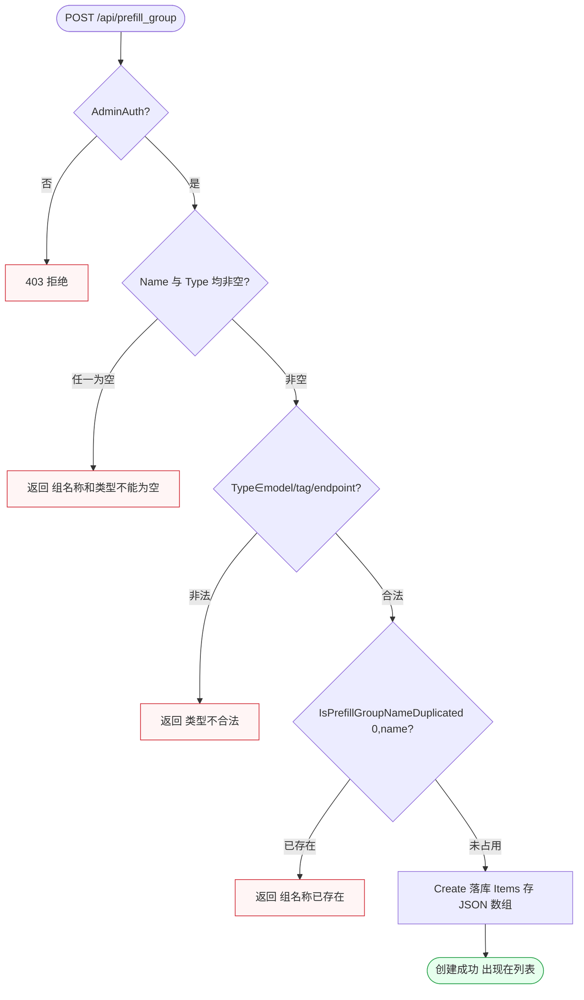
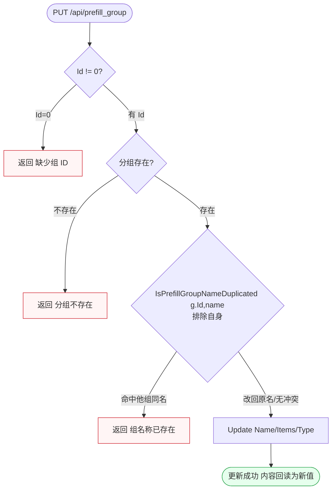
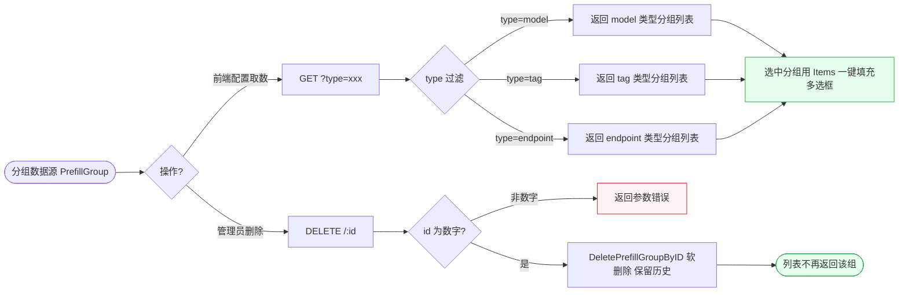

# FL-prefill — 预填分组（D6）流程图

> 分片：预填分组（F-2012~F-2015）。model/tag/endpoint 三类型预填分组的创建/更新/查重/软删除，及在渠道/令牌配置时按 type 下拉一键填充。
> 角色：管理员（CRUD，全程 AdminAuth）。
> 跨切面契约见 `../OVERALL-FLOW.md §3`：所有 `/api/prefill_group` 路由挂 AdminAuth（仅管理员）。与渠道配置衔接见 `FL-channel.md`（渠道 Models/Group 字段填充），本文件只画分组侧。
> 后端：`controller/prefill_group.go`、`model/prefill_group.go`。关键：`IsPrefillGroupNameDuplicated(id, name)`（创建传 id=0、更新传自身 id 排除）、`Type∈{model,tag,endpoint}`、`Items`（JSON 数组）、`DeletePrefillGroupByID`（软删除）。

---

## 场景 PF-1 · 预填分组创建（Name+Type 非空校验 + 全局名称查重）（F-2012）

> 业务规则：管理员 `POST /api/prefill_group` 创建分组。先校验 `Name` 与 `Type` 均非空（任一空返回「组名称和类型不能为空」），再调 `IsPrefillGroupNameDuplicated(0, name)`（id=0 表示全局查重）检查重名（命中返回「组名称已存在」）。`Type` 取 `model/tag/endpoint`，`Items` 以 JSON 数组存储。本图为「双字段校验 → 全局查重 → 落库」的串行校验闸门链（短路返回）。

屏幕状态清单（PF-1 创建分组，预填分组管理页）：
- 越权拒绝态（非管理员，403） ← 异常
- 字段为空态（Name/Type 任一空，「组名称和类型不能为空」） ← 异常
- 类型非法态（Type 不在 model/tag/endpoint） ← 异常
- 重名拒绝态（IsPrefillGroupNameDuplicated(0,name) 命中，「组名称已存在」） ← 异常
- 创建成功态（落库，Items 存 JSON，可在列表查到） ← 终态

---

## 场景 PF-2 · 预填分组更新（缺 id 校验 + 排除自身的名称冲突）（F-2013）

> 业务规则：管理员 `PUT /api/prefill_group` 更新分组。先校验 `Id!=0`（缺则返回「缺少组 ID」），再调 `IsPrefillGroupNameDuplicated(g.Id, name)`——传自身 Id 以**排除自身**查重：改名为他组已有名称返回「组名称已存在」，改回原名（排除自身后不算冲突）可成功。本图与 PF-1 创建链对照：关键差异在查重的「排除自身」分支，构造为「先验 id → 排除自身查重 → 更新 Items」。

屏幕状态清单（PF-2 更新分组，预填分组编辑弹窗）：
- 缺 ID 态（Id=0，「缺少组 ID」） ← 异常
- 分组不存在态（id 无对应记录） ← 异常
- 改名冲突态（命中他组同名，「组名称已存在」） ← 异常
- 改回原名成功态（排除自身查重后不冲突）
- 更新成功态（Name/Items/Type 回读为新值） ← 终态

---

## 场景 PF-3 · 按 type 下拉填充与软删除（渠道/令牌配置一键填充 + 软删除保留历史）（F-2014/F-2015）

> 业务规则：前端配置渠道/令牌时按 `type` 拉取分组——`GET /api/prefill_group?type=xxx` 按类型过滤 `GetAllPrefillGroups`（传 `type=model` 仅返回 model 类型），选中分组后前端用其 `Items` 一键填充模型多选框/令牌配置（减少重复输入）。删除走 `DELETE /api/prefill_group/:id`，调 `DeletePrefillGroupByID` **软删除**（非物理移除，保留历史），删除后 `GetPrefillGroups` 不再返回；非数字 id 返回参数错误。本图为「按 type 取数填充」与「软删除」两条独立操作汇入同一分组数据源，用左右分叉表达消费侧（填充）vs 维护侧（删除）。

屏幕状态清单（PF-3 下拉填充 + 软删除，渠道/令牌配置页 + 分组管理页）：
- type 过滤取数态（type=model 仅返回 model 类型分组）
- 一键填充态（选中分组用 Items 填充模型多选框/令牌配置） ← 终态
- 非数字 id 态（删除参数错误） ← 异常
- 软删除态（DeletePrefillGroupByID，保留历史不物理删）
- 删除后消失态（GetPrefillGroups 不再返回该组） ← 终态
