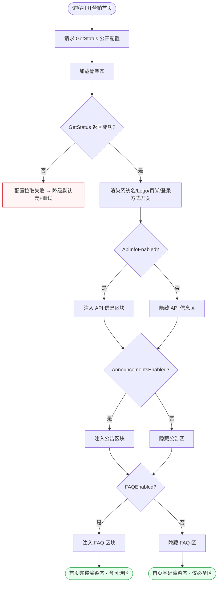
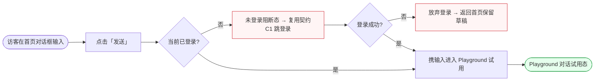
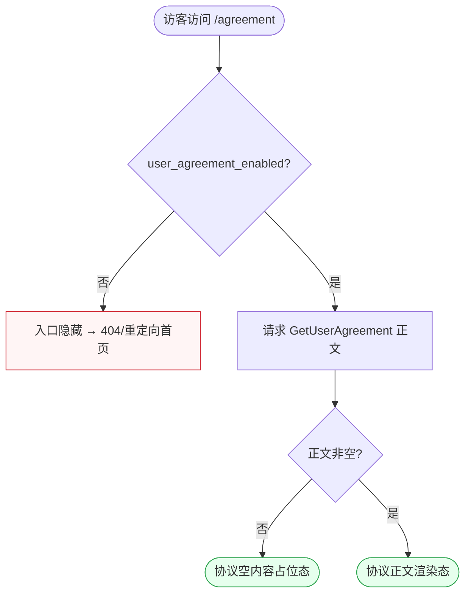
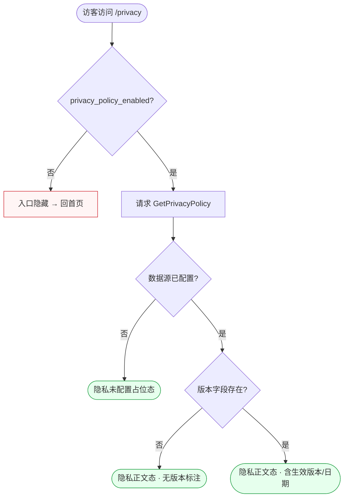
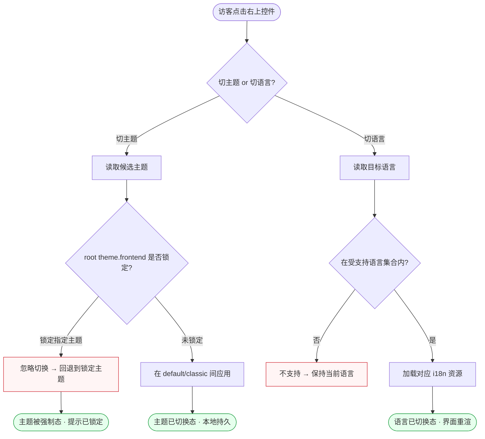
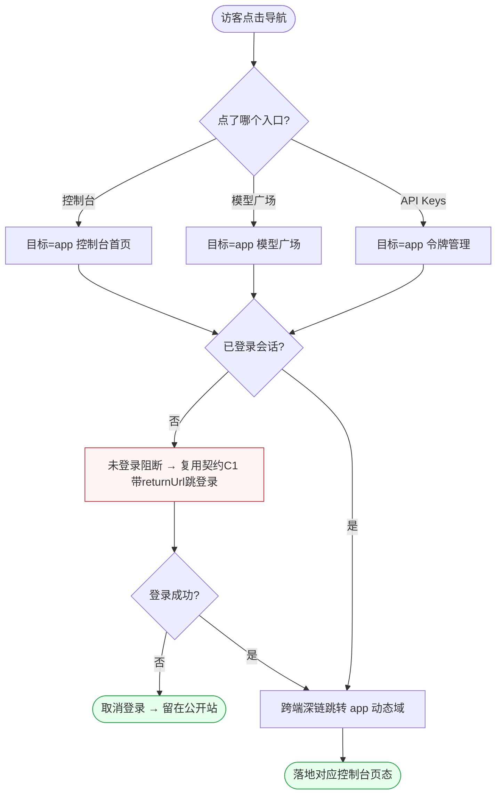

# FL-public — 公开与营销（公开站点）流程图

> 分片：公开站点（F-4039 ~ F-4044）。角色：访客 Guest / 用户 User。
> 跨切面契约见 `../OVERALL-FLOW.md §3`（C1 未登录先登录 / C2 externalJump / C4 Turnstile）。

---

## 场景 P-1 · 营销首页公开状态聚合（F-4039）

> 业务规则：`GetStatus` 返回公开配置，按 `ApiInfoEnabled / AnnouncementsEnabled / FAQEnabled / user_agreement_enabled` 等开关**条件注入**可选区块；敏感配置不暴露。这是首页能渲染什么的唯一数据来源。

屏幕状态清单（P-1 首页状态聚合）：
- 加载骨架态（GetStatus 进行中）
- 配置拉取失败降级态（默认壳 + 重试） ← 异常
- 基础渲染态（系统名/Logo/页脚/登录方式开关，所有可选开关均关） ← 终态
- 含 API 信息区态（ApiInfoEnabled=true）
- 含公告区态（AnnouncementsEnabled=true）
- 含 FAQ 区态（FAQEnabled=true）
- 完整渲染态（多可选区同时注入） ← 终态

---

## 场景 P-2 · 首页对话框 Playground 试用入口（F-4040）

> 业务规则：首页对话框 placeholder「问点什么…」，点发送导向 Playground；Playground 需 UserAuth，未登录点发送须引导登录。复用契约 C1（未登录先登录）。

屏幕状态清单（P-2 Playground 入口）：
- 首页对话框默认态（placeholder「问点什么…」）
- 未登录阻断态（跳登录，保留输入草稿） ← 异常（复用 C1）
- 放弃登录返回态（草稿回填首页） ← 异常终态
- Playground 试用态（携输入进入对话） ← 终态

---

## 场景 P-3 · 用户协议公开页（F-4041）

> 业务规则：`/agreement` 渲染 `GetUserAgreement`；入口由 `GetStatus.user_agreement_enabled` 控制，关闭时入口隐藏。单一条件分支 + 内容空判。

屏幕状态清单（P-3 用户协议页）：
- 入口隐藏态（user_agreement_enabled=false → 404/回首页） ← 异常
- 协议空内容占位态（正文未配置） ← 终态
- 协议正文渲染态 ← 终态

---

## 场景 P-4 · 隐私政策公开页（F-4042）

> 业务规则：`/privacy` 渲染 `GetPrivacyPolicy`；入口由 `privacy_policy_enabled` 控制。与协议页同形但独立数据源——刻意用不同节点构成（含「来源未配置」与「合规版本」分支）以反映隐私页特有的版本校验。

屏幕状态清单（P-4 隐私政策页）：
- 入口隐藏态（privacy_policy_enabled=false） ← 异常
- 隐私未配置占位态（数据源缺失） ← 终态
- 隐私正文态·无版本标注 ← 终态
- 隐私正文态·含生效版本/日期 ← 终态

---

## 场景 P-5 · 公开主题/语言切换控件（F-4043）

> 业务规则：访客无需登录即可切换；主题在 default/classic 间切换但**最终值受 root 配置 `theme.frontend` 约束**；语言在 i18n 受支持集合内切换。这是一个偏好状态机，两条独立切换链 + 约束回退。

屏幕状态清单（P-5 主题/语言切换）：
- 控件默认态（显示当前主题/语言）
- 主题已切换态（default↔classic 持久化） ← 终态
- 主题被锁定回退态（root 锁定，提示） ← 异常终态
- 语言不支持保持态（目标语言不在集合） ← 异常
- 语言已切换态（i18n 重渲） ← 终态

---

## 场景 P-6 · 控制台/模型广场/API Keys 主入口跳转（F-4044）

> 业务规则：导航入口指向 app 动态域；需登录后访问（证据 GAP SG-001，具体页以 repo 控制台为权威）。这是 www→app 的跨端深链，复用契约 C1。三入口共用一个网关判定但落地到不同目标路由。

屏幕状态清单（P-6 控制台入口跳转）：
- 导航默认态（三入口可见）
- 未登录阻断态（带 returnUrl 跳登录，复用 C1） ← 异常
- 取消登录留站态 ← 终态
- 跨端深链跳转中态
- 落地控制台首页态 / 落地模型广场态 / 落地令牌管理态（按入口） ← 终态
