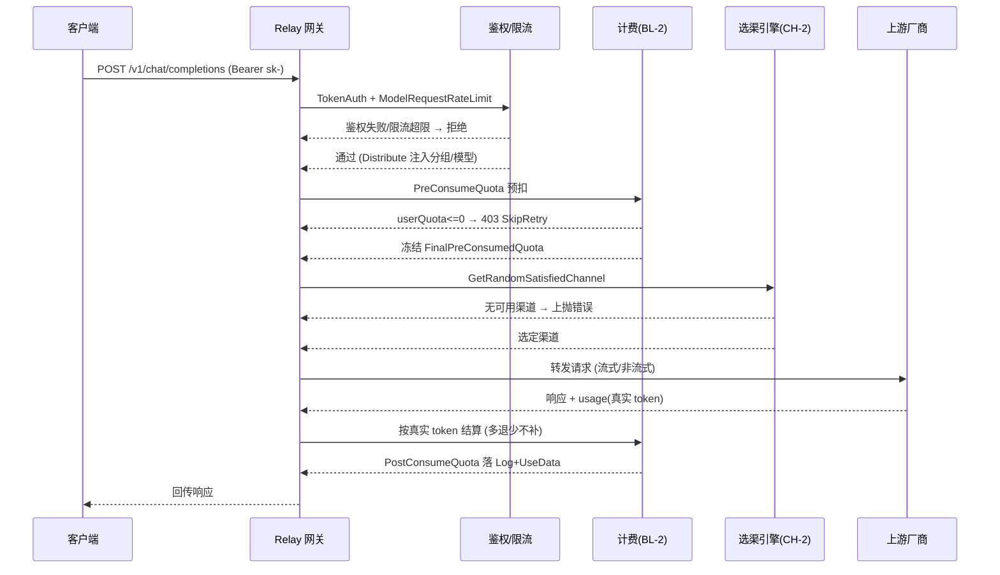
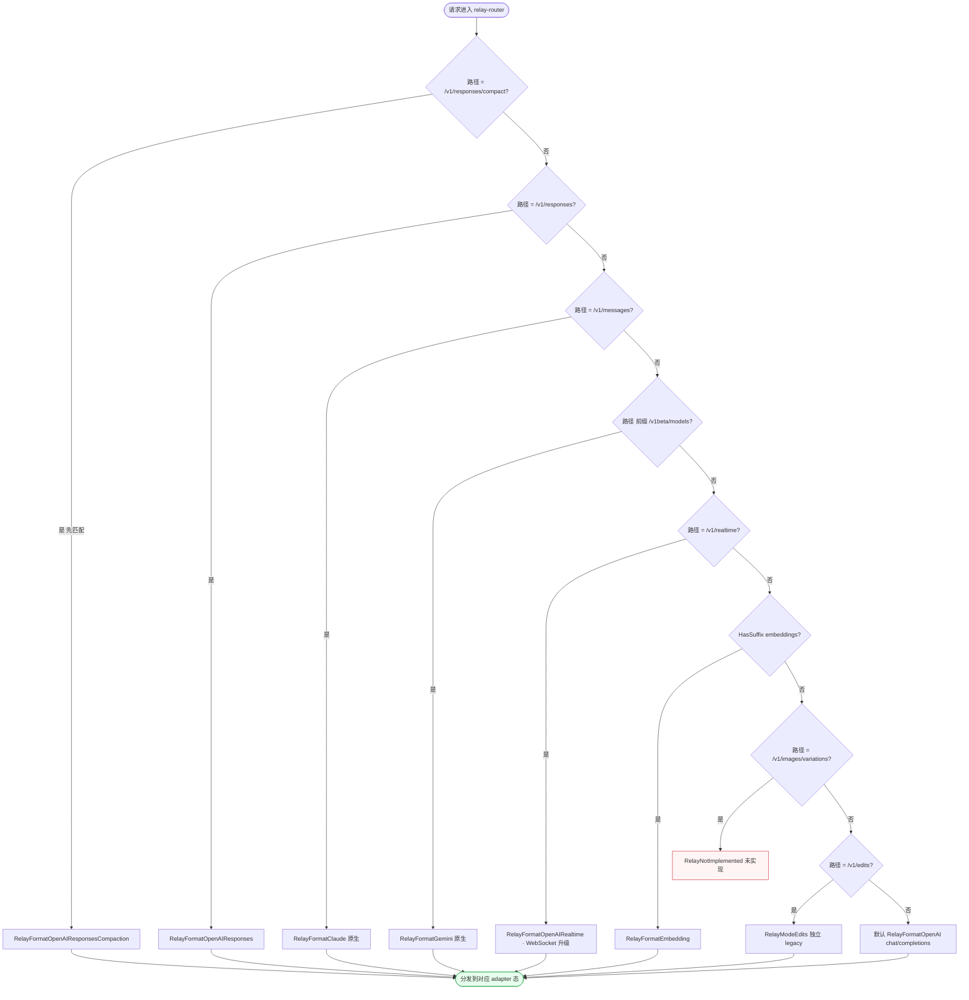
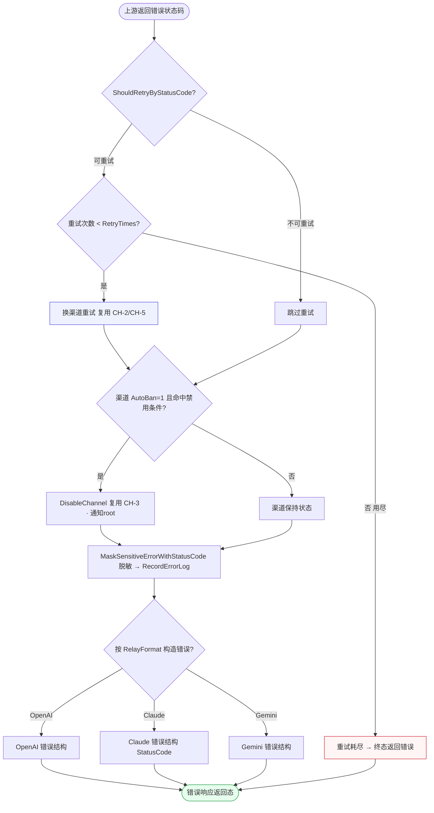
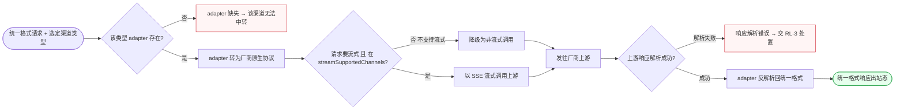
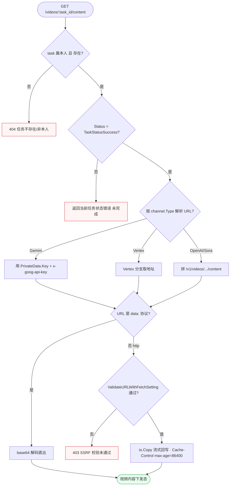
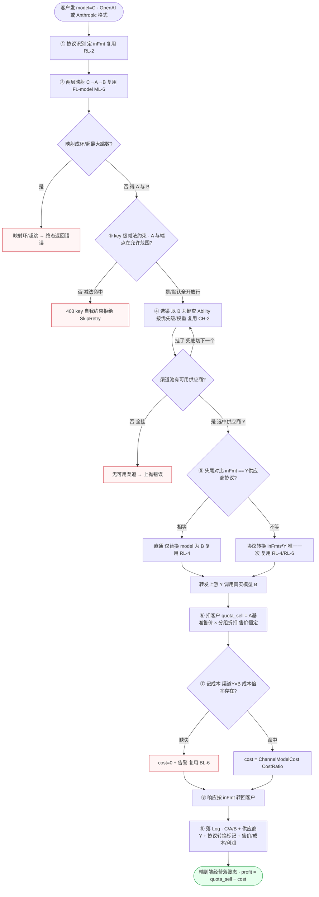

# FL-relay — Relay 网关多协议中转（D11/D13）流程图

> 分片：Relay 网关（F-3026~F-3037、F-3057）、视频内容代理（F-4046）。
> 角色：登录用户/外部客户端（携 token key）/ 系统（鉴权·选渠·转发·计费·禁用）/ 各厂商上游。
> 跨切面契约见 `../OVERALL-FLOW.md §3`：C1 鉴权（TokenAuth）、C5 限流（ModelRequestRateLimit）、Distribute 中间件。Relay 与计费的衔接见 `FL-billing.md BL-2`（预扣/结算），与选渠见 `FL-channel.md CH-2/CH-5`，本文件只标注「调 BL-2 预扣」「调 CH-2 选渠」不重画。
> 后端：`controller/relay.go`、`router/relay-router.go`、`relay/relay_mode.go`、`relay/channel/*`、`controller/video_proxy.go`。关键：`ShouldRetryByStatusCode`、`RelayFormat*`、`RetryTimes`。

---

## 场景 RL-1 · OpenAI 兼容端点主链路（鉴权→额度→选渠→转发→计费→记日志）（F-3026/F-3037）

> 业务规则：`POST /v1/chat/completions` 经中间件链 `TokenAuth → ModelRequestRateLimit → Distribute` 进入 Relay：鉴权失败拒绝、限流超限拒绝；转发前调 BL-2 预扣（userQuota<=0 → 403 SkipRetry）；调 CH-2 选满足渠道；转发上游后按真实 token 结算（多退少不补）并落 Log + UseData。本图为请求-响应时序，刻意用 sequenceDiagram 表达「客户端↔网关↔计费↔渠道↔上游」多参与方交互，区别于其余 flowchart。

屏幕状态清单（RL-1 OpenAI 主链路，外部 API + 内部态）：
- 鉴权失败拒绝态（TokenAuth） ← 异常
- 限流超限拒绝态（ModelRequestRateLimit） ← 异常
- 预扣 403 态（userQuota<=0，SkipRetry，复用 BL-2） ← 异常
- 无可用渠道态（选渠失败，复用 CH-2） ← 异常
- 额度冻结态（FinalPreConsumedQuota）
- 转发中态（流式/非流式）
- 结算完成态（真实 token 多退少不补，Log+UseData 入账） ← 终态

---

## 场景 RL-2 · 端点路径识别与多协议格式分发（Path2RelayMode 前缀顺序）（F-3027~F-3036/F-3057）

> 业务规则：`Path2RelayMode` 按路径定 `RelayMode` 与 `RelayFormat`——`/v1/responses/compact` **必须先于** `/v1/responses` 匹配（前缀顺序错会误判）；`/v1/embeddings` 及任意 `HasSuffix(embeddings)` 判 Embeddings；`/images/variations` 走 `RelayNotImplemented`；`/v1/edits` 是独立 `RelayModeEdits`（区别于 `/images/edits`）；`/v1/messages` 走 Claude、`/v1beta/models/*` 走 Gemini、`/v1/realtime` 走 WebSocket 升级。本图为路径分发的有序匹配树，节点对应真实路由判定。

屏幕状态清单（RL-2 协议分发，系统内部态）：
- compact 优先匹配态（先于 /v1/responses）
- responses / claude / gemini / realtime 分发态
- embeddings 后缀匹配态
- variations 未实现态（RelayNotImplemented） ← 异常
- edits 独立 legacy 态（区别 images/edits）
- 默认 chat/completions 态
- 分发到 adapter 态 ← 终态

---

## 场景 RL-3 · 上游错误处理与按状态码重试/禁用渠道（F-3037）

> 业务规则：上游返回错误码时 `ShouldRetryByStatusCode(code)` 决定重试还是跳过；可重试且未达 `RetryTimes` 则换渠道重试（复用 CH-2/CH-5），不可重试直接返回；满足条件且渠道 `AutoBan=1` 时 `DisableChannel`（复用 CH-3）；错误日志经 `MaskSensitiveErrorWithStatusCode` 脱敏后 `RecordErrorLog`（记 channel/model/status_code）；错误响应按 `RelayFormat`（OpenAI/Claude/Gemini）分别构造。本图为「重试判定 ⊕ 禁用判定 ⊕ 脱敏记录」三条并行处置汇聚到格式化返回。

屏幕状态清单（RL-3 错误处理/重试，系统内部态）：
- 可重试换渠道态（复用 CH-2/CH-5）
- 重试耗尽态（>=RetryTimes，返错） ← 异常
- 跳过重试态（不可重试码）
- 渠道自动禁用态（AutoBan 命中，复用 CH-3，通知 root）
- 渠道保持态
- 错误脱敏记录态（MaskSensitive，记 channel/model/status_code）
- OpenAI/Claude/Gemini 格式化错误态
- 错误响应返回态 ← 终态

---

## 场景 RL-4 · 厂商原生协议适配（37 adapter 请求/响应双向转换）（F-3034/F-3035/F-3036）

> 业务规则：请求分发到渠道类型对应 adapter（`relay/channel/` 下 37 个，渠道类型常量至 57），由 adapter 将**统一入参**转为厂商原生协议、再将厂商响应解析回统一格式；adapter 缺失则该渠道类型无法中转；新增渠道按 AGENTS Rule4 决定是否加入 `streamSupportedChannels`（不支持流式则降级非流）。本图为「入站统一格式 → 适配转换 → 上游 → 反向解析 → 出站统一格式」的双向管线，中段含流式能力分支。

屏幕状态清单（RL-4 厂商适配，系统内部态）：
- adapter 缺失态（该渠道类型无法中转） ← 异常
- 协议转换态（统一→厂商原生）
- 非流式降级态（不在 streamSupportedChannels）
- 流式 SSE 态（支持流式）
- 响应解析失败态（交 RL-3） ← 异常
- 反向解析态（厂商→统一格式）
- 统一格式响应出站态 ← 终态

---

## 场景 RL-5 · 视频内容网关代理（本人校验 + SSRF + 流式回传）（F-4046）

> 业务规则：`GET /videos/:task_id/content` 经 `VideoProxy`——校验 task **属本人**（`GetByTaskId` 带 userID）且 `Status==TaskStatusSuccess`；按 `channel.Type` 分支解析上游 URL（Gemini 用 `task.PrivateData.Key + x-goog-api-key`、Vertex、OpenAI/Sora 拼 `/v1/videos/.../content`）；`data:` URL 走 base64 解码直出；其余 URL 经 `ValidateURLWithFetchSetting` SSRF 校验后 `io.Copy` 流式回写，响应设 `Cache-Control max-age=86400`；任务非本人/不存在 → 404，未完成 → 当前状态错误，SSRF 不过 → 403。本图为「归属校验 → 状态校验 → 类型分支取 URL → SSRF → 回传」的代理下发链。

屏幕状态清单（RL-5 视频内容代理）：
- 404 态（任务不存在/非本人） ← 异常
- 任务未完成态（Status≠Success，返回当前状态） ← 异常
- 渠道类型分支态（Gemini/Vertex/OpenAI·Sora 取 URL）
- data: 直出态（base64 解码）
- SSRF 拦截态（403，校验未通过） ← 异常
- 流式回写态（io.Copy，Cache-Control max-age=86400）
- 视频内容下发态 ← 终态

---

## 场景 RL-6 · 端到端经营转发链路（协议识别→两层映射→减法约束→选渠容灾→头尾转换→双价记账→落 Log）（兼容层 / 经营链路）

> 业务规则（唯一权威 = `../COMPAT-BILLING-DECISIONS.md §10` 完整一笔请求链路 ①~⑨，对齐 prd-relay RL-7）：客户用 OpenAI 或 Anthropic 格式发 `model=C`，一笔请求按固定链路串行编排——① **协议识别** 定 `inFmt`（复用 RL-2）；② **两层模型映射** `C →(客户层 L1 UserModelAlias，user>group)→ A →(超管层 L2 PlatformModelMapping)→ B`，B 客户永不可见、带环检测+最大跳数（明细见 `FL-model.md ML-6`）；③ **key 级减法约束** 校验 A/端点是否在该 key 的允许范围内（**默认全开放行**，纯减法自我约束非权限闸门）；④ **渠道池路由** 以 B 为键按优先级/权重选一供应商，挂了按 CH-5 容灾兜底切下一个（**售价恒定不随兜底波动**）；⑤ **协议头尾对比** `inFmt vs 选中供应商协议` → 相等直通、不等转换（复用 RL-4/RL-6 协议适配，全链唯一一次）；⑥ **扣客户** = 对外模型 A 基准售价 × 分组折扣系数（`quota_sell`，客户可见）；⑦ **记成本** = 实际选中渠道 × 真实模型 B 的成本倍率（`cost`，明细见 `FL-billing.md BL-6`），成本缺失记 0 + 告警；⑧ **响应** 按 `inFmt` 转回客户；⑨ **落 Log** = C/A/B + 实际供应商 + 协议转换标记 + 售价/成本/利润（`DATA-MODEL §5` 已落 10 字段）。本图为「识别→映射→约束→选渠→转换→双价→落账」的端到端经营编排主链，判定菱形含「协议是否相等 / 渠道是否可用 / 成本是否缺失」。

屏幕状态清单（RL-6 端到端经营链路，系统内部态）：
- 协议识别态（定 inFmt，复用 RL-2）
- 两层映射态（C→A→B，B 客户不可见，复用 FL-model ML-6）
- 映射环/超跳拒绝态（环检测+最大跳数） ← 异常
- key 级减法约束拒绝态（减法命中，默认全开放行） ← 异常
- 兜底切供应商态（挂了切下一个，售价恒定）
- 无可用渠道态（全挂上抛，复用 CH-2/CH-5） ← 异常
- 协议直通态（inFmt==供应商协议）/ 协议转换态（不等，唯一一次，复用 RL-4/RL-6）
- 售价扣费态（quota_sell = A基准价 × 分组折扣，客户可见恒定）
- 成本缺失告警态（cost=0 + 告警，复用 BL-6） ← 异常
- 成本记账态（渠道Y×B 成本倍率）
- 响应转回 inFmt 态
- Log 落账态（C/A/B + 供应商 + 协议转换标记 + 售价/成本/利润，profit=售价−成本） ← 终态
