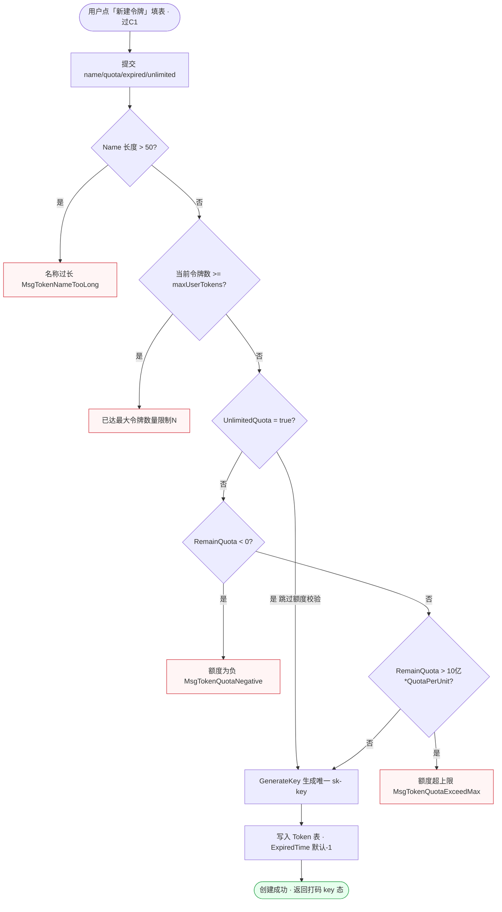
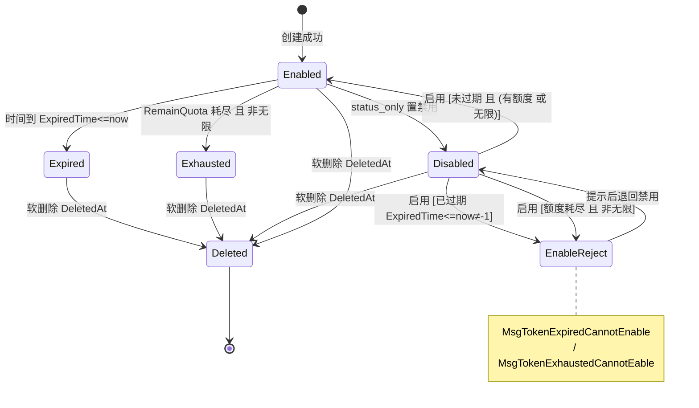
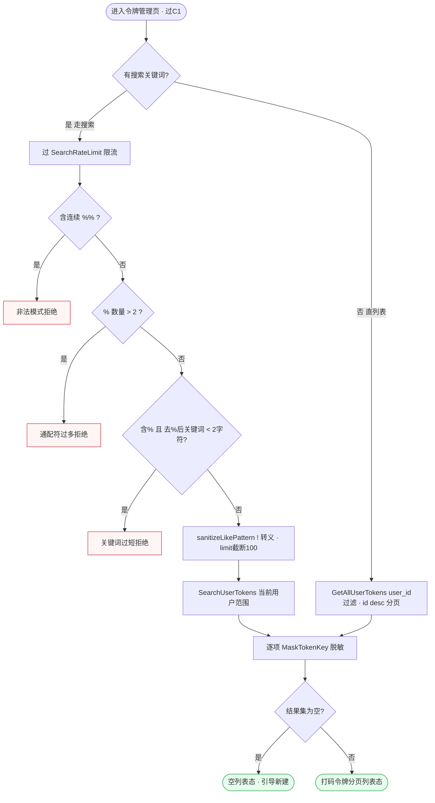
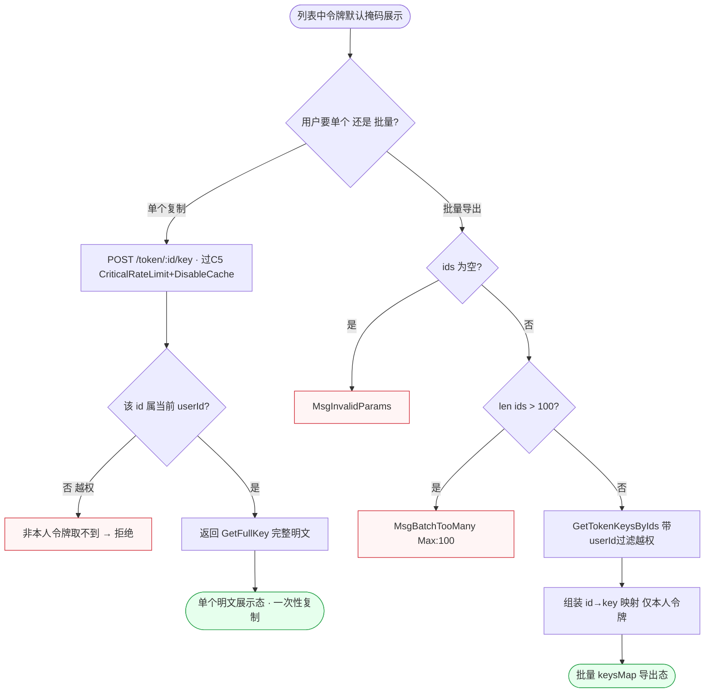
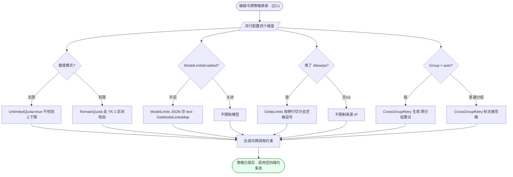
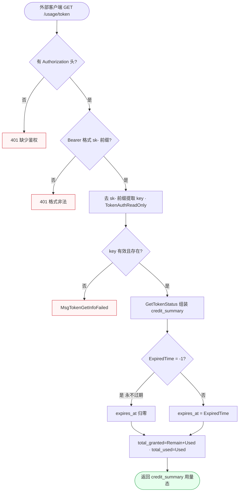

# FL-token — 令牌管理（D3）流程图

> 分片：令牌管理（F-3001~F-3012）。
> 角色：登录用户（令牌拥有者）/ 外部客户端（携 key 调用）/ 系统。
> 跨切面契约见 `../OVERALL-FLOW.md §3`：C1 会话鉴权（UserAuth）、C5 限流（CriticalRateLimit/SearchRateLimit/DisableCache）。本文件不重画 C1/C5，仅在节点标注「过 C1」「过 C5」。
> 后端实现集中于 `controller/token.go` + `model/token.go`，常量 `maxQuotaValue=1000000000*QuotaPerUnit`、`searchHardLimit=100`、`maxUserTokens=operation_setting.GetMaxUserTokens()`、Name 上限 50 字符。

---

## 场景 TK-1 · 创建令牌（额度区间 + 令牌数上限 + 名称长度三重串行校验）（F-3001/F-3008）

> 业务规则：`UnlimitedQuota=true` 跳过额度校验；否则 `RemainQuota<0` → `MsgTokenQuotaNegative`、`RemainQuota>10亿*QuotaPerUnit` → `MsgTokenQuotaExceedMax`；`Name>50` → `MsgTokenNameTooLong`；当前用户令牌数达 `GetMaxUserTokens()` → 「已达到最大令牌数量限制(N)」；通过后 `GenerateKey()` 生成唯一 `sk-` 前缀 key 写 Token 表，`ExpiredTime` 默认 -1（永不过期）。校验链是核心：任一关卡失败即拒。

屏幕状态清单（TK-1 创建令牌）：
- 新建令牌表单默认态（额度/有效期/无限开关）
- 名称过长态（MsgTokenNameTooLong） ← 异常
- 令牌数达上限态（已达最大令牌数量限制(N)） ← 异常
- 额度为负态（MsgTokenQuotaNegative） ← 异常
- 额度超上限态（MsgTokenQuotaExceedMax） ← 异常
- 无限额度跳过校验提示态（UnlimitedQuota）
- 创建成功返回打码 key 态 ← 终态

---

## 场景 TK-2 · 令牌生命周期状态机（启用→禁用→过期→耗尽→删除）（F-3006/F-3007）

> 业务规则：`status_only` 分支仅改 `Status` 不覆盖其他字段；从禁用启用时校验——已过期（`ExpiredTime<=now 且 ≠-1`）→ `MsgTokenExpiredCannotEnable`，额度耗尽且非无限 → `MsgTokenExhaustedCannotEable`；删除走 gorm `DeletedAt` 软删除。本图为状态机：不同当前态触发不同迁移与守卫条件。

屏幕状态清单（TK-2 生命周期）：
- 启用态（可正常调用）
- 禁用态（status_only 切换，调用被拒）
- 启用被拒态（已过期，MsgTokenExpiredCannotEnable） ← 异常
- 启用被拒态（额度耗尽且非无限，MsgTokenExhaustedCannotEable） ← 异常
- 已过期态（ExpiredTime<=now）
- 额度耗尽态（RemainQuota 用尽且非无限）
- 已删除态（DeletedAt 软删除，列表不再显示） ← 终态

---

## 场景 TK-3 · 令牌列表查询 + 关键词搜索（key 自动打码 + LIKE 注入防护）（F-3002/F-3003）

> 业务规则：列表 `GetAllUserTokens(user_id 过滤, Order id desc)`，每项 key 经 `MaskTokenKey` 脱敏（≤4 全打码、≤8 保留首尾2位、否则形如 `abcd**********wxyz`）；搜索 `sanitizeLikePattern` 用 `!` 作 ESCAPE，连续 `%%` 拒绝、`%` 超过 2 个拒绝、含 `%` 时去 % 后关键词需 ≥2 字符，`limit>100` 强制截断为 100，并过 `SearchRateLimit`。两条入口（直列表 / 搜索）合流到脱敏渲染。

屏幕状态清单（TK-3 列表/搜索）：
- 令牌分页列表态（key 已 MaskTokenKey 脱敏）
- 空列表态（无令牌，引导新建） ← 终态
- 搜索非法模式态（连续 %%） ← 异常
- 搜索通配符过多态（% > 2） ← 异常
- 搜索关键词过短态（去 % 后 < 2 字符） ← 异常
- 搜索被限流态（SearchRateLimit）
- 搜索结果分页态（打码） ← 终态

---

## 场景 TK-4 · 令牌密钥访问（掩码默认展示 + 受控取明文 + 批量上限）（F-3004/F-3005）

> 业务规则：列表中 key 默认掩码；单个取明文 `POST /token/:id/key` 经 `CriticalRateLimit + DisableCache`，返回 `GetFullKey()`，越权（非本人 `GetTokenByIds 带 userId` 取不到）；批量 `GetTokenKeysBatch` 要求 `len(Ids)≤100`，否则 `MsgBatchTooMany{Max:100}`，空 ids → `MsgInvalidParams`。掩码→受控明文的安全升级路径，单/批两分支。

屏幕状态清单（TK-4 密钥访问）：
- 掩码默认展示态（列表内 key 脱敏）
- 单个越权拒绝态（非本人令牌） ← 异常
- 单个明文一次性展示态（DisableCache，引导立即复制） ← 终态
- 批量参数无效态（ids 空，MsgInvalidParams） ← 异常
- 批量超上限态（>100，MsgBatchTooMany） ← 异常
- 批量 keysMap 导出态（仅本人令牌） ← 终态

---

## 场景 TK-5 · 令牌额度策略组合配置（无限/有限 + IP白名单 + 模型白名单 + 分组）（F-3008/F-3009/F-3010/F-3011）

> 业务规则：四个相互独立的限制维度叠加在一个令牌上——`UnlimitedQuota` 决定额度模式；`ModelLimitsEnabled=true` 时 `GetModelLimitsMap()` 生成允许模型布尔表（白名单外拒）；`AllowIps` 按换行解析、空/nil 不限制；`Group` + `CrossGroupRetry`（仅 `Group=auto` 生效）。本图为并行配置汇聚而非线性流程：每个开关各自落库，最终合成一份调用约束。

屏幕状态清单（TK-5 额度策略）：
- 策略配置表单态（额度模式/模型/IP/分组四区）
- 无限额度态（跳过上下限校验）
- 有限额度态（走区间校验）
- 模型白名单启用态（白名单外模型将被拒）
- 模型不限制态（ModelLimitsEnabled=false）
- IP 白名单生效态（多行解析）
- IP 不限制态（AllowIps 空/nil）
- 分组 auto + 跨分组重试态（CrossGroupRetry 生效）
- 普通分组态（CrossGroupRetry 忽略）
- 策略保存成功态（四维约束合成） ← 终态

---

## 场景 TK-6 · 令牌用量查询（OpenAI 兼容 credit_summary，外部 Bearer 鉴权）（F-3012）

> 业务规则：外部客户端 `GET /usage/token` 经 `TokenAuthReadOnly` 只读鉴权；无 `Authorization` 头 → 401，非 bearer 格式 → 401，key 无效 → `MsgTokenGetInfoFailed`；`GetTokenStatus` 返回 `object=credit_summary`，`total_granted=RemainQuota+UsedQuota`、`total_used=UsedQuota`，`ExpiredTime=-1` 时 `expires_at` 归零。本图为外部 API 调用链，与控制台内查询形态不同（无会话、Bearer 解析）。

屏幕状态清单（TK-6 用量查询，外部 API）：
- 缺少鉴权态（无 Authorization，401） ← 异常
- 格式非法态（非 bearer，401） ← 异常
- key 无效态（MsgTokenGetInfoFailed） ← 异常
- 永不过期归零态（ExpiredTime=-1 → expires_at=0）
- credit_summary 用量返回态（total_granted/total_used/expires_at） ← 终态
