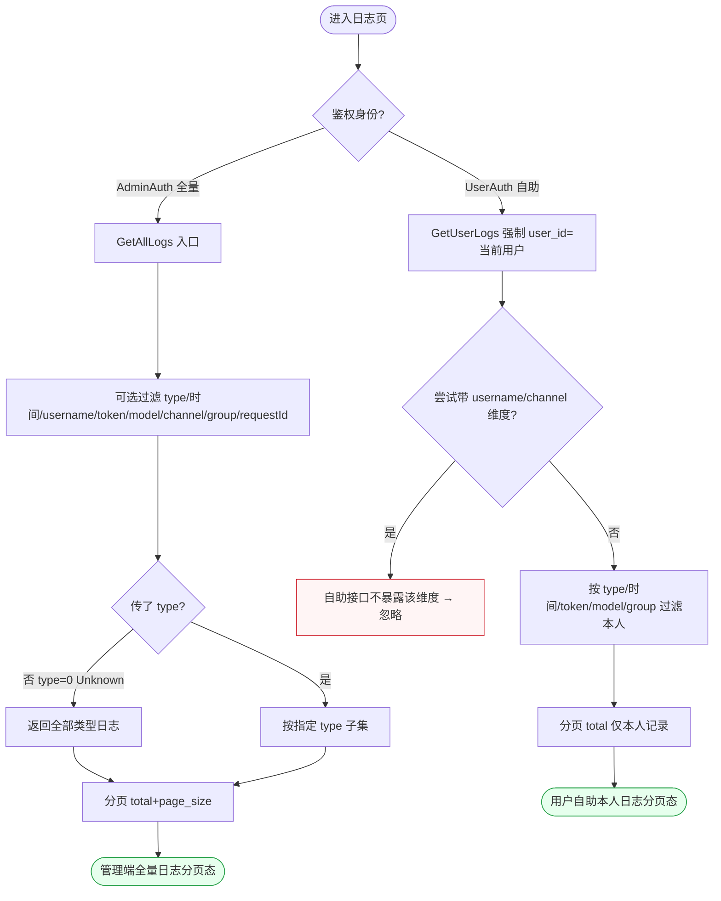
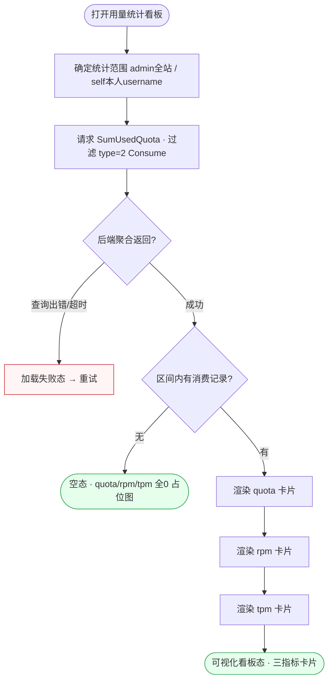
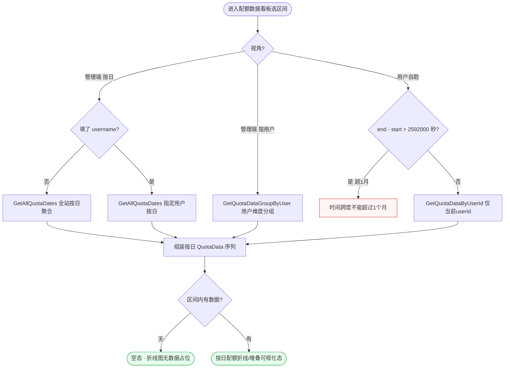
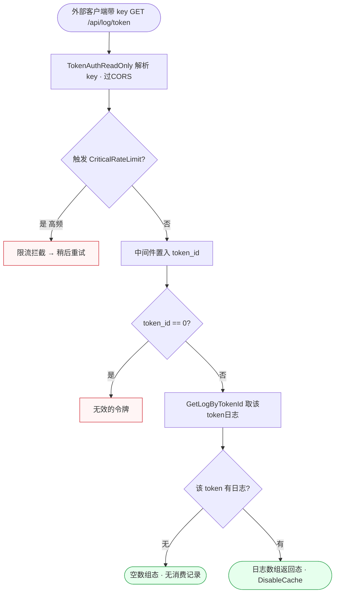
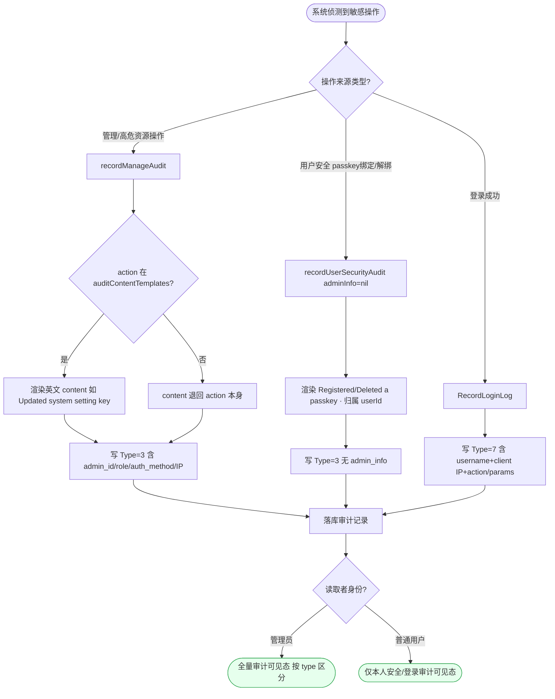
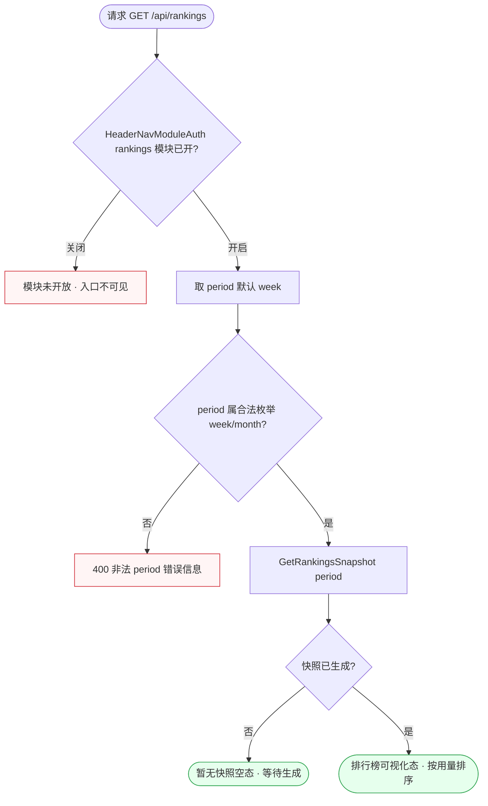
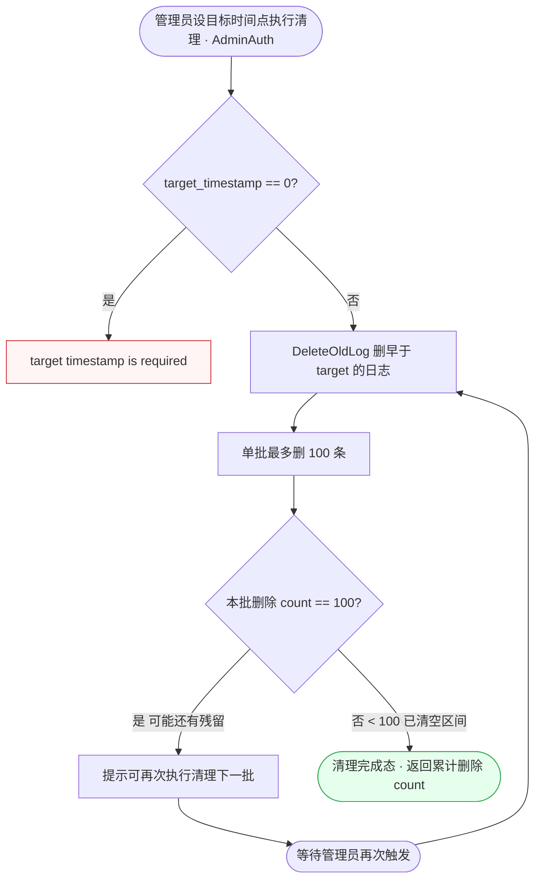
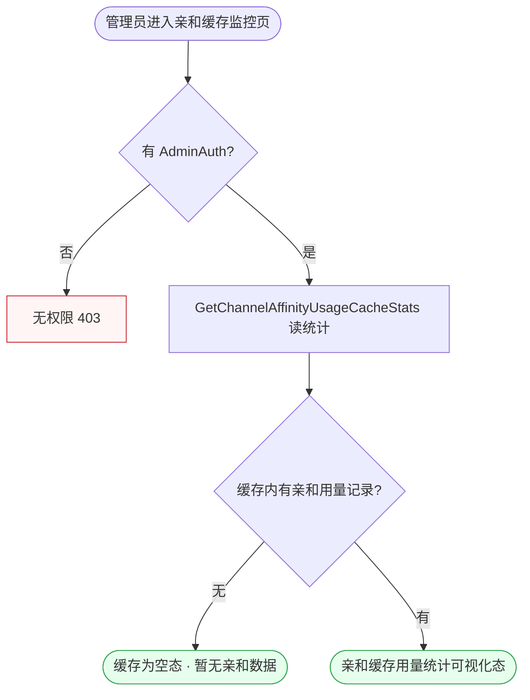

# FL-usagelog — 日志与用量（D4）流程图

> 分片：日志与用量（F-4001~F-4014）。
> 角色：管理员（AdminAuth）/ 登录用户（UserAuth，仅本人）/ 外部客户端（TokenAuthReadOnly）/ 系统埋点。
> 跨切面契约见 `../OVERALL-FLOW.md §3`：C1 会话鉴权、C5 限流（CriticalRateLimit/DisableCache）、C6 权限分层（AdminAuth vs UserAuth 范围闸门）。看板/统计类按「数据获取流」绘制，终态为可视化态 + 空态。
> 后端：`controller/log.go`、`controller/usedata.go`、`controller/rankings.go`、`controller/audit.go`、`model/log.go`。日志 `type`：1=充值 2=Consume 3=Manage 7=Login。

---

## 场景 UL-1 · 日志查询（管理端全量 vs 用户自助的范围分发）（F-4001/F-4002）

> 业务规则：同一日志列表两个入口走不同范围闸门——管理端 `GET /log/`（AdminAuth）可按 `type/时间区间/username/token_name/model_name/channel/group/request_id/upstream_request_id` 任一过滤，`type=0(LogTypeUnknown)` 返回全部类型；用户自助 `GET /log/self`（UserAuth）强制 `user_id=当前用户`，**不暴露** username/channel 维度，越权查他人 userId 不可行。本图核心是权限分叉决定可用过滤维度。

屏幕状态清单（UL-1 日志查询）：
- 管理端过滤面板态（八维过滤项）
- 全部类型态（未传 type=0）
- 指定类型子集态（传 type）
- 管理端全量分页列表态 ← 终态
- 自助维度受限态（username/channel 不可用） ← 异常处理
- 用户自助本人日志分页态（强制 user_id） ← 终态

---

## 场景 UL-2 · 用量统计看板（消费日志聚合 quota/rpm/tpm，数据获取流）（F-4004/F-4005）

> 业务规则：看板卡片调 `SumUsedQuota`，`Where(type=2 LogTypeConsume)` 仅统计消费记录，返回 `quota/rpm/tpm` 三字段；管理端 `GET /log/stat`（AdminAuth）过滤项随查询变化，用户自助 `GET /log/self/stat`（UserAuth）`username` 来自上下文不可伪造。看板按数据获取流绘制：终态为可视化卡片态 + 区间内无消费的空态。

屏幕状态清单（UL-2 用量统计看板）：
- 看板加载中态（请求 SumUsedQuota）
- 加载失败重试态（查询出错/超时） ← 异常
- 空态（区间内无 Consume 记录，三指标置 0 占位） ← 终态（空）
- 可视化看板态（quota/rpm/tpm 三卡片渲染） ← 终态（可视化）

---

## 场景 UL-3 · 按日配额数据看板（区间聚合 + 自助跨度 1 月上限 + 按用户维度）（F-4007/F-4008/F-4009）

> 业务规则：管理端 `GetAllQuotaDates(start,end,username)`（AdminAuth）空 username 返回全站、否则过滤指定用户；`GetQuotaDatesByUser` 按用户维度分组（全站排布）；用户自助 `GetUserQuotaDates`（UserAuth）校验 `endTimestamp-startTimestamp > 2592000`（1 月秒数）→「时间跨度不能超过 1 个月」，仅返回当前 userId。本图核心判定是自助接口的时间跨度护栏，区别于管理端无跨度限制。

屏幕状态清单（UL-3 配额数据看板）：
- 区间选择面板态
- 管理端全站按日态（空 username）
- 管理端指定用户按日态
- 管理端按用户维度分组态
- 自助跨度超限态（>2592000 秒，时间跨度不能超过 1 个月） ← 异常
- 空态（区间内无 QuotaData，占位） ← 终态（空）
- 按日配额可视化态（折线/堆叠图） ← 终态（可视化）

---

## 场景 UL-4 · 按令牌 key 查询消费日志（外部 Bearer + 限流 + 禁缓存）（F-4003）

> 业务规则：外部 `GET /api/log/token` 经 `TokenAuthReadOnly + CORS + CriticalRateLimit`；中间件解析 key 后置入 `token_id`，`token_id==0` → 「无效的令牌」，有效则 `GetLogByTokenId` 返回该 token 日志数组，高频被 `CriticalRateLimit` 拦截。本图为外部只读 API 链，短直且限流密集，区别于控制台分页查询。

屏幕状态清单（UL-4 按 key 查日志，外部 API）：
- 限流拦截态（CriticalRateLimit，稍后重试） ← 异常
- 无效令牌态（token_id==0） ← 异常
- 空数组态（该 token 无消费记录） ← 终态（空）
- 日志数组返回态（DisableCache 不缓存） ← 终态

---

## 场景 UL-5 · 审计日志记录与读取（管理/用户安全/登录三类埋点汇流）（F-4011/F-4012/F-4013）

> 业务规则：三种审计写入路径汇入同一 `RecordOperationAuditLog`/`RecordLoginLog`——管理操作 `Type=3(Manage)` 含 `admin_id/admin_username/admin_role/auth_method`，`content` 由 `auditContentTemplates` 英文渲染（未登记 action 退回 action 本身）；用户安全操作（passkey 绑定/解绑）`adminInfo=nil` 归属用户自身，不依赖 AdminAuth 兜底；登录 `Type=7(Login)` 含 username+IP。读取时管理员可见全部、用户仅见自身。本图核心是按操作来源分流写入字段集，再经 type 字段区分读取。

屏幕状态清单（UL-5 审计日志）：
- 管理操作 action 已登记态（英文模板渲染）
- 管理操作 action 未登记态（退回 action 本身）
- 管理审计写入态（Type=3 含 admin 身份四字段）
- 用户安全审计写入态（adminInfo=nil 归属本人）
- 登录审计写入态（Type=7 含 username+IP）
- 管理员全量审计可见态（按 type 区分） ← 终态
- 用户仅本人审计可见态 ← 终态

---

## 场景 UL-6 · 用量排行榜快照（公开 + period 校验 + 模块开关）（F-4010）

> 业务规则：`GET /api/rankings` 经 `HeaderNavModuleAuth("rankings")` 模块开关控制可见性；`GetRankingsSnapshot(period)`，`period` 默认 `week`，非法 period → 400 + 错误信息，合法返回排行快照。匿名/登录皆可访问（受模块开关）。本图为快照读取流，含模块开关闸门 + 枚举校验，终态为榜单可视化态 + 暂无快照空态。

屏幕状态清单（UL-6 排行榜快照）：
- 模块未开放态（HeaderNavModuleAuth 关闭，入口隐藏） ← 异常
- period 非法态（400 错误信息） ← 异常
- 暂无快照空态（未生成） ← 终态（空）
- 排行榜可视化态（period 默认 week，按用量排序） ← 终态（可视化）

---

## 场景 UL-7 · 历史日志清理（按目标时间戳分批删除，每批上限 100）（F-4006）

> 业务规则：管理员 `DELETE /log/`（AdminAuth）传 `target_timestamp`，`target_timestamp==0` → 「target timestamp is required」；`DeleteOldLog(ctx, targetTimestamp, 100)` 删除早于该时间戳的日志，**单次最多删 100 条**，返回 `data=删除 count`。因单批上限存在，超量需循环触发。本图为带批次循环的维护流，与查询/看板形态截然不同。

屏幕状态清单（UL-7 历史日志清理）：
- 设目标时间点表单态
- 缺少时间戳态（target_timestamp==0，target timestamp is required） ← 异常
- 单批删除进行态（每批 ≤100）
- 仍有残留可再执行态（本批满 100，引导继续）
- 清理完成态（本批 <100，返回删除 count） ← 终态

---

## 场景 UL-8 · 渠道亲和缓存用量统计（管理端监控读取）（F-4014）

> 业务规则：`GET /log/channel_affinity_usage_cache`（AdminAuth）调 `GetChannelAffinityUsageCacheStats` 返回 `channel_affinity_usage_cache` 的统计数据，挂在 logRoute 分组下受 AdminAuth 保护。本图为单一只读监控点，短链，终态为缓存命中可视化态与缓存为空态，区别于多分支看板。

屏幕状态清单（UL-8 亲和缓存统计）：
- 无权限态（403，非 AdminAuth） ← 异常
- 缓存为空态（暂无亲和用量数据） ← 终态（空）
- 亲和缓存用量统计可视化态 ← 终态（可视化）
